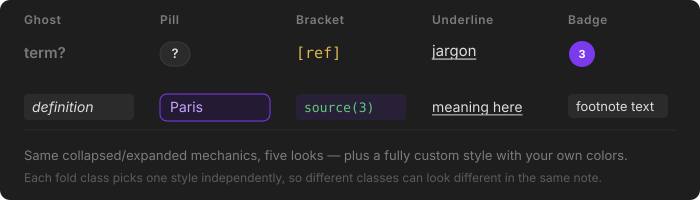
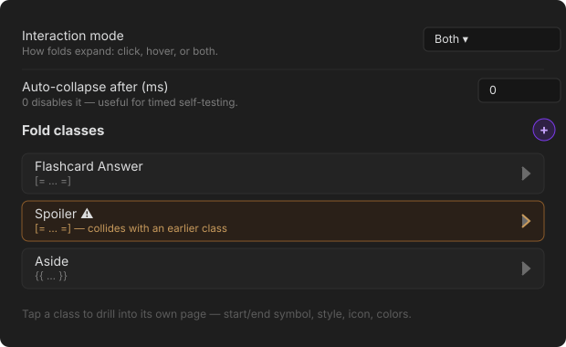

## commands\commandManager.ts

```typescript
import { Editor, Notice, Plugin } from "obsidian";
import { FoldParser } from "../core/parser";
import { assignFoldKeys, flattenFoldTree } from "../core/foldTree";
import { FoldClass, FoldNode } from "../core/types";
import { PluginDataStore } from "../data/PluginDataStore";

const WORD_CHAR = /[\p{L}\p{N}_-]/u;

export class CommandManager {
  private registeredIds: string[] = [];

  constructor(
    private plugin: Plugin,
    private dataStore: PluginDataStore,
  ) {}

  refresh(): void {
    this.removeAll();
    const settings = this.dataStore.getSettings();

    for (const cls of settings.classes) {
      const toggleId = `toggle-encapsulation-${cls.id}`;
      this.plugin.addCommand({
        id: toggleId,
        name: `Toggle encapsulation: ${cls.name}`,
        editorCallback: (editor: Editor) => this.toggleEncapsulation(editor, cls),
      });
      this.registeredIds.push(toggleId);

      const expandId = `expand-all-${cls.id}`;
      this.plugin.addCommand({
        id: expandId,
        name: `Expand all: ${cls.name}`,
        editorCallback: (editor: Editor) => this.setAllFoldsInFile(editor, true, cls.id),
      });
      this.registeredIds.push(expandId);

      const collapseId = `collapse-all-${cls.id}`;
      this.plugin.addCommand({
        id: collapseId,
        name: `Collapse all: ${cls.name}`,
        editorCallback: (editor: Editor) => this.setAllFoldsInFile(editor, false, cls.id),
      });
      this.registeredIds.push(collapseId);
    }

    const globalId = "toggle-fold-at-cursor";
    this.plugin.addCommand({
      id: globalId,
      name: "Toggle expansion/collapse of folded text",
      editorCallback: (editor: Editor) => this.toggleFoldAtCursor(editor),
    });
    this.registeredIds.push(globalId);

    const expandAllId = "expand-all-folds";
    this.plugin.addCommand({
      id: expandAllId,
      name: "Expand all folds in note",
      editorCallback: (editor: Editor) => this.setAllFoldsInFile(editor, true),
    });
    this.registeredIds.push(expandAllId);

    const collapseAllId = "collapse-all-folds";
    this.plugin.addCommand({
      id: collapseAllId,
      name: "Collapse all folds in note",
      editorCallback: (editor: Editor) => this.setAllFoldsInFile(editor, false),
    });
    this.registeredIds.push(collapseAllId);

    const nextId = "jump-to-next-fold";
    this.plugin.addCommand({
      id: nextId,
      name: "Jump to next fold",
      editorCallback: (editor: Editor) => this.jumpToFold(editor, 1),
    });
    this.registeredIds.push(nextId);

    const prevId = "jump-to-previous-fold";
    this.plugin.addCommand({
      id: prevId,
      name: "Jump to previous fold",
      editorCallback: (editor: Editor) => this.jumpToFold(editor, -1),
    });
    this.registeredIds.push(prevId);

    const focusId = "collapse-all-and-jump-to-first-fold";
    this.plugin.addCommand({
      id: focusId,
      name: "Start focus mode (collapse all, jump to first fold)",
      editorCallback: (editor: Editor) => {
        this.setAllFoldsInFile(editor, false);
        this.jumpToFold(editor, 1, { fromStart: true });
      },
    });
    this.registeredIds.push(focusId);
  }

  private removeAll(): void {
    const commands = (this.plugin.app as unknown as { commands?: { removeCommand?: (id: string) => void } })
      .commands;
    for (const id of this.registeredIds) {
      commands?.removeCommand?.(`${this.plugin.manifest.id}:${id}`);
    }
    this.registeredIds = [];
  }

  /** Wraps/unwraps text in a class's delimiters — an editing operation, distinct from expand/collapse. */
  private toggleEncapsulation(editor: Editor, cls: FoldClass): void {
    const parser = new FoldParser([cls]);
    const cursor = editor.getCursor();
    const line = editor.getLine(cursor.line);
    const lineOffset = editor.posToOffset({ line: cursor.line, ch: 0 });
    const cursorAbs = lineOffset + cursor.ch;

    const hit = flattenFoldTree(parser.parseLine(line, lineOffset)).find(
      (node) => cursorAbs >= node.from && cursorAbs <= node.to,
    );
    if (hit) {
      const fromCh = hit.from - lineOffset;
      const toCh = hit.to - lineOffset;
      editor.replaceRange(hit.content, { line: cursor.line, ch: fromCh }, { line: cursor.line, ch: toCh });
      editor.setCursor({ line: cursor.line, ch: fromCh });
      return;
    }

    if (cls.useRegex) {
      new Notice(
        `"${cls.name}" uses regex delimiters, so there's no fixed text to insert — type something matching the pattern directly instead.`,
      );
      return;
    }

    if (editor.somethingSelected()) {
      const selection = editor.getSelection();
      if (selection.startsWith(cls.startSymbol) && selection.endsWith(cls.endSymbol)) {
        editor.replaceSelection(selection.substring(cls.startSymbol.length, selection.length - cls.endSymbol.length));
      } else {
        editor.replaceSelection(`${cls.startSymbol}${selection}${cls.endSymbol}`);
      }
      return;
    }

    let start = cursor.ch;
    let end = cursor.ch;
    while (start > 0 && WORD_CHAR.test(line[start - 1])) start--;
    while (end < line.length && WORD_CHAR.test(line[end])) end++;

    if (start < end) {
      const word = line.substring(start, end);
      editor.replaceRange(
        `${cls.startSymbol}${word}${cls.endSymbol}`,
        { line: cursor.line, ch: start },
        { line: cursor.line, ch: end },
      );
      editor.setCursor({ line: cursor.line, ch: start + cls.startSymbol.length + word.length + cls.endSymbol.length });
    } else {
      editor.replaceRange(`${cls.startSymbol}${cls.endSymbol}`, cursor);
      editor.setCursor({ line: cursor.line, ch: cursor.ch + cls.startSymbol.length });
    }
  }

  /** Flips persisted expand/collapse state — never touches document text. */
  private toggleFoldAtCursor(editor: Editor): void {
    const settings = this.dataStore.getSettings();
    const filePath = this.plugin.app.workspace.getActiveFile()?.path;
    if (!filePath) return;

    const { allRoots, cursorAbs, cursorLineStart, cursorLineEnd } = this.parseWholeDocument(editor);
    if (allRoots.length === 0) return;

    const keys = assignFoldKeys(allRoots);
    const lineNodes = allRoots.filter((n) => n.from >= cursorLineStart && n.from <= cursorLineEnd);
    if (lineNodes.length === 0) return;

    const flip = (node: FoldNode): void => {
      const key = keys.get(node) as string;
      this.dataStore.setExpanded(filePath, key, !this.dataStore.isExpanded(filePath, key));
    };

    if (settings.hotkeyExpansionTarget === "line") {
      lineNodes.forEach(flip);
      return;
    }

    let closest = lineNodes[0];
    let bestDist = Math.abs(cursorAbs - (closest.from + closest.to) / 2);
    for (const node of lineNodes) {
      const dist = Math.abs(cursorAbs - (node.from + node.to) / 2);
      if (dist < bestDist) {
        bestDist = dist;
        closest = node;
      }
    }
    flip(closest);
  }

  /**
   * Moves the cursor to the next (or previous, direction -1) fold's
   * start in document order, wrapping around at either end so stepping
   * through a note for review is cyclic. With `fromStart`, always jumps
   * to the very first fold rather than "the next one after the cursor"
   * — used by focus mode's initial jump.
   */
  private jumpToFold(editor: Editor, direction: 1 | -1, opts: { fromStart?: boolean } = {}): void {
    const { allRoots, cursorAbs } = this.parseWholeDocument(editor);
    if (allRoots.length === 0) {
      new Notice("No folds in this note.");
      return;
    }

    const sorted = [...allRoots].sort((a, b) => a.from - b.from);
    let target: FoldNode;
    if (opts.fromStart) {
      target = sorted[0];
    } else if (direction === 1) {
      target = sorted.find((n) => n.from > cursorAbs) ?? sorted[0];
    } else {
      target = [...sorted].reverse().find((n) => n.from < cursorAbs) ?? sorted[sorted.length - 1];
    }

    const pos = editor.offsetToPos(target.from);
    editor.setCursor(pos);
    editor.scrollIntoView({ from: pos, to: editor.offsetToPos(target.to) }, true);
  }

  /** Sets every fold in the note (or every fold of one class, if classId
   * is given) to expanded/collapsed. Includes nested folds, not just
   * top-level ones — flattenFoldTree covers the whole tree.
   *
   * Positions here are per-line (offset 0 for each line) rather than
   * absolute — fine, since assignFoldKeys never looks at position, only
   * traversal order, and processing lines top-to-bottom in order
   * produces identical keys to the absolute-offset version used
   * elsewhere.
   */
  private setAllFoldsInFile(editor: Editor, expanded: boolean, classId?: string): void {
    const filePath = this.plugin.app.workspace.getActiveFile()?.path;
    if (!filePath) return;

    const settings = this.dataStore.getSettings();
    const parser = new FoldParser(settings.classes);

    const allRoots: FoldNode[] = [];
    for (let i = 0; i < editor.lineCount(); i++) {
      allRoots.push(...parser.parseLine(editor.getLine(i), 0));
    }

    const keys = assignFoldKeys(allRoots);
    const targetKeys: string[] = [];
    for (const node of flattenFoldTree(allRoots)) {
      if (classId && node.classId !== classId) continue;
      targetKeys.push(keys.get(node) as string);
    }
    this.dataStore.setManyExpanded(filePath, targetKeys, expanded);
  }

  /**
   * Parses the whole document with real absolute offsets (via Editor's
   * own posToOffset, so no hand-rolled line-length accumulation) —
   * needed wherever a command has to reason about cursor position
   * against fold positions, or produce keys consistent with what Live
   * Preview/Reading view compute from the same document.
   */
  private parseWholeDocument(editor: Editor): {
    allRoots: FoldNode[];
    cursorAbs: number;
    cursorLineStart: number;
    cursorLineEnd: number;
  } {
    const settings = this.dataStore.getSettings();
    const parser = new FoldParser(settings.classes);
    const cursor = editor.getCursor();
    const cursorAbs = editor.posToOffset(cursor);
    const cursorLineStart = editor.posToOffset({ line: cursor.line, ch: 0 });
    const cursorLineEnd = cursorLineStart + editor.getLine(cursor.line).length;

    const allRoots: FoldNode[] = [];
    for (let i = 0; i < editor.lineCount(); i++) {
      allRoots.push(...parser.parseLine(editor.getLine(i), editor.posToOffset({ line: i, ch: 0 })));
    }

    return { allRoots, cursorAbs, cursorLineStart, cursorLineEnd };
  }
}

```

## core\autoPair.ts

```typescript
import { FoldClass } from "./types";

/**
 * Given the text immediately before and after a just-moved cursor,
 * decides whether a class's end symbol should be auto-inserted — the
 * same idea as bracket/quote auto-closing.
 *
 * Deliberately pure (just two small text windows in, an end symbol or
 * null out) so it's unit-testable without a CM6 EditorState; the CM6
 * wiring (live-preview/autoPair.ts) only has to slice the right-sized
 * windows around the cursor and apply the result.
 *
 * Classes whose start and end symbols are identical (e.g. a class using
 * "==" for both) are skipped — auto-pairing symmetric delimiters is
 * ambiguous (is a typed "=" opening or closing?) and would need a
 * separate "type through" behavior this doesn't attempt.
 *
 * Regex-delimiter classes are skipped too: startSymbol/endSymbol are
 * pattern source strings there, not literal text to insert.
 */
export function computeAutoPairEndSymbol(
  precedingText: string,
  followingText: string,
  classes: FoldClass[],
): string | null {
  for (const cls of classes) {
    if (!cls.startSymbol || !cls.endSymbol) continue;
    if (cls.startSymbol === cls.endSymbol) continue;
    if (cls.useRegex) continue; // a regex source string isn't literal text to insert
    if (!precedingText.endsWith(cls.startSymbol)) continue;
    if (followingText.startsWith(cls.endSymbol)) continue; // already paired, don't duplicate
    return cls.endSymbol;
  }
  return null;
}

```

## core\delimiterValidation.ts

```typescript
import { FoldClass } from "./types";

export interface DelimiterCollision {
  classId: string;
  className: string;
  shadowedByClassId: string;
  shadowedByClassName: string;
  reason: "duplicate" | "prefix";
}

/**
 * Finds fold classes whose start symbol can never actually trigger,
 * because an earlier class in the list has an identical or
 * prefix-matching start symbol.
 *
 * The parser tries classes in array order and takes the first
 * text.startsWith() match at each position — so if class A's start
 * symbol is "[" and class B's is "[[", B is unreachable wherever A
 * comes first in the list, since "[[" always starts with "[" too, and
 * A wins the match before B ever gets a chance.
 *
 * Regex-delimiter classes are skipped: comparing two regex source
 * strings as if they were literal text isn't meaningful (and general
 * regex-overlap detection isn't something this attempts).
 */
export function findDelimiterCollisions(classes: FoldClass[]): DelimiterCollision[] {
  const collisions: DelimiterCollision[] = [];

  for (let laterIndex = 0; laterIndex < classes.length; laterIndex++) {
    const later = classes[laterIndex];
    if (!later.startSymbol || later.useRegex) continue;

    for (let earlierIndex = 0; earlierIndex < laterIndex; earlierIndex++) {
      const earlier = classes[earlierIndex];
      if (!earlier.startSymbol || earlier.useRegex) continue;

      if (earlier.startSymbol === later.startSymbol) {
        collisions.push({
          classId: later.id,
          className: later.name,
          shadowedByClassId: earlier.id,
          shadowedByClassName: earlier.name,
          reason: "duplicate",
        });
      } else if (later.startSymbol.startsWith(earlier.startSymbol)) {
        collisions.push({
          classId: later.id,
          className: later.name,
          shadowedByClassId: earlier.id,
          shadowedByClassName: earlier.name,
          reason: "prefix",
        });
      }
    }
  }

  return collisions;
}

export interface InvalidRegexIssue {
  classId: string;
  className: string;
  field: "start" | "end";
  message: string;
}

/**
 * Finds regex-delimiter classes whose start or end pattern doesn't
 * actually compile, so the settings UI can surface it instead of the
 * class just silently never matching anything at parse time.
 */
export function findInvalidRegexClasses(classes: FoldClass[]): InvalidRegexIssue[] {
  const issues: InvalidRegexIssue[] = [];

  for (const cls of classes) {
    if (!cls.useRegex) continue;
    for (const field of ["start", "end"] as const) {
      const source = field === "start" ? cls.startSymbol : cls.endSymbol;
      try {
        new RegExp(source, "y");
      } catch (err) {
        issues.push({
          classId: cls.id,
          className: cls.name,
          field,
          message: err instanceof Error ? err.message : String(err),
        });
      }
    }
  }

  return issues;
}

```

## core\foldTree.ts

```typescript
import { FoldNode } from "./types";

/**
 * Derives a stable identity for every fold node in a parsed document.
 *
 * Identity is (classId + content), NOT position. That's the fix for the
 * old plugin's two state bugs: raw offsets drift as the document is
 * edited and don't survive a reload, and they aren't comparable between
 * Live Preview and Reading view at all. Content-based keys are stable
 * across edits elsewhere in the file, across view-mode switches, and
 * across restarts.
 *
 * Duplicate class+content pairs in the same document (e.g. the same
 * flashcard answer used twice) are disambiguated by occurrence order —
 * call this once across a whole document's root nodes so the ordering
 * is consistent everywhere it's used (Live Preview, Reading view, and
 * commands all parse independently and must agree on the same keys).
 */
export function assignFoldKeys(roots: FoldNode[]): Map<FoldNode, string> {
  const seen = new Map<string, number>();
  const keys = new Map<FoldNode, string>();

  const visit = (nodes: FoldNode[]): void => {
    for (const node of nodes) {
      const base = `${node.classId}::${node.content}`;
      const occurrence = seen.get(base) ?? 0;
      seen.set(base, occurrence + 1);
      keys.set(node, occurrence === 0 ? base : `${base}::${occurrence}`);
      if (node.children.length > 0) visit(node.children);
    }
  };

  visit(roots);
  return keys;
}

/** Flattens a fold tree (roots + all descendants) into one array. */
export function flattenFoldTree(roots: FoldNode[]): FoldNode[] {
  const out: FoldNode[] = [];
  const visit = (nodes: FoldNode[]): void => {
    for (const node of nodes) {
      out.push(node);
      if (node.children.length > 0) visit(node.children);
    }
  };
  visit(roots);
  return out;
}

```

## core\inlineMarkdown.ts

```typescript
export type InlineNode =
  | { type: "text"; value: string }
  | { type: "bold"; children: InlineNode[] }
  | { type: "italic"; children: InlineNode[] }
  | { type: "code"; value: string }
  | { type: "link"; label: InlineNode[]; url: string }
  | { type: "wikilink"; target: string; alias?: string };

/**
 * A small, intentionally limited inline-markdown parser: bold, italic,
 * inline code, [text](url) links, and [[wikilinks]]. No block elements
 * (paragraphs, lists, headings, embeds, tables) — this only ever runs on
 * a single run of inline fold content, so block structure isn't
 * meaningful here.
 *
 * This deliberately doesn't reuse Obsidian's own MarkdownRenderer. That
 * renderer is async and produces block-level output (wrapped in <p>),
 * which would need unwrapping to stay inline and can't be awaited
 * inside a synchronous CM6 widget's toDOM(). A small synchronous parser
 * covers the realistic "make my flashcard answer look nice" case
 * without that async/sync mismatch.
 *
 * No backslash-escaping is supported (e.g. `\*` isn't a literal
 * asterisk) — kept deliberately simple.
 */
export function parseInlineMarkdown(text: string): InlineNode[] {
  const nodes: InlineNode[] = [];
  let buffer = "";
  let i = 0;

  const flush = (): void => {
    if (buffer) {
      nodes.push({ type: "text", value: buffer });
      buffer = "";
    }
  };

  while (i < text.length) {
    const match = matchCode(text, i) ?? matchWikilink(text, i) ?? matchLink(text, i) ?? matchEmphasis(text, i);
    if (match) {
      flush();
      nodes.push(match.node);
      i = match.next;
      continue;
    }
    buffer += text[i];
    i++;
  }

  flush();
  return nodes;
}

interface Match {
  node: InlineNode;
  next: number;
}

function matchCode(text: string, i: number): Match | null {
  if (text[i] !== "`") return null;
  const end = text.indexOf("`", i + 1);
  if (end === -1 || end === i + 1) return null; // no empty code spans
  return { node: { type: "code", value: text.slice(i + 1, end) }, next: end + 1 };
}

function matchWikilink(text: string, i: number): Match | null {
  if (!text.startsWith("[[", i)) return null;
  const end = text.indexOf("]]", i + 2);
  if (end === -1 || end === i + 2) return null;
  const inner = text.slice(i + 2, end);
  const pipeIndex = inner.indexOf("|");
  const node: InlineNode =
    pipeIndex === -1
      ? { type: "wikilink", target: inner }
      : { type: "wikilink", target: inner.slice(0, pipeIndex), alias: inner.slice(pipeIndex + 1) };
  return { node, next: end + 2 };
}

function matchLink(text: string, i: number): Match | null {
  if (text[i] !== "[") return null;
  // Simple (non-nested-bracket) label matching — real markdown allows
  // nested brackets in link labels, but that's a rare enough case to
  // not be worth the extra complexity for inline fold content.
  const labelEnd = text.indexOf("]", i + 1);
  if (labelEnd === -1 || text[labelEnd + 1] !== "(") return null;
  const urlEnd = text.indexOf(")", labelEnd + 2);
  if (urlEnd === -1) return null;
  const label = text.slice(i + 1, labelEnd);
  const url = text.slice(labelEnd + 2, urlEnd);
  return { node: { type: "link", label: parseInlineMarkdown(label), url }, next: urlEnd + 1 };
}

function matchEmphasis(text: string, i: number): Match | null {
  // Two-character markers checked first so "**bold**" isn't misread as
  // an empty italic span followed by more asterisks.
  for (const marker of ["**", "__"]) {
    if (text.startsWith(marker, i)) {
      const end = text.indexOf(marker, i + marker.length);
      if (end !== -1 && end > i + marker.length) {
        return {
          node: { type: "bold", children: parseInlineMarkdown(text.slice(i + marker.length, end)) },
          next: end + marker.length,
        };
      }
    }
  }
  for (const marker of ["*", "_"]) {
    if (text.startsWith(marker, i)) {
      const end = text.indexOf(marker, i + marker.length);
      if (end !== -1 && end > i + marker.length) {
        return {
          node: { type: "italic", children: parseInlineMarkdown(text.slice(i + marker.length, end)) },
          next: end + marker.length,
        };
      }
    }
  }
  return null;
}

```

## core\parser.ts

```typescript
import { FoldClass, FoldNode } from "./types";

interface StackFrame {
  foldClass: FoldClass | null; // null marks the virtual root frame
  index: number; // position of the start symbol within `text`
  matchedStartLength: number; // actual matched length — may differ from startSymbol.length for regex classes
  children: FoldNode[];
}

function compileSticky(source: string): RegExp | null {
  if (!source) return null;
  try {
    return new RegExp(source, "y");
  } catch {
    return null; // invalid pattern — treated as "never matches" rather than crashing the parse
  }
}

/**
 * Parses fold delimiters out of a line of text into a tree of FoldNode.
 *
 * This is a pure function of (classes, text) — no Obsidian API, no
 * global state — so it's unit-testable in isolation and safely reusable
 * from Live Preview, Reading view, and commands alike.
 *
 * Nesting is genuine: an end symbol always closes the innermost
 * currently-open fold (standard nested-bracket matching generalized
 * across however many delimiter pairs are configured). Overlapping,
 * non-nested folds are simply not possible by construction.
 *
 * A class can opt into regex delimiters (FoldClass.useRegex) — start/end
 * are then compiled as sticky (`y` flag) regexes and matched anchored at
 * the current position instead of a literal startsWith(). Everything
 * else about the algorithm (the stack, nesting, alias splitting) stays
 * identical; only how a start/end symbol is recognized changes.
 */
export class FoldParser {
  private compiledRegex = new Map<string, { start: RegExp | null; end: RegExp | null }>();

  constructor(private classes: FoldClass[]) {
    for (const cls of classes) {
      if (!cls.useRegex) continue;
      this.compiledRegex.set(cls.id, {
        start: compileSticky(cls.startSymbol),
        end: compileSticky(cls.endSymbol),
      });
    }
  }

  parseLine(text: string, lineOffset: number): FoldNode[] {
    const root: StackFrame = { foldClass: null, index: -1, matchedStartLength: 0, children: [] };
    const stack: StackFrame[] = [root];
    let i = 0;

    while (i < text.length) {
      const top = stack[stack.length - 1];

      const endLen = top.foldClass ? this.matchLength(top.foldClass, "end", text, i) : null;
      if (top.foldClass && endLen !== null) {
        const frame = stack.pop() as StackFrame;
        const cls = frame.foldClass as FoldClass;
        const from = lineOffset + frame.index;
        const to = lineOffset + i + endLen;
        const innerStart = frame.index + frame.matchedStartLength;
        const raw = text.substring(innerStart, i);
        const { content, alias } = FoldParser.splitContentAndAlias(raw);

        const node: FoldNode = {
          from,
          to,
          contentFrom: lineOffset + innerStart,
          content,
          alias,
          classId: cls.id,
          children: frame.children,
        };
        stack[stack.length - 1].children.push(node);
        i += endLen;
        continue;
      }

      let opened = false;
      for (const cls of this.classes) {
        const startLen = this.matchLength(cls, "start", text, i);
        if (startLen !== null) {
          stack.push({ foldClass: cls, index: i, matchedStartLength: startLen, children: [] });
          i += startLen;
          opened = true;
          break;
        }
      }
      if (!opened) i++;
    }

    // Any still-open frames on the stack are unterminated folds (the user
    // is mid-typing an end symbol) — intentionally dropped, matching the
    // old behaviour of only surfacing complete pairs.
    return root.children;
  }

  /** Length of the match at position i for a class's start/end symbol, or null if none. */
  private matchLength(cls: FoldClass, which: "start" | "end", text: string, i: number): number | null {
    const pattern = which === "start" ? cls.startSymbol : cls.endSymbol;

    if (cls.useRegex) {
      const compiled = this.compiledRegex.get(cls.id);
      const regex = which === "start" ? compiled?.start : compiled?.end;
      if (!regex) return null;
      regex.lastIndex = i;
      const match = regex.exec(text);
      // A zero-length match would never advance `i`, looping forever —
      // treat it as no match at all.
      if (match && match.index === i && match[0].length > 0) return match[0].length;
      return null;
    }

    if (pattern.length > 0 && text.startsWith(pattern, i)) return pattern.length;
    return null;
  }

  /**
   * Splits raw delimiter content into content/alias on the first
   * unescaped "|". A "|" preceded by a backslash is treated as literal
   * and unescaped in the result — so `[=A \| B=]` folds to the content
   * `A | B` with no alias, instead of splitting on that pipe.
   *
   * This only handles the one escape (`\|` → `|`); it isn't a general
   * backslash-escaping grammar, so a literal backslash immediately
   * before a real separator can't itself be escaped. Kept deliberately
   * simple for the one case that actually comes up.
   */
  static splitContentAndAlias(raw: string): { content: string; alias?: string } {
    let sepIndex = -1;
    for (let i = 0; i < raw.length; i++) {
      if (raw[i] === "|" && raw[i - 1] !== "\\") {
        sepIndex = i;
        break;
      }
    }
    const unescape = (s: string): string => s.replace(/\\\|/g, "|");
    if (sepIndex === -1) return { content: unescape(raw) };
    return {
      content: unescape(raw.substring(0, sepIndex)),
      alias: unescape(raw.substring(sepIndex + 1)),
    };
  }
}

```

## core\types.ts

```typescript
export type FoldStyleType = "ghost" | "pill" | "bracket" | "underline" | "badge" | "custom";
export type InteractionMode = "click" | "hover" | "both";
export type CursorLinkMode = "atomicOnCollapse" | "alwaysReveal";
export type HotkeyTarget = "line" | "closest";
export type BorderStyle = "none" | "solid" | "dashed" | "dotted";

/**
 * A single fold "type": a delimiter pair plus how it should look.
 *
 * Kept as one flat shape (rather than a styleType-discriminated union)
 * on purpose: it keeps v1 data.json files loadable without a migration
 * step, and lets the settings UI pre-fill custom-style fields even
 * before a class is switched to styleType "custom". Only styleEngine
 * needs to care about which fields apply for a given styleType.
 */
export interface FoldClass {
  id: string;
  name: string;
  startSymbol: string;
  endSymbol: string;
  /** Interpret startSymbol/endSymbol as regexes instead of literal text. */
  useRegex: boolean;
  styleType: FoldStyleType;
  triggerText: string;
  /** Lucide icon id (see lucide.dev), shown before the trigger text. Empty = no icon. */
  icon: string;
  customTextColor: string;
  customBgColor: string;
  customBorderColor: string;
  customBorderStyle: BorderStyle;
  customBorderWidth: string;
  customBorderRadius: string;
  customPadding: string;
  customFontSize: string;
}

export interface PluginSettings {
  interactionMode: InteractionMode;
  linkCursorToExpansion: CursorLinkMode;
  protectCollapsedBoundaries: boolean;
  hotkeyExpansionTarget: HotkeyTarget;
  hoverCollapseDelay: number;
  autoPairDelimiters: boolean;
  /** A click-expanded fold re-collapses after this many ms. 0 disables it. */
  autoCollapseAfterMs: number;
  classes: FoldClass[];
}

/**
 * A parsed fold instance found in a document. Positions are absolute
 * document offsets. `children` holds folds nested inside this one's
 * content — a real tree, not a flattened/discarded list.
 */
export interface FoldNode {
  from: number;
  to: number;
  /**
   * Absolute offset where raw `content` begins — right after the
   * matched start delimiter. Not necessarily `from + startSymbol.length`:
   * for a regex-based class the actual matched text can be longer or
   * shorter than the pattern source string, so this is recorded
   * directly by the parser rather than recomputed from startSymbol.
   */
  contentFrom: number;
  content: string;
  alias?: string;
  classId: string;
  children: FoldNode[];
}

```

## data\PluginDataStore.ts

```typescript
import { Events, Plugin, TAbstractFile, TFile } from "obsidian";
import { DEFAULT_SETTINGS } from "../settings/defaults";
import { PluginSettings } from "../core/types";
import { PersistedData } from "./types";

const SAVE_DEBOUNCE_MS = 1500;

/**
 * Owns both settings and per-file fold expansion state, persisted
 * together via Obsidian's plugin data.json.
 *
 * This replaces the old plugin's two separate, module-scoped globals
 * (a Set of raw editor offsets for Live Preview, a Set of content
 * strings for Reading view) that leaked state across every open file
 * in the vault. Expansion state here is:
 *   - scoped per file path,
 *   - the single source of truth for both Live Preview and Reading
 *     view (they both read/write through this store instead of
 *     keeping their own copies), and
 *   - persisted to disk, debounced so rapid toggling doesn't hammer
 *     the filesystem.
 *
 * Emits "settings-change" and "expansion-change" (with the affected
 * file path) so editor extensions and the settings tab can react.
 */
export class PluginDataStore extends Events {
  private data: PersistedData = { settings: DEFAULT_SETTINGS, expansions: {} };
  private saveTimer: number | null = null;

  constructor(private plugin: Plugin) {
    super();
  }

  async load(): Promise<void> {
    const raw = (await this.plugin.loadData()) as Record<string, unknown> | null;
    this.data = normalizePersistedData(raw);

    this.plugin.registerEvent(
      this.plugin.app.vault.on("rename", (file, oldPath) => this.handleRename(file, oldPath)),
    );
    this.plugin.registerEvent(
      this.plugin.app.vault.on("delete", (file) => this.handleDelete(file)),
    );
  }

  getSettings(): PluginSettings {
    return this.data.settings;
  }

  async setSettings(settings: PluginSettings): Promise<void> {
    this.data.settings = settings;
    this.trigger("settings-change", settings);
    await this.persist();
  }

  isExpanded(filePath: string, foldKey: string): boolean {
    return this.data.expansions[filePath]?.includes(foldKey) ?? false;
  }

  setExpanded(filePath: string, foldKey: string, expanded: boolean): void {
    const changed = this.applyExpanded(filePath, foldKey, expanded);
    if (!changed) return;
    this.trigger("expansion-change", filePath);
    this.schedulePersist();
  }

  /**
   * Applies several expansion changes for one file as a single unit —
   * one "expansion-change" event and one debounced persist, instead of
   * one per fold. Used by "expand/collapse all", where firing a full
   * CM6 decoration rebuild per fold would be wasteful on a note with
   * many folds.
   */
  setManyExpanded(filePath: string, foldKeys: string[], expanded: boolean): void {
    let anyChanged = false;
    for (const key of foldKeys) {
      if (this.applyExpanded(filePath, key, expanded)) anyChanged = true;
    }
    if (!anyChanged) return;
    this.trigger("expansion-change", filePath);
    this.schedulePersist();
  }

  private applyExpanded(filePath: string, foldKey: string, expanded: boolean): boolean {
    const current = new Set(this.data.expansions[filePath] ?? []);
    const alreadyMatches = expanded ? current.has(foldKey) : !current.has(foldKey);
    if (alreadyMatches) return false;

    if (expanded) current.add(foldKey);
    else current.delete(foldKey);

    if (current.size > 0) this.data.expansions[filePath] = Array.from(current);
    else delete this.data.expansions[filePath];

    return true;
  }

  /** Immediately flushes any pending debounced write. Call on unload. */
  async flush(): Promise<void> {
    if (this.saveTimer !== null) {
      window.clearTimeout(this.saveTimer);
      this.saveTimer = null;
    }
    await this.persist();
  }

  private handleRename(file: TAbstractFile, oldPath: string): void {
    if (!(file instanceof TFile)) return;
    if (this.data.expansions[oldPath]) {
      this.data.expansions[file.path] = this.data.expansions[oldPath];
      delete this.data.expansions[oldPath];
      this.schedulePersist();
    }
  }

  private handleDelete(file: TAbstractFile): void {
    if (!(file instanceof TFile)) return;
    if (this.data.expansions[file.path]) {
      delete this.data.expansions[file.path];
      this.schedulePersist();
    }
  }

  private schedulePersist(): void {
    if (this.saveTimer !== null) window.clearTimeout(this.saveTimer);
    this.saveTimer = window.setTimeout(() => {
      void this.persist();
    }, SAVE_DEBOUNCE_MS);
  }

  private async persist(): Promise<void> {
    this.saveTimer = null;
    await this.plugin.saveData(this.data);
  }
}

/**
 * Accepts either the new `{ settings, expansions }` shape or a v1
 * data.json (a flat settings object with no `expansions` key at all)
 * so upgrading doesn't silently reset a user's configured fold classes.
 */
function normalizePersistedData(raw: Record<string, unknown> | null): PersistedData {
  if (raw && !("settings" in raw) && Array.isArray((raw as { classes?: unknown }).classes)) {
    return {
      settings: backfillClassFields(Object.assign({}, DEFAULT_SETTINGS, raw) as PluginSettings),
      expansions: {},
    };
  }
  const typed = raw as Partial<PersistedData> | null;
  return {
    settings: backfillClassFields(Object.assign({}, DEFAULT_SETTINGS, typed?.settings)),
    expansions: typed?.expansions ?? {},
  };
}

/**
 * Fills in fields added to FoldClass after some classes were already
 * saved (`icon`, `useRegex`) so older data.json files don't leave a
 * literal `undefined` sitting in a settings field.
 */
function backfillClassFields(settings: PluginSettings): PluginSettings {
  return {
    ...settings,
    classes: settings.classes.map((cls) => ({
      ...cls,
      icon: cls.icon ?? "",
      useRegex: cls.useRegex ?? false,
    })),
  };
}

```

## data\types.ts

```typescript
import { PluginSettings } from "../core/types";

export interface PersistedData {
  settings: PluginSettings;
  /** filePath -> array of expanded fold keys (see core/foldTree.ts) */
  expansions: Record<string, string[]>;
}

```

## live-preview\autoPair.ts

```typescript
import { EditorSelection, EditorState, Extension, Transaction } from "@codemirror/state";
import { computeAutoPairEndSymbol } from "../core/autoPair";
import { PluginDataStore } from "../data/PluginDataStore";

/**
 * Auto-inserts a class's end symbol once its start symbol has just been
 * typed, cursor left sitting between the two — mirrors how Obsidian
 * already auto-closes brackets and quotes.
 *
 * Scoped deliberately narrowly to avoid surprising edits: only plain
 * typing (isUserEvent("input.type")) with a single caret, no selection.
 * Paste, multi-cursor edits, and wrapping a selection by typing a start
 * symbol are all left alone for now.
 *
 * Not gated on Live Preview — typing convenience should work in Source
 * Mode too, unlike the fold-collapsing decorations themselves.
 */
export function createAutoPairBehavior(dataStore: PluginDataStore): Extension {
  return EditorState.transactionFilter.of((tr: Transaction) => {
    if (!tr.docChanged) return tr;
    if (!tr.isUserEvent("input.type")) return tr;
    if (!tr.selection || tr.selection.ranges.length !== 1 || !tr.selection.main.empty) return tr;

    const settings = dataStore.getSettings();
    if (!settings.autoPairDelimiters || settings.classes.length === 0) return tr;

    const cursor = tr.selection.main.head;
    const maxStartLen = Math.max(0, ...settings.classes.map((c) => c.startSymbol.length));
    const maxEndLen = Math.max(0, ...settings.classes.map((c) => c.endSymbol.length));
    if (maxStartLen === 0) return tr;

    const precedingText = tr.newDoc.sliceString(Math.max(0, cursor - maxStartLen), cursor);
    const followingText = tr.newDoc.sliceString(cursor, Math.min(tr.newDoc.length, cursor + maxEndLen));

    const endSymbol = computeAutoPairEndSymbol(precedingText, followingText, settings.classes);
    if (!endSymbol) return tr;

    return [
      tr,
      {
        changes: { from: cursor, insert: endSymbol },
        selection: EditorSelection.cursor(cursor),
        userEvent: "input.complete",
      },
    ];
  });
}

```

## live-preview\cursorBehavior.ts

```typescript
import { EditorSelection, EditorState, Extension, Transaction } from "@codemirror/state";
import { editorInfoField, editorLivePreviewField } from "obsidian";
import { FoldParser } from "../core/parser";
import { assignFoldKeys } from "../core/foldTree";
import { PluginDataStore } from "../data/PluginDataStore";

/**
 * When linkCursorToExpansion is "atomicOnCollapse", makes a collapsed
 * fold act like a single atomic character for cursor movement — landing
 * inside one snaps the cursor to whichever boundary it's closer to,
 * instead of letting the caret sit inside hidden text.
 */
export function createCursorBehavior(dataStore: PluginDataStore): Extension {
  return EditorState.transactionFilter.of((tr: Transaction) => {
    if (!tr.selection) return tr;

    const settings = dataStore.getSettings();
    if (settings.linkCursorToExpansion !== "atomicOnCollapse") return tr;
    if (!tr.state.field(editorLivePreviewField, false)) return tr;

    const filePath = tr.state.field(editorInfoField, false)?.file?.path;
    if (!filePath) return tr;

    const parser = new FoldParser(settings.classes);
    const prevHead = tr.startState.selection.main.head;
    let changed = false;

    const mapped = tr.selection.ranges.map((range) => {
      try {
        const line = tr.state.doc.lineAt(range.head);
        const nodes = parser.parseLine(line.text, line.from);
        // Line-scoped keys, not whole-document ones: this runs on every
        // cursor move, so a full-document parse here isn't worth the
        // cost. The only effect of a mismatch is that atomic-skip could
        // be slightly wrong for a fold whose class+content is duplicated
        // elsewhere in the file — a cosmetic edge case, not a data issue.
        const keys = assignFoldKeys(nodes);

        for (const node of nodes) {
          if (node.content === "") continue;
          if (prevHead > node.from && prevHead < node.to) continue; // already inside — let free editing continue

          const key = keys.get(node) as string;
          if (dataStore.isExpanded(filePath, key)) continue; // expanded folds aren't atomic

          if (range.head > node.from && range.head < node.to) {
            changed = true;
            if (prevHead <= node.from) return EditorSelection.cursor(node.to);
            if (prevHead >= node.to) return EditorSelection.cursor(node.from);
            return range.head - node.from > node.to - range.head
              ? EditorSelection.cursor(node.to)
              : EditorSelection.cursor(node.from);
          }
        }
      } catch {
        // malformed/mid-edit line — fall through and leave this range alone
      }
      return range;
    });

    return changed ? [tr, { selection: EditorSelection.create(mapped) }] : tr;
  });
}

```

## live-preview\effects.ts

```typescript
import { StateEffect } from "@codemirror/state";

/**
 * Forces the fold StateField to rebuild its decorations from the
 * PluginDataStore. Dispatched whenever expansion state changes for the
 * file this editor is showing (including changes made from a different
 * pane, or from Reading view) or when settings are edited.
 *
 * There is deliberately no "toggle" effect here — toggling a fold no
 * longer flows through CM6's dispatch cycle at all. It's a direct write
 * to PluginDataStore (see render/domBuilder.ts's onToggle), which is
 * the single source of truth; this effect just tells already-open
 * editors to re-read it.
 */
export const refreshDecorationsEffect = StateEffect.define<null>();

```

## live-preview\index.ts

```typescript
import { Extension, Prec } from "@codemirror/state";
import { App } from "obsidian";
import { FoldClass } from "../core/types";
import { PluginDataStore } from "../data/PluginDataStore";
import { createFoldStateField } from "./stateField";
import { createCursorBehavior } from "./cursorBehavior";
import { createAutoPairBehavior } from "./autoPair";

export function createLivePreviewExtension(
  dataStore: PluginDataStore,
  classesById: () => Map<string, FoldClass>,
  app: App,
): Extension {
  return [
    Prec.highest(createFoldStateField(dataStore, classesById, app)),
    createCursorBehavior(dataStore),
    createAutoPairBehavior(dataStore),
  ];
}

export { refreshDecorationsEffect } from "./effects";

```

## live-preview\stateField.ts

```typescript
import { EditorState, Range, StateField } from "@codemirror/state";
import { Decoration, DecorationSet, EditorView } from "@codemirror/view";
import { App, editorInfoField, editorLivePreviewField } from "obsidian";
import { FoldParser } from "../core/parser";
import { assignFoldKeys } from "../core/foldTree";
import { FoldClass, FoldNode, PluginSettings } from "../core/types";
import { FoldRenderContext } from "../render/domBuilder";
import { PluginDataStore } from "../data/PluginDataStore";
import { refreshDecorationsEffect } from "./effects";
import { FoldWidget } from "./widget";

function getFilePath(state: EditorState): string | null {
  return state.field(editorInfoField, false)?.file?.path ?? null;
}

function collectDocNodes(state: EditorState, settings: PluginSettings): FoldNode[] {
  const parser = new FoldParser(settings.classes);
  const startSymbols = settings.classes.map((c) => c.startSymbol).filter((s) => s.length > 0);
  if (startSymbols.length === 0) return [];

  const nodes: FoldNode[] = [];
  for (let i = 1; i <= state.doc.lines; i++) {
    const line = state.doc.line(i);
    if (!startSymbols.some((s) => line.text.includes(s))) continue;
    nodes.push(...parser.parseLine(line.text, line.from));
  }
  return nodes;
}

/**
 * A collapsed fold should fall back to showing raw markdown (no
 * decoration at all) whenever the cursor is actively inside or right at
 * its boundary, so the delimiters stay editable. Boundary touches are
 * still allowed through once the fold is already expanded — standing at
 * the edge of visible content isn't "entering" a hidden region the same
 * way it is for a collapsed one.
 */
function selectionTouchesFold(
  state: EditorState,
  node: FoldNode,
  expanded: boolean,
  settings: PluginSettings,
): boolean {
  for (const range of state.selection.ranges) {
    if (range.head > node.from && range.head < node.to) return true;
    if (range.head === node.from || range.head === node.to) {
      if (!settings.protectCollapsedBoundaries || expanded) return true;
    }
    if (settings.linkCursorToExpansion === "alwaysReveal") {
      if (range.from <= node.to && range.to >= node.from) return true;
    }
  }
  return false;
}

function buildDecorations(
  state: EditorState,
  dataStore: PluginDataStore,
  classesById: Map<string, FoldClass>,
  app: App,
): DecorationSet {
  const filePath = getFilePath(state);
  if (filePath === null) return Decoration.none;

  const settings = dataStore.getSettings();
  const rootNodes = collectDocNodes(state, settings);
  if (rootNodes.length === 0) return Decoration.none;

  const foldKeys = assignFoldKeys(rootNodes);
  const ctx: FoldRenderContext = {
    classesById,
    foldKeys,
    settings,
    app,
    sourcePath: filePath,
    isExpanded: (key) => dataStore.isExpanded(filePath, key),
    onToggle: (key) => dataStore.setExpanded(filePath, key, !dataStore.isExpanded(filePath, key)),
  };

  const ranges: Range<Decoration>[] = [];
  for (const node of rootNodes) {
    const key = foldKeys.get(node) as string;
    const expanded = dataStore.isExpanded(filePath, key);
    if (selectionTouchesFold(state, node, expanded, settings)) continue;
    ranges.push(Decoration.replace({ widget: new FoldWidget(node, ctx, expanded) }).range(node.from, node.to));
  }

  return Decoration.set(ranges, true);
}

export function createFoldStateField(
  dataStore: PluginDataStore,
  classesById: () => Map<string, FoldClass>,
  app: App,
): StateField<DecorationSet> {
  return StateField.define<DecorationSet>({
    create(state) {
      if (!state.field(editorLivePreviewField, false)) return Decoration.none;
      return buildDecorations(state, dataStore, classesById(), app);
    },
    update(deco, tr) {
      if (!tr.state.field(editorLivePreviewField, false)) return Decoration.none;

      const forcedRefresh = tr.effects.some((e) => e.is(refreshDecorationsEffect));
      const selectionChanged = !tr.startState.selection.eq(tr.state.selection);

      if (tr.docChanged || forcedRefresh || selectionChanged) {
        return buildDecorations(tr.state, dataStore, classesById(), app);
      }
      return deco.map(tr.changes);
    },
    provide: (field) => EditorView.decorations.from(field),
  });
}

```

## live-preview\widget.ts

```typescript
import { WidgetType } from "@codemirror/view";
import { FoldNode } from "../core/types";
import { FoldRenderContext, renderFoldNode } from "../render/domBuilder";

/**
 * A thin CM6 adapter: all of the actual DOM construction, styling, and
 * event wiring is shared with Reading view via renderFoldNode. This
 * widget's only job is satisfying WidgetType's contract (eq/toDOM/
 * ignoreEvent) and reusing DOM across redraws where possible.
 */
export class FoldWidget extends WidgetType {
  constructor(
    private readonly node: FoldNode,
    private readonly ctx: FoldRenderContext,
    private readonly expanded: boolean,
  ) {
    super();
  }

  eq(other: FoldWidget): boolean {
    return (
      other.node.from === this.node.from &&
      other.node.to === this.node.to &&
      other.node.content === this.node.content &&
      other.node.classId === this.node.classId &&
      other.node.alias === this.node.alias &&
      other.expanded === this.expanded &&
      other.ctx.settings === this.ctx.settings
    );
  }

  toDOM(): HTMLElement {
    return renderFoldNode(this.node, this.ctx);
  }

  ignoreEvent(): boolean {
    // The widget's own click/hover handlers manage everything; don't let
    // CM6 additionally try to interpret clicks as cursor placement.
    return true;
  }
}

```

## main.ts

```typescript
import { EditorView } from "@codemirror/view";
import { MarkdownView, Plugin } from "obsidian";
import { PluginDataStore } from "./data/PluginDataStore";
import { FoldClass } from "./core/types";
import { SettingsTab } from "./settings/SettingsTab";
import { CommandManager } from "./commands/commandManager";
import { createLivePreviewExtension, refreshDecorationsEffect } from "./live-preview";
import { createFoldPostProcessor } from "./reading-view/postProcessor";

export default class InlineFoldPlugin extends Plugin {
  dataStore!: PluginDataStore;
  private commandManager!: CommandManager;

  async onload(): Promise<void> {
    this.dataStore = new PluginDataStore(this);
    await this.dataStore.load();

    this.commandManager = new CommandManager(this, this.dataStore);
    this.commandManager.refresh();

    this.registerEditorExtension(createLivePreviewExtension(this.dataStore, () => this.classesById(), this.app));
    this.registerMarkdownPostProcessor(createFoldPostProcessor(this.dataStore, () => this.classesById(), this.app));

    this.addSettingTab(new SettingsTab(this.app, this, this.dataStore, () => this.onSettingsChanged()));

    // Single source of truth (PluginDataStore) notifies every open Live
    // Preview editor for the affected file — including panes other than
    // the one the toggle happened in — instead of each editor keeping
    // its own copy of what's expanded.
    this.registerEvent(
      this.dataStore.on("expansion-change", (...data: unknown[]) => this.refreshLivePreview(data[0] as string)),
    );

    this.register(() => {
      void this.dataStore.flush();
    });
  }

  async onunload(): Promise<void> {
    await this.dataStore.flush();
  }

  private classesById(): Map<string, FoldClass> {
    return new Map(this.dataStore.getSettings().classes.map((cls) => [cls.id, cls]));
  }

  private onSettingsChanged(): void {
    this.commandManager.refresh();
    this.app.workspace.iterateAllLeaves((leaf) => this.dispatchRefresh(leaf));
  }

  private refreshLivePreview(filePath: string): void {
    this.app.workspace.iterateAllLeaves((leaf) => {
      if (leaf.view instanceof MarkdownView && leaf.view.file?.path === filePath) {
        this.dispatchRefresh(leaf);
      }
    });
  }

  private dispatchRefresh(leaf: { view: unknown }): void {
    const view = leaf.view;
    if (!(view instanceof MarkdownView)) return;
    const cm = (view.editor as unknown as { cm?: EditorView }).cm;
    cm?.dispatch({ effects: refreshDecorationsEffect.of(null) });
  }
}

```

## reading-view\postProcessor.ts

```typescript
import { App, MarkdownPostProcessor, MarkdownPostProcessorContext } from "obsidian";
import { FoldParser } from "../core/parser";
import { assignFoldKeys } from "../core/foldTree";
import { FoldClass, FoldNode } from "../core/types";
import { PluginDataStore } from "../data/PluginDataStore";
import { FoldRenderContext, renderInlineContent } from "../render/domBuilder";

/**
 * Reading view has no persistent editor state to hang decorations off
 * of — it just re-renders HTML from scratch. So this reads/writes
 * expansion state through the same PluginDataStore that Live Preview
 * uses, scoped by ctx.sourcePath (which the old plugin's post-processor
 * received but never used, leaving expansion state keyed by raw content
 * text — shared across every note in the vault that happened to contain
 * identical text).
 *
 * Known limitation: this reads each candidate element's `.innerText`
 * (flattened plain text), which is what lets it detect a fold
 * regardless of what markdown might be inside it — but it also means
 * any rich formatting already applied by Obsidian's own renderer,
 * anywhere in that same element, gets discarded when the element is
 * rebuilt. A version that walks individual text nodes instead would
 * preserve that surrounding formatting, but breaks detecting a fold
 * whose own content contains further markdown — Obsidian's renderer
 * splits the fold's start/end delimiters into two separate, disjoint
 * text nodes the moment it renders something like `**bold**` between
 * them, so a single text node never contains the whole fold to parse.
 * Neither option is strictly better, and this one fails more gracefully
 * (a folded capsule with plain content, vs. a fold not rendering at
 * all), so it's the one kept for now — see the README.
 */
export function createFoldPostProcessor(
  dataStore: PluginDataStore,
  classesById: () => Map<string, FoldClass>,
  app: App,
): MarkdownPostProcessor {
  return (el: HTMLElement, ctx: MarkdownPostProcessorContext) => {
    const settings = dataStore.getSettings();
    const startSymbols = settings.classes.map((c) => c.startSymbol).filter((s) => s.length > 0);
    if (startSymbols.length === 0) return;

    const parser = new FoldParser(settings.classes);
    const filePath = ctx.sourcePath;

    // Parse every candidate element in this post-processor call up front
    // and assign keys across all of them together, THEN render. Doing it
    // per-element (as the old plugin effectively did, just with a
    // different bug) would let two identical-content folds in different
    // paragraphs collide on the same un-disambiguated key. This still
    // isn't whole-document-perfect for very long notes that Reading view
    // renders in more than one post-processor call, but it covers the
    // realistic case (duplicate content within the same rendered chunk)
    // without an async whole-file read on every render.
    const targets: { el: HTMLElement; text: string; nodes: FoldNode[] }[] = [];
    el.querySelectorAll("p, li, span, td, th").forEach((raw) => {
      const target = raw as HTMLElement;
      const text = target.innerText;
      if (!text || !startSymbols.some((s) => text.includes(s))) return;
      const nodes = parser.parseLine(text, 0);
      if (nodes.length > 0) targets.push({ el: target, text, nodes });
    });
    if (targets.length === 0) return;

    const foldKeys = assignFoldKeys(targets.flatMap((t) => t.nodes));

    for (const { el: target, text, nodes } of targets) {
      const renderCtx: FoldRenderContext = {
        classesById: classesById(),
        foldKeys,
        settings,
        app,
        sourcePath: filePath,
        isExpanded: (key) => dataStore.isExpanded(filePath, key),
        onToggle: (key) => dataStore.setExpanded(filePath, key, !dataStore.isExpanded(filePath, key)),
      };
      target.empty();
      renderInlineContent(target, text, 0, nodes, renderCtx);
    }
  };
}

```

## render\domBuilder.ts

```typescript
import { App, setIcon } from "obsidian";
import { FoldClass, FoldNode, PluginSettings } from "../core/types";
import { InlineNode, parseInlineMarkdown } from "../core/inlineMarkdown";
import { applyFoldStyle } from "./styleEngine";

export interface FoldRenderContext {
  classesById: Map<string, FoldClass>;
  foldKeys: Map<FoldNode, string>;
  settings: PluginSettings;
  isExpanded: (foldKey: string) => boolean;
  /** Called after the click handler has already applied the optimistic
   *  local DOM update — responsible for persisting + notifying other views. */
  onToggle: (foldKey: string, node: FoldNode) => void;
  /** Needed for wikilink navigation. Omit in contexts that don't render
   *  interactive links (e.g. tests) — wikilinks just render inert then. */
  app?: App;
  sourcePath?: string;
}

/**
 * Renders a span of plain text interleaved with fold capsules for the
 * top-level nodes found in it. Used both for a whole paragraph
 * (Reading view) and, recursively, for the inside of an expanded fold
 * (nested folds) — the same function either way, so nesting "just
 * works" everywhere without special-casing.
 */
export function renderInlineContent(
  container: HTMLElement,
  text: string,
  textOffset: number,
  nodes: FoldNode[],
  ctx: FoldRenderContext,
): void {
  let cursor = 0;
  for (const node of nodes) {
    const relFrom = node.from - textOffset;
    const relTo = node.to - textOffset;
    if (relFrom > cursor) {
      renderInlineMarkdownRun(container, text.substring(cursor, relFrom), ctx);
    }
    container.appendChild(renderFoldNode(node, ctx));
    cursor = relTo;
  }
  if (cursor < text.length) {
    renderInlineMarkdownRun(container, text.substring(cursor), ctx);
  }
}

/**
 * Parses a run of plain text for a small set of inline markdown
 * (bold/italic/code/links/wikilinks — see core/inlineMarkdown.ts) and
 * appends the result. In Live Preview this is where "rich content
 * inside folds" actually comes from, since fold content there is raw,
 * unrendered source text. In Reading view it's usually a safe no-op:
 * by the time our post-processor sees a paragraph's text, Obsidian's
 * own renderer has already consumed any markdown syntax elsewhere in
 * that paragraph and turned it into real elements — there's nothing
 * left in the plain-text content we read back out to re-parse. See the
 * README for the one case that doesn't cover (formatting *inside* a
 * fold's own content when read via Reading view).
 */
function renderInlineMarkdownRun(container: HTMLElement, text: string, ctx: FoldRenderContext): void {
  for (const node of parseInlineMarkdown(text)) {
    container.appendChild(renderInlineMarkdownNode(node, ctx));
  }
}

function renderInlineMarkdownNode(node: InlineNode, ctx: FoldRenderContext): Node {
  switch (node.type) {
    case "text":
      return document.createTextNode(node.value);
    case "bold": {
      const el = document.createElement("strong");
      for (const child of node.children) el.appendChild(renderInlineMarkdownNode(child, ctx));
      return el;
    }
    case "italic": {
      const el = document.createElement("em");
      for (const child of node.children) el.appendChild(renderInlineMarkdownNode(child, ctx));
      return el;
    }
    case "code": {
      const el = document.createElement("code");
      el.textContent = node.value;
      return el;
    }
    case "link": {
      const el = document.createElement("a");
      el.href = node.url;
      el.target = "_blank";
      el.rel = "noopener";
      for (const child of node.label) el.appendChild(renderInlineMarkdownNode(child, ctx));
      return el;
    }
    case "wikilink": {
      const el = document.createElement("a");
      el.className = "internal-link";
      el.textContent = node.alias ?? node.target;
      if (ctx.app) {
        const app = ctx.app;
        const sourcePath = ctx.sourcePath ?? "";
        el.addEventListener("click", (evt) => {
          evt.preventDefault();
          evt.stopPropagation();
          void app.workspace.openLinkText(node.target, sourcePath, evt.metaKey || evt.ctrlKey);
        });
      }
      return el;
    }
  }
}

/** Renders a single fold node (and, recursively, any nested folds inside it). */
export function renderFoldNode(node: FoldNode, ctx: FoldRenderContext): HTMLElement {
  const foldClass = ctx.classesById.get(node.classId);
  const key = ctx.foldKeys.get(node) ?? `${node.classId}::${node.content}`;
  const expanded = ctx.isExpanded(key);

  const wrapper = document.createElement("span");
  const trigger = document.createElement("span");
  trigger.className = "inline-fold-trigger";
  if (foldClass?.icon) {
    const iconEl = document.createElement("span");
    iconEl.className = "inline-fold-icon";
    setIcon(iconEl, foldClass.icon);
    trigger.appendChild(iconEl);
  }
  const triggerText = node.alias ?? foldClass?.triggerText ?? "?";
  if (triggerText) trigger.appendChild(document.createTextNode(triggerText));

  const content = document.createElement("span");
  content.className = "inline-fold-content";

  if (node.children.length > 0) {
    renderInlineContent(content, node.content, node.contentFrom, node.children, ctx);
  } else {
    renderInlineMarkdownRun(content, node.content, ctx);
  }

  applyFoldStyle(wrapper, foldClass, expanded);
  wrapper.appendChild(trigger);
  wrapper.appendChild(content);
  bindFoldEvents(wrapper, foldClass, ctx, key, node, expanded);

  return wrapper;
}

function bindFoldEvents(
  wrapper: HTMLElement,
  foldClass: FoldClass | undefined,
  ctx: FoldRenderContext,
  key: string,
  node: FoldNode,
  initiallyExpanded: boolean,
): void {
  const mode = ctx.settings.interactionMode;
  let hoverTimer: number | null = null;
  let autoCollapseTimer: number | null = null;
  let expanded = initiallyExpanded;

  const clearAutoCollapseTimer = (): void => {
    if (autoCollapseTimer !== null) {
      window.clearTimeout(autoCollapseTimer);
      autoCollapseTimer = null;
    }
  };

  if (mode === "click" || mode === "both") {
    wrapper.addEventListener("click", (evt) => {
      evt.preventDefault();
      evt.stopPropagation();
      expanded = !expanded;
      applyFoldStyle(wrapper, foldClass, expanded);
      ctx.onToggle(key, node);
      clearAutoCollapseTimer();

      // A click-expanded fold can auto-recollapse after a delay — handy
      // for timed self-testing. Hover-reveal already has its own,
      // separate recollapse-on-mouseleave mechanism and isn't affected.
      if (expanded && ctx.settings.autoCollapseAfterMs > 0) {
        autoCollapseTimer = window.setTimeout(() => {
          autoCollapseTimer = null;
          if (!expanded) return; // user (or another timer) already changed it
          expanded = false;
          applyFoldStyle(wrapper, foldClass, expanded);
          ctx.onToggle(key, node);
        }, ctx.settings.autoCollapseAfterMs);
      }
    });
  }

  if (mode === "hover" || mode === "both") {
    wrapper.addEventListener("mouseenter", () => {
      if (hoverTimer !== null) {
        window.clearTimeout(hoverTimer);
        hoverTimer = null;
      }
      wrapper.classList.add("is-hover-revealed");
    });
    wrapper.addEventListener("mouseleave", () => {
      const delay = ctx.settings.hoverCollapseDelay;
      const clear = (): void => wrapper.classList.remove("is-hover-revealed");
      if (delay > 0) hoverTimer = window.setTimeout(clear, delay);
      else clear();
    });
  }
}

```

## render\styleEngine.ts

```typescript
import { FoldClass } from "../core/types";

const CUSTOM_PROPERTY_MAP: Record<string, keyof FoldClass> = {
  "--fold-text-color": "customTextColor",
  "--fold-bg-color": "customBgColor",
  "--fold-border-color": "customBorderColor",
  "--fold-border-style": "customBorderStyle",
  "--fold-border-width": "customBorderWidth",
  "--fold-border-radius": "customBorderRadius",
  "--fold-padding": "customPadding",
  "--fold-font-size": "customFontSize",
};

/**
 * Applies visual state to an already-built capsule's three elements.
 *
 * This is the ONE place styling logic lives. The old plugin had this
 * exact ghost/pill/bracket/custom branching duplicated near-verbatim in
 * both the CM6 widget and the Reading view post-processor; every future
 * theme or bugfix had to be made twice. Preset themes (ghost/pill/
 * bracket) are plain CSS classes in styles.css — the old `styles.css`
 * was actually dead code, since nothing ever set the
 * `data-inline-capsule-style` body attribute it relied on, and it also
 * couldn't have supported two different styleTypes on screen at once.
 * Only "custom" needs inline styling, since its colors are arbitrary
 * per-class user input — and even then it's expressed as CSS custom
 * properties rather than raw inline styles, so styles.css stays the
 * single source of truth for what each property does.
 */
export function applyFoldStyle(
  wrapper: HTMLElement,
  foldClass: FoldClass | undefined,
  expanded: boolean,
): void {
  const styleType = foldClass?.styleType ?? "pill";
  wrapper.className = `inline-fold-wrapper inline-fold-theme-${styleType}`;
  // Stable per-class hook independent of styleType, so a CSS snippet can
  // target one specific class (e.g. give just "Flashcard Answer" its own
  // look) without needing to fight or duplicate the theme rules.
  if (foldClass) wrapper.classList.add(`inline-fold-class-${foldClass.id}`);
  // Expanded/collapsed and hover-revealed visibility are driven entirely
  // by CSS (see styles.css) via these two classes, deliberately never by
  // element.style.display — inline styles would out-rank the hover CSS
  // rule (equal-or-higher stylesheet specificity can't beat an inline
  // style), which is exactly the trap the old plugin's approach of
  // writing every visual state directly to .style.* made unavoidable.
  wrapper.classList.toggle("is-expanded", expanded);

  if (styleType !== "custom" || !foldClass) return;

  for (const [cssVar, field] of Object.entries(CUSTOM_PROPERTY_MAP)) {
    wrapper.style.setProperty(cssVar, String(foldClass[field]));
  }
}

```

## settings\defaults.ts

```typescript
import { FoldClass, PluginSettings } from "../core/types";

export const DEFAULT_FLASHCARD_CLASS: FoldClass = {
  id: "default-flashcard",
  name: "Flashcard Answer",
  startSymbol: "[=",
  endSymbol: "=]",
  useRegex: false,
  styleType: "pill",
  triggerText: "?",
  icon: "",
  customTextColor: "var(--text-accent)",
  customBgColor: "var(--background-primary-alt)",
  customBorderColor: "var(--interactive-accent)",
  customBorderStyle: "solid",
  customBorderWidth: "1px",
  customBorderRadius: "6px",
  customPadding: "2px 8px",
  customFontSize: "0.95em",
};

export const DEFAULT_SETTINGS: PluginSettings = {
  interactionMode: "both",
  linkCursorToExpansion: "atomicOnCollapse",
  protectCollapsedBoundaries: true,
  hotkeyExpansionTarget: "line",
  hoverCollapseDelay: 200,
  autoPairDelimiters: true,
  autoCollapseAfterMs: 0,
  classes: [DEFAULT_FLASHCARD_CLASS],
};

export function createBlankFoldClass(index: number): FoldClass {
  return {
    id: `class-${Date.now()}`,
    name: `Class (${index})`,
    startSymbol: "[?",
    endSymbol: "?]",
    useRegex: false,
    styleType: "pill",
    triggerText: "??",
    icon: "",
    customTextColor: "var(--text-normal)",
    customBgColor: "var(--background-modifier-form-field)",
    customBorderColor: "var(--background-modifier-border)",
    customBorderStyle: "solid",
    customBorderWidth: "1px",
    customBorderRadius: "12px",
    customPadding: "2px 6px",
    customFontSize: "inherit",
  };
}

```

## settings\SettingsTab.ts

```typescript
import { App, PluginSettingTab, Setting } from "obsidian";
import type InlineFoldPlugin from "../main";
import { PluginDataStore } from "../data/PluginDataStore";
import { createBlankFoldClass } from "./defaults";
import { FoldClass } from "../core/types";
import { findDelimiterCollisions, findInvalidRegexClasses } from "../core/delimiterValidation";

export class SettingsTab extends PluginSettingTab {
  constructor(
    app: App,
    plugin: InlineFoldPlugin,
    private dataStore: PluginDataStore,
    private onChanged: () => void,
  ) {
    super(app, plugin);
  }

  display(): void {
    const { containerEl } = this;
    containerEl.empty();
    containerEl.createEl("h2", { text: "Inline Fold" });

    this.renderGlobalSettings(containerEl);

    containerEl.createEl("hr");
    const header = containerEl.createDiv({ cls: "inline-fold-classes-header" });
    header.createEl("h3", { text: "Fold classes" });
    new Setting(header).addButton((btn) =>
      btn
        .setButtonText("+ Add class")
        .setCta()
        .onClick(async () => {
          const settings = this.dataStore.getSettings();
          settings.classes.push(createBlankFoldClass(settings.classes.length + 1));
          await this.persist(settings);
          this.redisplayPreservingScroll();
        }),
    );

    const settings = this.dataStore.getSettings();
    const collisions = findDelimiterCollisions(settings.classes);
    const regexIssues = findInvalidRegexClasses(settings.classes);
    settings.classes.forEach((cls, index) => this.renderClassCard(containerEl, cls, index, collisions, regexIssues));
  }

  /**
   * Re-renders the whole tab (needed because a few controls change what
   * other rows should show — e.g. toggling regex mode changes the
   * start/end symbol descriptions, picking "Custom" style reveals a
   * whole extra panel). The plain `this.display()` this wraps calls
   * `containerEl.empty()`, which collapses the container to zero height
   * for a moment; without restoring scrollTop afterward, that snaps the
   * whole settings tab back to the top on every one of these changes.
   */
  private redisplayPreservingScroll(): void {
    const scrollTop = this.containerEl.scrollTop;
    this.display();
    this.containerEl.scrollTop = scrollTop;
  }

  private renderGlobalSettings(containerEl: HTMLElement): void {
    const settings = this.dataStore.getSettings();

    new Setting(containerEl)
      .setName("Interaction mode")
      .setDesc("How folds expand: click, hover, or both.")
      .addDropdown((dd) =>
        dd
          .addOption("click", "Click only")
          .addOption("hover", "Hover only")
          .addOption("both", "Both")
          .setValue(settings.interactionMode)
          .onChange(async (value) => {
            settings.interactionMode = value as typeof settings.interactionMode;
            await this.persist(settings);
          }),
      );

    new Setting(containerEl)
      .setName("Cursor behavior over collapsed folds")
      .setDesc("Whether the caret jumps over a collapsed fold or reveals its raw markdown as it approaches.")
      .addDropdown((dd) =>
        dd
          .addOption("atomicOnCollapse", "Jump over (atomic)")
          .addOption("alwaysReveal", "Always reveal on proximity")
          .setValue(settings.linkCursorToExpansion)
          .onChange(async (value) => {
            settings.linkCursorToExpansion = value as typeof settings.linkCursorToExpansion;
            await this.persist(settings);
          }),
      );

    new Setting(containerEl)
      .setName("Protect collapsed boundaries")
      .setDesc("Keep the caret from exposing raw markdown at a fold's edges unless it's already expanded.")
      .addToggle((toggle) =>
        toggle.setValue(settings.protectCollapsedBoundaries).onChange(async (value) => {
          settings.protectCollapsedBoundaries = value;
          await this.persist(settings);
        }),
      );

    new Setting(containerEl)
      .setName("Hotkey expansion target")
      .setDesc('What "Toggle expansion/collapse" affects: every fold on the line, or the closest one to the cursor.')
      .addDropdown((dd) =>
        dd
          .addOption("line", "Whole line")
          .addOption("closest", "Closest fold")
          .setValue(settings.hotkeyExpansionTarget)
          .onChange(async (value) => {
            settings.hotkeyExpansionTarget = value as typeof settings.hotkeyExpansionTarget;
            await this.persist(settings);
          }),
      );

    new Setting(containerEl)
      .setName("Hover collapse delay (ms)")
      .setDesc("Grace period before a hover-revealed fold collapses again after the pointer leaves.")
      .addSlider((slider) =>
        slider
          .setLimits(0, 1000, 50)
          .setValue(settings.hoverCollapseDelay)
          .setDynamicTooltip()
          .onChange(async (value) => {
            settings.hoverCollapseDelay = value;
            await this.persist(settings);
          }),
      );

    new Setting(containerEl)
      .setName("Auto-pair delimiters")
      .setDesc("Typing a class's start symbol automatically inserts its end symbol, cursor left in between.")
      .addToggle((toggle) =>
        toggle.setValue(settings.autoPairDelimiters).onChange(async (value) => {
          settings.autoPairDelimiters = value;
          await this.persist(settings);
        }),
      );

    new Setting(containerEl)
      .setName("Auto-collapse after (ms)")
      .setDesc(
        "A fold expanded by clicking automatically collapses again after this many milliseconds — useful for timed self-testing. 0 disables it. Doesn't affect hover-reveal, which already has its own delay above.",
      )
      .addText((text) =>
        text.setValue(String(settings.autoCollapseAfterMs)).onChange(async (value) => {
          const parsed = Number(value);
          settings.autoCollapseAfterMs = Number.isFinite(parsed) && parsed >= 0 ? Math.round(parsed) : 0;
          await this.persist(settings);
        }),
      );
  }

  private renderClassCard(
    containerEl: HTMLElement,
    cls: FoldClass,
    index: number,
    collisions: ReturnType<typeof findDelimiterCollisions>,
    regexIssues: ReturnType<typeof findInvalidRegexClasses>,
  ): void {
    const settings = this.dataStore.getSettings();
    const card = containerEl.createDiv({ cls: "inline-fold-class-card" });

    const header = card.createDiv({ cls: "inline-fold-class-card-header" });
    header.createEl("h4", { text: cls.name });
    const headerButtons = new Setting(header);
    if (index > 0) {
      headerButtons.addButton((btn) =>
        btn
          .setIcon("arrow-up")
          .setTooltip("Move up")
          .onClick(async () => {
            [settings.classes[index - 1], settings.classes[index]] = [settings.classes[index], settings.classes[index - 1]];
            await this.persist(settings);
            this.redisplayPreservingScroll();
          }),
      );
    }
    if (index < settings.classes.length - 1) {
      headerButtons.addButton((btn) =>
        btn
          .setIcon("arrow-down")
          .setTooltip("Move down")
          .onClick(async () => {
            [settings.classes[index], settings.classes[index + 1]] = [settings.classes[index + 1], settings.classes[index]];
            await this.persist(settings);
            this.redisplayPreservingScroll();
          }),
      );
    }
    if (settings.classes.length > 1) {
      headerButtons.addButton((btn) =>
        btn
          .setButtonText("Delete")
          .setWarning()
          .onClick(async () => {
            settings.classes.splice(index, 1);
            await this.persist(settings);
            this.redisplayPreservingScroll();
          }),
      );
    }

    const ownCollisions = collisions.filter((c) => c.classId === cls.id);
    if (ownCollisions.length > 0) {
      const warning = card.createDiv({ cls: "inline-fold-collision-warning" });
      warning.style.color = "var(--text-warning)";
      warning.style.fontSize = "0.85em";
      warning.style.marginBottom = "8px";
      for (const collision of ownCollisions) {
        const reasonText =
          collision.reason === "duplicate"
            ? `identical to "${collision.shadowedByClassName}"'s start symbol`
            : `starts with "${collision.shadowedByClassName}"'s start symbol`;
        warning.createDiv({
          text: `⚠ Start symbol is ${reasonText}, which appears earlier in the list — this class's fold will never trigger. Reorder or change the delimiter.`,
        });
      }
    }

    const ownRegexIssues = regexIssues.filter((issue) => issue.classId === cls.id);
    if (ownRegexIssues.length > 0) {
      const error = card.createDiv({ cls: "inline-fold-regex-error" });
      error.style.color = "var(--text-error)";
      error.style.fontSize = "0.85em";
      error.style.marginBottom = "8px";
      for (const issue of ownRegexIssues) {
        error.createDiv({ text: `✗ ${issue.field === "start" ? "Start" : "End"} symbol isn't a valid regex: ${issue.message}` });
      }
    }

    new Setting(card).setName("Name").addText((text) =>
      text.setValue(cls.name).onChange(async (value) => {
        cls.name = value || "Unnamed class";
        await this.persist(settings);
      }),
    );

    new Setting(card)
      .setName("Use regex delimiters")
      .setDesc(
        "Interpret the start/end symbols below as regular expressions instead of literal text. Auto-pair and the wrap-selection command aren't available for regex classes.",
      )
      .addToggle((toggle) =>
        toggle.setValue(cls.useRegex).onChange(async (value) => {
          cls.useRegex = value;
          await this.persist(settings);
          this.redisplayPreservingScroll();
        }),
      );

    new Setting(card)
      .setName("Start symbol")
      .setDesc(cls.useRegex ? "Regular expression matching the opening delimiter." : "The literal opening delimiter.")
      .addText((text) =>
        text.setValue(cls.startSymbol).onChange(async (value) => {
          cls.startSymbol = value || "[=";
          await this.persist(settings);
        }),
      );

    new Setting(card)
      .setName("End symbol")
      .setDesc(cls.useRegex ? "Regular expression matching the closing delimiter." : "The literal closing delimiter.")
      .addText((text) =>
        text.setValue(cls.endSymbol).onChange(async (value) => {
          cls.endSymbol = value || "=]";
          await this.persist(settings);
        }),
      );

    new Setting(card).setName("Trigger text").addText((text) =>
      text.setValue(cls.triggerText).onChange(async (value) => {
        cls.triggerText = value || "..";
        await this.persist(settings);
      }),
    );

    new Setting(card)
      .setName("Icon (optional)")
      .setDesc("A Lucide icon id (browse names at lucide.dev) shown before the trigger text.")
      .addText((text) =>
        text
          .setPlaceholder("e.g. sparkles")
          .setValue(cls.icon)
          .onChange(async (value) => {
            cls.icon = value;
            await this.persist(settings);
          }),
      );

    new Setting(card).setName("Style").addDropdown((dd) =>
      dd
        .addOption("ghost", "Ghost")
        .addOption("pill", "Pill")
        .addOption("bracket", "Bracket")
        .addOption("underline", "Underline")
        .addOption("badge", "Badge")
        .addOption("custom", "Custom")
        .setValue(cls.styleType)
        .onChange(async (value) => {
          cls.styleType = value as typeof cls.styleType;
          await this.persist(settings);
          this.redisplayPreservingScroll();
        }),
    );

    if (cls.styleType === "custom") {
      const panel = card.createDiv({ cls: "inline-fold-custom-style-panel" });
      this.renderCustomStyleFields(panel, cls, settings);
    }
  }

  private renderCustomStyleFields(
    panel: HTMLElement,
    cls: FoldClass,
    settings: ReturnType<PluginDataStore["getSettings"]>,
  ): void {
    const field = (
      name: string,
      get: () => string,
      set: (value: string) => void,
    ): void => {
      new Setting(panel).setName(name).addText((text) =>
        text.setValue(get()).onChange(async (value) => {
          set(value);
          await this.persist(settings);
        }),
      );
    };

    // Text field + a color-picker swatch as a quick-pick convenience.
    // The text field stays the source of truth and keeps accepting
    // anything CSS accepts — including theme variables like
    // "var(--text-accent)", which is what the default class uses so it
    // adapts to the user's Obsidian theme. The swatch can only write
    // plain hex values, so it's an add-on, not a replacement: picking a
    // color overwrites the text field, but typing a variable into the
    // text field isn't reflected back onto the swatch.
    const colorField = (name: string, get: () => string, set: (value: string) => void): void => {
      const setting = new Setting(panel).setName(name);
      setting.addText((text) =>
        text.setValue(get()).onChange(async (value) => {
          set(value);
          await this.persist(settings);
        }),
      );
      const current = get();
      const swatchValue = /^#([0-9a-f]{3}|[0-9a-f]{6})$/i.test(current) ? current : "#000000";
      setting.addColorPicker((picker) =>
        picker.setValue(swatchValue).onChange(async (value) => {
          set(value);
          await this.persist(settings);
          this.redisplayPreservingScroll();
        }),
      );
    };

    colorField("Text color", () => cls.customTextColor, (v) => (cls.customTextColor = v || "inherit"));
    colorField("Background color", () => cls.customBgColor, (v) => (cls.customBgColor = v || "transparent"));
    new Setting(panel).setName("Border style").addDropdown((dd) =>
      dd
        .addOption("none", "None")
        .addOption("solid", "Solid")
        .addOption("dashed", "Dashed")
        .addOption("dotted", "Dotted")
        .setValue(cls.customBorderStyle)
        .onChange(async (value) => {
          cls.customBorderStyle = value as typeof cls.customBorderStyle;
          await this.persist(settings);
        }),
    );
    colorField("Border color", () => cls.customBorderColor, (v) => (cls.customBorderColor = v || "transparent"));
    field("Border width", () => cls.customBorderWidth, (v) => (cls.customBorderWidth = v || "1px"));
    field("Border radius", () => cls.customBorderRadius, (v) => (cls.customBorderRadius = v || "0px"));
    field("Padding", () => cls.customPadding, (v) => (cls.customPadding = v || "0px"));
    field("Font size", () => cls.customFontSize, (v) => (cls.customFontSize = v || "inherit"));
  }

  private async persist(settings: ReturnType<PluginDataStore["getSettings"]>): Promise<void> {
    await this.dataStore.setSettings(settings);
    this.onChanged();
  }
}

```

## autoPair.test.ts

```typescript
import { describe, expect, it } from "vitest";
import { computeAutoPairEndSymbol } from "../src/core/autoPair";
import { FoldClass } from "../src/core/types";

function makeClass(overrides: Partial<FoldClass> = {}): FoldClass {
  return {
    id: "test",
    name: "Test",
    startSymbol: "[=",
    endSymbol: "=]",
    styleType: "pill",
    triggerText: "?",
    icon: "",
    useRegex: false,
    customTextColor: "",
    customBgColor: "",
    customBorderColor: "",
    customBorderStyle: "solid",
    customBorderWidth: "",
    customBorderRadius: "",
    customPadding: "",
    customFontSize: "",
    ...overrides,
  };
}

describe("computeAutoPairEndSymbol", () => {
  it("returns the end symbol once the start symbol has just been typed", () => {
    const result = computeAutoPairEndSymbol("hello [=", "", [makeClass()]);
    expect(result).toBe("=]");
  });

  it("returns null when the preceding text doesn't end with any start symbol", () => {
    const result = computeAutoPairEndSymbol("hello [", "", [makeClass()]);
    expect(result).toBeNull();
  });

  it("does not duplicate when the end symbol is already right there", () => {
    const result = computeAutoPairEndSymbol("[=", "=]", [makeClass()]);
    expect(result).toBeNull();
  });

  it("skips classes with identical start and end symbols (symmetric, ambiguous)", () => {
    const result = computeAutoPairEndSymbol("hello ==", "", [makeClass({ startSymbol: "==", endSymbol: "==" })]);
    expect(result).toBeNull();
  });

  it("checks classes in order and returns the first match", () => {
    const a = makeClass({ id: "a", startSymbol: "[[", endSymbol: "]]" });
    const b = makeClass({ id: "b", startSymbol: "[", endSymbol: "]" });
    const result = computeAutoPairEndSymbol("x [[", "", [a, b]);
    expect(result).toBe("]]");
  });

  it("handles multi-character symbols", () => {
    const cls = makeClass({ startSymbol: "{{", endSymbol: "}}" });
    expect(computeAutoPairEndSymbol("note {{", "", [cls])).toBe("}}");
    expect(computeAutoPairEndSymbol("note {", "", [cls])).toBeNull();
  });

  it("skips regex-delimiter classes — a pattern source isn't literal text to insert", () => {
    const cls = makeClass({ startSymbol: "\\[=+", endSymbol: "=+\\]", useRegex: true });
    const result = computeAutoPairEndSymbol("hello \\[=+", "", [cls]);
    expect(result).toBeNull();
  });
});

```

## delimiterValidation.test.ts

```typescript
import { describe, expect, it } from "vitest";
import { findDelimiterCollisions, findInvalidRegexClasses } from "../src/core/delimiterValidation";
import { FoldClass } from "../src/core/types";

function makeClass(overrides: Partial<FoldClass> = {}): FoldClass {
  return {
    id: "test",
    name: "Test",
    startSymbol: "[=",
    endSymbol: "=]",
    styleType: "pill",
    triggerText: "?",
    icon: "",
    useRegex: false,
    customTextColor: "",
    customBgColor: "",
    customBorderColor: "",
    customBorderStyle: "solid",
    customBorderWidth: "",
    customBorderRadius: "",
    customPadding: "",
    customFontSize: "",
    ...overrides,
  };
}

describe("findDelimiterCollisions", () => {
  it("reports no collisions for distinct, non-overlapping symbols", () => {
    const a = makeClass({ id: "a", startSymbol: "[=", endSymbol: "=]" });
    const b = makeClass({ id: "b", startSymbol: "{{", endSymbol: "}}" });
    expect(findDelimiterCollisions([a, b])).toHaveLength(0);
  });

  it("flags an exact duplicate start symbol on the later class", () => {
    const a = makeClass({ id: "a", name: "First", startSymbol: "[=" });
    const b = makeClass({ id: "b", name: "Second", startSymbol: "[=" });
    const collisions = findDelimiterCollisions([a, b]);
    expect(collisions).toHaveLength(1);
    expect(collisions[0]).toMatchObject({ classId: "b", shadowedByClassId: "a", reason: "duplicate" });
  });

  it("flags a later class whose start symbol is a prefix-extension of an earlier one", () => {
    const a = makeClass({ id: "a", name: "Short", startSymbol: "[" });
    const b = makeClass({ id: "b", name: "Long", startSymbol: "[[" });
    const collisions = findDelimiterCollisions([a, b]);
    expect(collisions).toHaveLength(1);
    expect(collisions[0]).toMatchObject({ classId: "b", shadowedByClassId: "a", reason: "prefix" });
  });

  it("does not flag when the shorter symbol comes after the longer one", () => {
    const a = makeClass({ id: "a", startSymbol: "[[" });
    const b = makeClass({ id: "b", startSymbol: "[" });
    // "[[".startsWith("[") is true, but here the SHORTER one is later —
    // it shadows the longer one which comes first, not the reverse, so
    // it's the longer (earlier) class that's actually fine; the shorter
    // (later) one is the one that would be shadowed going forward, which
    // isn't the case since it comes second and matches immediately.
    // Only the later class is ever checked against earlier ones.
    expect(findDelimiterCollisions([a, b])).toHaveLength(0);
  });

  it("ignores classes with an empty start symbol", () => {
    const a = makeClass({ id: "a", startSymbol: "" });
    const b = makeClass({ id: "b", startSymbol: "[=" });
    expect(findDelimiterCollisions([a, b])).toHaveLength(0);
  });

  it("does not compare regex-delimiter classes as if they were literal text", () => {
    const a = makeClass({ id: "a", startSymbol: "[", useRegex: false });
    const b = makeClass({ id: "b", startSymbol: "[", useRegex: true });
    // Same source string, but b is a regex class — comparing them as
    // literal prefixes wouldn't be meaningful, so this should not flag.
    expect(findDelimiterCollisions([a, b])).toHaveLength(0);
  });
});

describe("findInvalidRegexClasses", () => {
  it("reports nothing for a non-regex class regardless of its symbols", () => {
    const cls = makeClass({ startSymbol: "(unbalanced", useRegex: false });
    expect(findInvalidRegexClasses([cls])).toHaveLength(0);
  });

  it("reports nothing for valid regex delimiters", () => {
    const cls = makeClass({ startSymbol: "\\[=+", endSymbol: "=+\\]", useRegex: true });
    expect(findInvalidRegexClasses([cls])).toHaveLength(0);
  });

  it("flags an invalid start pattern", () => {
    const cls = makeClass({ startSymbol: "(unbalanced", endSymbol: "=]", useRegex: true });
    const issues = findInvalidRegexClasses([cls]);
    expect(issues).toHaveLength(1);
    expect(issues[0]).toMatchObject({ classId: "test", field: "start" });
  });

  it("flags both fields independently when both are invalid", () => {
    const cls = makeClass({ startSymbol: "(bad", endSymbol: "[bad", useRegex: true });
    const issues = findInvalidRegexClasses([cls]);
    expect(issues.map((i) => i.field).sort()).toEqual(["end", "start"]);
  });
});

```

## foldTree.test.ts

```typescript
import { describe, expect, it } from "vitest";
import { FoldParser } from "../src/core/parser";
import { assignFoldKeys, flattenFoldTree } from "../src/core/foldTree";
import { FoldClass } from "../src/core/types";

function makeClass(overrides: Partial<FoldClass> = {}): FoldClass {
  return {
    id: "test",
    name: "Test",
    startSymbol: "[=",
    endSymbol: "=]",
    styleType: "pill",
    triggerText: "?",
    icon: "",
    useRegex: false,
    customTextColor: "",
    customBgColor: "",
    customBorderColor: "",
    customBorderStyle: "solid",
    customBorderWidth: "",
    customBorderRadius: "",
    customPadding: "",
    customFontSize: "",
    ...overrides,
  };
}

describe("assignFoldKeys", () => {
  it("gives identical class+content folds the same base key on first occurrence", () => {
    const parser = new FoldParser([makeClass()]);
    const nodes = parser.parseLine("[=Paris=]", 0);
    const keys = assignFoldKeys(nodes);
    expect(keys.get(nodes[0])).toBe("test::Paris");
  });

  it("disambiguates duplicate class+content pairs by occurrence order", () => {
    const parser = new FoldParser([makeClass()]);
    const nodes = parser.parseLine("[=Paris=] ... [=Paris=]", 0);
    const keys = assignFoldKeys(nodes);
    expect(keys.get(nodes[0])).toBe("test::Paris");
    expect(keys.get(nodes[1])).toBe("test::Paris::1");
  });

  it("is stable across re-parses of unchanged text (survives reload/restart)", () => {
    const parser = new FoldParser([makeClass()]);
    const first = assignFoldKeys(parser.parseLine("[=Paris=] and [=Lyon=]", 0));
    const second = assignFoldKeys(parser.parseLine("[=Paris=] and [=Lyon=]", 0));
    expect([...first.values()]).toEqual([...second.values()]);
  });

  it("is unaffected by inserting an unrelated fold earlier in the line", () => {
    const parser = new FoldParser([makeClass()]);
    const before = assignFoldKeys(parser.parseLine("[=Paris=]", 0));
    const after = assignFoldKeys(parser.parseLine("[=Berlin=] [=Paris=]", 0));
    // content-based keys, unlike raw offsets, don't shift when something
    // is inserted earlier in the document
    const beforeNodes = parser.parseLine("[=Paris=]", 0);
    const afterNodes = parser.parseLine("[=Berlin=] [=Paris=]", 0);
    expect(before.get(beforeNodes[0])).toBe(after.get(afterNodes[1]));
  });

  it("assigns keys to nested children too", () => {
    const outer = makeClass({ id: "outer", startSymbol: "[[", endSymbol: "]]" });
    const inner = makeClass({ id: "inner" });
    const parser = new FoldParser([outer, inner]);
    const nodes = parser.parseLine("[[a [=b=]]]", 0);
    const keys = assignFoldKeys(nodes);
    expect(keys.get(nodes[0].children[0])).toBe("inner::b");
  });
});

describe("flattenFoldTree", () => {
  it("includes nested nodes at every depth", () => {
    const outer = makeClass({ id: "outer", startSymbol: "[[", endSymbol: "]]" });
    const inner = makeClass({ id: "inner" });
    const parser = new FoldParser([outer, inner]);
    const nodes = parser.parseLine("[[a [=b=] c]]", 0);
    const flat = flattenFoldTree(nodes);
    expect(flat.map((n) => n.classId)).toEqual(["outer", "inner"]);
  });
});

```

## inlineMarkdown.test.ts

```typescript
import { describe, expect, it } from "vitest";
import { InlineNode, parseInlineMarkdown } from "../src/core/inlineMarkdown";

describe("parseInlineMarkdown", () => {
  it("returns a single text node for plain text", () => {
    expect(parseInlineMarkdown("just plain text")).toEqual([{ type: "text", value: "just plain text" }]);
  });

  it("parses bold with **", () => {
    expect(parseInlineMarkdown("**bold**")).toEqual([{ type: "bold", children: [{ type: "text", value: "bold" }] }]);
  });

  it("parses bold with __", () => {
    expect(parseInlineMarkdown("__bold__")).toEqual([{ type: "bold", children: [{ type: "text", value: "bold" }] }]);
  });

  it("parses italic with single * and _", () => {
    expect(parseInlineMarkdown("*i*")).toEqual([{ type: "italic", children: [{ type: "text", value: "i" }] }]);
    expect(parseInlineMarkdown("_i_")).toEqual([{ type: "italic", children: [{ type: "text", value: "i" }] }]);
  });

  it("parses inline code", () => {
    expect(parseInlineMarkdown("`code`")).toEqual([{ type: "code", value: "code" }]);
  });

  it("does not interpret markdown inside code spans", () => {
    expect(parseInlineMarkdown("`**not bold**`")).toEqual([{ type: "code", value: "**not bold**" }]);
  });

  it("parses a markdown link", () => {
    expect(parseInlineMarkdown("[Anthropic](https://anthropic.com)")).toEqual([
      { type: "link", label: [{ type: "text", value: "Anthropic" }], url: "https://anthropic.com" },
    ]);
  });

  it("parses a wikilink without an alias", () => {
    expect(parseInlineMarkdown("[[Some Note]]")).toEqual([{ type: "wikilink", target: "Some Note" }]);
  });

  it("parses a wikilink with an alias", () => {
    expect(parseInlineMarkdown("[[Some Note|display text]]")).toEqual([
      { type: "wikilink", target: "Some Note", alias: "display text" },
    ]);
  });

  it("mixes plain text and formatting in sequence", () => {
    const result = parseInlineMarkdown("The capital is **Paris**, in `France`.");
    expect(result).toEqual([
      { type: "text", value: "The capital is " },
      { type: "bold", children: [{ type: "text", value: "Paris" }] },
      { type: "text", value: ", in " },
      { type: "code", value: "France" },
      { type: "text", value: "." },
    ]);
  });

  it("recurses into bold to find nested italic", () => {
    const result = parseInlineMarkdown("**bold *and italic* text**");
    expect(result).toEqual([
      {
        type: "bold",
        children: [
          { type: "text", value: "bold " },
          { type: "italic", children: [{ type: "text", value: "and italic" }] },
          { type: "text", value: " text" },
        ],
      },
    ]);
  });

  it("recurses into a link label for nested formatting", () => {
    const result = parseInlineMarkdown("[**bold link**](url)");
    expect(result).toEqual([
      {
        type: "link",
        label: [{ type: "bold", children: [{ type: "text", value: "bold link" }] }],
        url: "url",
      },
    ]);
  });

  it("treats an unclosed marker as literal text rather than throwing", () => {
    expect(() => parseInlineMarkdown("**never closed")).not.toThrow();
    const result = parseInlineMarkdown("**never closed");
    expect(result).toEqual([{ type: "text", value: "**never closed" }]);
  });

  it("degrades gracefully for a run of bare asterisks", () => {
    expect(() => parseInlineMarkdown("****")).not.toThrow();
    const result = parseInlineMarkdown("****") as InlineNode[];
    // every node collapses to plain text, no empty bold/italic nodes
    expect(result.every((n) => n.type === "text")).toBe(true);
    expect(result.map((n) => (n as { value: string }).value).join("")).toBe("****");
  });

  it("does not throw on an empty string", () => {
    expect(parseInlineMarkdown("")).toEqual([]);
  });

  it("does not treat an unmatched single bracket as a link", () => {
    expect(parseInlineMarkdown("[not a link")).toEqual([{ type: "text", value: "[not a link" }]);
  });
});

```

## parser.test.ts

```typescript
import { describe, expect, it } from "vitest";
import { FoldParser } from "../src/core/parser";
import { FoldClass } from "../src/core/types";

function makeClass(overrides: Partial<FoldClass> = {}): FoldClass {
  return {
    id: "test",
    name: "Test",
    startSymbol: "[=",
    endSymbol: "=]",
    styleType: "pill",
    triggerText: "?",
    icon: "",
    useRegex: false,
    customTextColor: "",
    customBgColor: "",
    customBorderColor: "",
    customBorderStyle: "solid",
    customBorderWidth: "",
    customBorderRadius: "",
    customPadding: "",
    customFontSize: "",
    ...overrides,
  };
}

describe("FoldParser", () => {
  it("parses a single fold with correct positions", () => {
    const parser = new FoldParser([makeClass()]);
    const [node] = parser.parseLine("The answer is [=Paris=].", 0);
    expect(node.content).toBe("Paris");
    expect(node.from).toBe(14);
    expect(node.to).toBe(23);
    expect(node.children).toHaveLength(0);
  });

  it("splits alias from content on |", () => {
    const parser = new FoldParser([makeClass()]);
    const [node] = parser.parseLine("[=Paris|France's capital=]", 0);
    expect(node.content).toBe("Paris");
    expect(node.alias).toBe("France's capital");
  });

  it("supports multiple non-overlapping folds on one line", () => {
    const parser = new FoldParser([makeClass()]);
    const nodes = parser.parseLine("[=a=] and [=b=]", 0);
    expect(nodes.map((n) => n.content)).toEqual(["a", "b"]);
  });

  it("builds a real tree for nested folds instead of discarding them", () => {
    const outer = makeClass({ id: "outer", startSymbol: "[[", endSymbol: "]]" });
    const inner = makeClass({ id: "inner", startSymbol: "[=", endSymbol: "=]" });
    const parser = new FoldParser([outer, inner]);

    const [node] = parser.parseLine("[[Paris is [=hint: capital=] of France]]", 0);
    expect(node.classId).toBe("outer");
    expect(node.children).toHaveLength(1);
    expect(node.children[0].classId).toBe("inner");
    expect(node.children[0].content).toBe("hint: capital");
    // The outer node's raw content still contains the nested delimiters verbatim.
    expect(node.content).toContain("[=hint: capital=]");
  });

  it("supports three levels of nesting", () => {
    const a = makeClass({ id: "a", startSymbol: "(", endSymbol: ")" });
    const b = makeClass({ id: "b", startSymbol: "[", endSymbol: "]" });
    const c = makeClass({ id: "c", startSymbol: "{", endSymbol: "}" });
    const parser = new FoldParser([a, b, c]);

    const [node] = parser.parseLine("(one [two {three}])", 0);
    expect(node.classId).toBe("a");
    expect(node.children[0].classId).toBe("b");
    expect(node.children[0].children[0].classId).toBe("c");
    expect(node.children[0].children[0].content).toBe("three");
  });

  it("closes only the innermost open fold on a matching end symbol", () => {
    const cls = makeClass();
    const parser = new FoldParser([cls]);
    const nodes = parser.parseLine("[=outer [=inner=] tail=]", 0);
    expect(nodes).toHaveLength(1);
    expect(nodes[0].children).toHaveLength(1);
    expect(nodes[0].children[0].content).toBe("inner");
  });

  it("leaves unterminated folds out of the result", () => {
    const parser = new FoldParser([makeClass()]);
    const nodes = parser.parseLine("this has [=no closing delimiter", 0);
    expect(nodes).toHaveLength(0);
  });

  it("ignores classes with an empty start symbol", () => {
    const parser = new FoldParser([makeClass({ startSymbol: "" })]);
    expect(() => parser.parseLine("anything", 0)).not.toThrow();
    expect(parser.parseLine("anything", 0)).toHaveLength(0);
  });

  it("treats an escaped pipe as literal content, not an alias separator", () => {
    const parser = new FoldParser([makeClass()]);
    const [node] = parser.parseLine("[=A \\| B=]", 0);
    expect(node.content).toBe("A | B");
    expect(node.alias).toBeUndefined();
  });

  it("still splits on a real, unescaped pipe after an escaped one", () => {
    const parser = new FoldParser([makeClass()]);
    const [node] = parser.parseLine("[=A \\| B|my alias=]", 0);
    expect(node.content).toBe("A | B");
    expect(node.alias).toBe("my alias");
  });

  it("records contentFrom as the absolute offset right after the start delimiter", () => {
    const parser = new FoldParser([makeClass()]);
    const [node] = parser.parseLine("hi [=Paris=]", 0);
    // "hi [=" is 5 chars, so content starts at offset 5
    expect(node.contentFrom).toBe(5);
    expect(node.content).toBe("Paris");
  });
});

describe("FoldParser regex delimiters", () => {
  it("matches a regex start/end pair instead of literal text", () => {
    const cls = makeClass({ startSymbol: "\\[=+", endSymbol: "=+\\]", useRegex: true });
    const parser = new FoldParser([cls]);
    const [node] = parser.parseLine("[===Paris===]", 0);
    expect(node.content).toBe("Paris");
  });

  it("computes contentFrom correctly when the matched length differs from the pattern source length", () => {
    // source "-+" is 2 chars, but greedily matches all 5 consecutive
    // dashes — proves contentFrom comes from the actual match, not
    // startSymbol.length (which would be wrong here: 2, not 5)
    const cls = makeClass({ startSymbol: "-+", endSymbol: "-+", useRegex: true });
    const parser = new FoldParser([cls]);
    const [node] = parser.parseLine("-----Paris-----", 0);
    expect(node.content).toBe("Paris");
    expect(node.contentFrom).toBe(5);
    expect(node.from).toBe(0);
    expect(node.to).toBe(15);
  });

  it("falls back to no match (not a crash) for an invalid regex", () => {
    const cls = makeClass({ startSymbol: "(unterminated", endSymbol: "=]", useRegex: true });
    const parser = new FoldParser([cls]);
    expect(() => parser.parseLine("(unterminated foo=]", 0)).not.toThrow();
    expect(parser.parseLine("(unterminated foo=]", 0)).toHaveLength(0);
  });

  it("does not infinite-loop on a zero-width-matching start pattern", () => {
    const cls = makeClass({ startSymbol: "x*", endSymbol: "=]", useRegex: true });
    const parser = new FoldParser([cls]);
    expect(() => parser.parseLine("some plain text=]", 0)).not.toThrow();
  });

  it("supports nesting with regex classes just like literal ones", () => {
    const outer = makeClass({ id: "outer", startSymbol: "\\(+", endSymbol: "\\)+", useRegex: true });
    const inner = makeClass({ id: "inner" });
    const parser = new FoldParser([outer, inner]);
    const [node] = parser.parseLine("((a [=b=] c))", 0);
    expect(node.classId).toBe("outer");
    expect(node.children[0].classId).toBe("inner");
    expect(node.children[0].content).toBe("b");
  });
});

```

## .gitignore

```gitignore
node_modules/
main.js
*.js.map
.DS_Store

```

## esbuild.config.mjs

```javascript
import esbuild from "esbuild";
import process from "process";
import builtins from "builtin-modules";

const banner = `/*
THIS IS A GENERATED/BUNDLED FILE BY ESBUILD
if you want to view the source code, please visit the source repository.
*/`;

const prod = process.argv[2] === "production";

const context = await esbuild.context({
  banner: { js: banner },
  entryPoints: ["src/main.ts"],
  bundle: true,
  external: [
    "obsidian",
    "electron",
    "@codemirror/autocomplete",
    "@codemirror/collab",
    "@codemirror/commands",
    "@codemirror/language",
    "@codemirror/lint",
    "@codemirror/search",
    "@codemirror/state",
    "@codemirror/view",
    "@lezer/common",
    "@lezer/highlight",
    "@lezer/lr",
    ...builtins,
  ],
  format: "cjs",
  target: "es2020",
  logLevel: "info",
  sourcemap: prod ? false : "inline",
  outfile: "main.js",
  minify: prod,
});

if (prod) {
  await context.rebuild();
  process.exit(0);
} else {
  await context.watch();
}

```

## manifest.json

```json
{
  "id": "inline-fold",
  "name": "Inline Fold",
  "version": "1.1.0",
  "minAppVersion": "1.5.0",
  "description": "Encapsulates inline text details seamlessly behind an expandable trigger.",
  "author": "Mohamed Saleh",
  "isDesktopOnly": false
}

```

## package.json

```json
{
  "name": "inline-fold",
  "version": "1.1.0",
  "description": "Encapsulates inline text details seamlessly behind an expandable trigger.",
  "main": "main.js",
  "scripts": {
    "dev": "node esbuild.config.mjs",
    "build": "tsc -noEmit -skipLibCheck && node esbuild.config.mjs production",
    "typecheck": "tsc -noEmit -skipLibCheck",
    "test": "vitest run"
  },
  "keywords": [],
  "author": "",
  "license": "MIT",
  "devDependencies": {
    "@codemirror/state": "^6.4.1",
    "@codemirror/view": "^6.26.3",
    "@types/node": "^20.12.7",
    "builtin-modules": "^3.3.0",
    "esbuild": "^0.20.2",
    "obsidian": "^1.5.7",
    "tslib": "2.6.2",
    "typescript": "^5.4.5",
    "vitest": "^1.5.0"
  }
}

```

## package-lock.json

```json
{
  "name": "inline-fold",
  "version": "2.0.0",
  "lockfileVersion": 3,
  "requires": true,
  "packages": {
    "": {
      "name": "inline-fold",
      "version": "2.0.0",
      "license": "MIT",
      "devDependencies": {
        "@codemirror/state": "^6.4.1",
        "@codemirror/view": "^6.26.3",
        "@types/node": "^20.12.7",
        "builtin-modules": "^3.3.0",
        "esbuild": "^0.20.2",
        "obsidian": "^1.5.7",
        "tslib": "2.6.2",
        "typescript": "^5.4.5",
        "vitest": "^1.5.0"
      }
    },
    "node_modules/@codemirror/state": {
      "version": "6.7.1",
      "resolved": "https://registry.npmjs.org/@codemirror/state/-/state-6.7.1.tgz",
      "integrity": "sha512-9QzNDgE4EYDnAHfrTlR2lwiPciiOymLtwKK+8yHQzCc7GXhAP9xdEbEJFy2IWB1j9UGUl9BsgMmTo/ImA02T7A==",
      "dev": true,
      "license": "MIT",
      "dependencies": {
        "@marijn/find-cluster-break": "^1.0.0"
      }
    },
    "node_modules/@codemirror/view": {
      "version": "6.43.9",
      "resolved": "https://registry.npmjs.org/@codemirror/view/-/view-6.43.9.tgz",
      "integrity": "sha512-sTuUzTpPMFebRhg6dawChoKKgndIwfjmJgKVxBefPElcU2NwQ6AFroupk0SFqEerQyZOGRfDNnSN8Dw/lMAsXw==",
      "dev": true,
      "license": "MIT",
      "dependencies": {
        "@codemirror/state": "^6.7.0",
        "crelt": "^1.0.6",
        "style-mod": "^4.1.0",
        "w3c-keyname": "^2.2.4"
      }
    },
    "node_modules/@esbuild/aix-ppc64": {
      "version": "0.20.2",
      "resolved": "https://registry.npmjs.org/@esbuild/aix-ppc64/-/aix-ppc64-0.20.2.tgz",
      "integrity": "sha512-D+EBOJHXdNZcLJRBkhENNG8Wji2kgc9AZ9KiPr1JuZjsNtyHzrsfLRrY0tk2H2aoFu6RANO1y1iPPUCDYWkb5g==",
      "cpu": [
        "ppc64"
      ],
      "dev": true,
      "license": "MIT",
      "optional": true,
      "os": [
        "aix"
      ],
      "engines": {
        "node": ">=12"
      }
    },
    "node_modules/@esbuild/android-arm": {
      "version": "0.20.2",
      "resolved": "https://registry.npmjs.org/@esbuild/android-arm/-/android-arm-0.20.2.tgz",
      "integrity": "sha512-t98Ra6pw2VaDhqNWO2Oph2LXbz/EJcnLmKLGBJwEwXX/JAN83Fym1rU8l0JUWK6HkIbWONCSSatf4sf2NBRx/w==",
      "cpu": [
        "arm"
      ],
      "dev": true,
      "license": "MIT",
      "optional": true,
      "os": [
        "android"
      ],
      "engines": {
        "node": ">=12"
      }
    },
    "node_modules/@esbuild/android-arm64": {
      "version": "0.20.2",
      "resolved": "https://registry.npmjs.org/@esbuild/android-arm64/-/android-arm64-0.20.2.tgz",
      "integrity": "sha512-mRzjLacRtl/tWU0SvD8lUEwb61yP9cqQo6noDZP/O8VkwafSYwZ4yWy24kan8jE/IMERpYncRt2dw438LP3Xmg==",
      "cpu": [
        "arm64"
      ],
      "dev": true,
      "license": "MIT",
      "optional": true,
      "os": [
        "android"
      ],
      "engines": {
        "node": ">=12"
      }
    },
    "node_modules/@esbuild/android-x64": {
      "version": "0.20.2",
      "resolved": "https://registry.npmjs.org/@esbuild/android-x64/-/android-x64-0.20.2.tgz",
      "integrity": "sha512-btzExgV+/lMGDDa194CcUQm53ncxzeBrWJcncOBxuC6ndBkKxnHdFJn86mCIgTELsooUmwUm9FkhSp5HYu00Rg==",
      "cpu": [
        "x64"
      ],
      "dev": true,
      "license": "MIT",
      "optional": true,
      "os": [
        "android"
      ],
      "engines": {
        "node": ">=12"
      }
    },
    "node_modules/@esbuild/darwin-arm64": {
      "version": "0.20.2",
      "resolved": "https://registry.npmjs.org/@esbuild/darwin-arm64/-/darwin-arm64-0.20.2.tgz",
      "integrity": "sha512-4J6IRT+10J3aJH3l1yzEg9y3wkTDgDk7TSDFX+wKFiWjqWp/iCfLIYzGyasx9l0SAFPT1HwSCR+0w/h1ES/MjA==",
      "cpu": [
        "arm64"
      ],
      "dev": true,
      "license": "MIT",
      "optional": true,
      "os": [
        "darwin"
      ],
      "engines": {
        "node": ">=12"
      }
    },
    "node_modules/@esbuild/darwin-x64": {
      "version": "0.20.2",
      "resolved": "https://registry.npmjs.org/@esbuild/darwin-x64/-/darwin-x64-0.20.2.tgz",
      "integrity": "sha512-tBcXp9KNphnNH0dfhv8KYkZhjc+H3XBkF5DKtswJblV7KlT9EI2+jeA8DgBjp908WEuYll6pF+UStUCfEpdysA==",
      "cpu": [
        "x64"
      ],
      "dev": true,
      "license": "MIT",
      "optional": true,
      "os": [
        "darwin"
      ],
      "engines": {
        "node": ">=12"
      }
    },
    "node_modules/@esbuild/freebsd-arm64": {
      "version": "0.20.2",
      "resolved": "https://registry.npmjs.org/@esbuild/freebsd-arm64/-/freebsd-arm64-0.20.2.tgz",
      "integrity": "sha512-d3qI41G4SuLiCGCFGUrKsSeTXyWG6yem1KcGZVS+3FYlYhtNoNgYrWcvkOoaqMhwXSMrZRl69ArHsGJ9mYdbbw==",
      "cpu": [
        "arm64"
      ],
      "dev": true,
      "license": "MIT",
      "optional": true,
      "os": [
        "freebsd"
      ],
      "engines": {
        "node": ">=12"
      }
    },
    "node_modules/@esbuild/freebsd-x64": {
      "version": "0.20.2",
      "resolved": "https://registry.npmjs.org/@esbuild/freebsd-x64/-/freebsd-x64-0.20.2.tgz",
      "integrity": "sha512-d+DipyvHRuqEeM5zDivKV1KuXn9WeRX6vqSqIDgwIfPQtwMP4jaDsQsDncjTDDsExT4lR/91OLjRo8bmC1e+Cw==",
      "cpu": [
        "x64"
      ],
      "dev": true,
      "license": "MIT",
      "optional": true,
      "os": [
        "freebsd"
      ],
      "engines": {
        "node": ">=12"
      }
    },
    "node_modules/@esbuild/linux-arm": {
      "version": "0.20.2",
      "resolved": "https://registry.npmjs.org/@esbuild/linux-arm/-/linux-arm-0.20.2.tgz",
      "integrity": "sha512-VhLPeR8HTMPccbuWWcEUD1Az68TqaTYyj6nfE4QByZIQEQVWBB8vup8PpR7y1QHL3CpcF6xd5WVBU/+SBEvGTg==",
      "cpu": [
        "arm"
      ],
      "dev": true,
      "license": "MIT",
      "optional": true,
      "os": [
        "linux"
      ],
      "engines": {
        "node": ">=12"
      }
    },
    "node_modules/@esbuild/linux-arm64": {
      "version": "0.20.2",
      "resolved": "https://registry.npmjs.org/@esbuild/linux-arm64/-/linux-arm64-0.20.2.tgz",
      "integrity": "sha512-9pb6rBjGvTFNira2FLIWqDk/uaf42sSyLE8j1rnUpuzsODBq7FvpwHYZxQ/It/8b+QOS1RYfqgGFNLRI+qlq2A==",
      "cpu": [
        "arm64"
      ],
      "dev": true,
      "license": "MIT",
      "optional": true,
      "os": [
        "linux"
      ],
      "engines": {
        "node": ">=12"
      }
    },
    "node_modules/@esbuild/linux-ia32": {
      "version": "0.20.2",
      "resolved": "https://registry.npmjs.org/@esbuild/linux-ia32/-/linux-ia32-0.20.2.tgz",
      "integrity": "sha512-o10utieEkNPFDZFQm9CoP7Tvb33UutoJqg3qKf1PWVeeJhJw0Q347PxMvBgVVFgouYLGIhFYG0UGdBumROyiig==",
      "cpu": [
        "ia32"
      ],
      "dev": true,
      "license": "MIT",
      "optional": true,
      "os": [
        "linux"
      ],
      "engines": {
        "node": ">=12"
      }
    },
    "node_modules/@esbuild/linux-loong64": {
      "version": "0.20.2",
      "resolved": "https://registry.npmjs.org/@esbuild/linux-loong64/-/linux-loong64-0.20.2.tgz",
      "integrity": "sha512-PR7sp6R/UC4CFVomVINKJ80pMFlfDfMQMYynX7t1tNTeivQ6XdX5r2XovMmha/VjR1YN/HgHWsVcTRIMkymrgQ==",
      "cpu": [
        "loong64"
      ],
      "dev": true,
      "license": "MIT",
      "optional": true,
      "os": [
        "linux"
      ],
      "engines": {
        "node": ">=12"
      }
    },
    "node_modules/@esbuild/linux-mips64el": {
      "version": "0.20.2",
      "resolved": "https://registry.npmjs.org/@esbuild/linux-mips64el/-/linux-mips64el-0.20.2.tgz",
      "integrity": "sha512-4BlTqeutE/KnOiTG5Y6Sb/Hw6hsBOZapOVF6njAESHInhlQAghVVZL1ZpIctBOoTFbQyGW+LsVYZ8lSSB3wkjA==",
      "cpu": [
        "mips64el"
      ],
      "dev": true,
      "license": "MIT",
      "optional": true,
      "os": [
        "linux"
      ],
      "engines": {
        "node": ">=12"
      }
    },
    "node_modules/@esbuild/linux-ppc64": {
      "version": "0.20.2",
      "resolved": "https://registry.npmjs.org/@esbuild/linux-ppc64/-/linux-ppc64-0.20.2.tgz",
      "integrity": "sha512-rD3KsaDprDcfajSKdn25ooz5J5/fWBylaaXkuotBDGnMnDP1Uv5DLAN/45qfnf3JDYyJv/ytGHQaziHUdyzaAg==",
      "cpu": [
        "ppc64"
      ],
      "dev": true,
      "license": "MIT",
      "optional": true,
      "os": [
        "linux"
      ],
      "engines": {
        "node": ">=12"
      }
    },
    "node_modules/@esbuild/linux-riscv64": {
      "version": "0.20.2",
      "resolved": "https://registry.npmjs.org/@esbuild/linux-riscv64/-/linux-riscv64-0.20.2.tgz",
      "integrity": "sha512-snwmBKacKmwTMmhLlz/3aH1Q9T8v45bKYGE3j26TsaOVtjIag4wLfWSiZykXzXuE1kbCE+zJRmwp+ZbIHinnVg==",
      "cpu": [
        "riscv64"
      ],
      "dev": true,
      "license": "MIT",
      "optional": true,
      "os": [
        "linux"
      ],
      "engines": {
        "node": ">=12"
      }
    },
    "node_modules/@esbuild/linux-s390x": {
      "version": "0.20.2",
      "resolved": "https://registry.npmjs.org/@esbuild/linux-s390x/-/linux-s390x-0.20.2.tgz",
      "integrity": "sha512-wcWISOobRWNm3cezm5HOZcYz1sKoHLd8VL1dl309DiixxVFoFe/o8HnwuIwn6sXre88Nwj+VwZUvJf4AFxkyrQ==",
      "cpu": [
        "s390x"
      ],
      "dev": true,
      "license": "MIT",
      "optional": true,
      "os": [
        "linux"
      ],
      "engines": {
        "node": ">=12"
      }
    },
    "node_modules/@esbuild/linux-x64": {
      "version": "0.20.2",
      "resolved": "https://registry.npmjs.org/@esbuild/linux-x64/-/linux-x64-0.20.2.tgz",
      "integrity": "sha512-1MdwI6OOTsfQfek8sLwgyjOXAu+wKhLEoaOLTjbijk6E2WONYpH9ZU2mNtR+lZ2B4uwr+usqGuVfFT9tMtGvGw==",
      "cpu": [
        "x64"
      ],
      "dev": true,
      "license": "MIT",
      "optional": true,
      "os": [
        "linux"
      ],
      "engines": {
        "node": ">=12"
      }
    },
    "node_modules/@esbuild/netbsd-x64": {
      "version": "0.20.2",
      "resolved": "https://registry.npmjs.org/@esbuild/netbsd-x64/-/netbsd-x64-0.20.2.tgz",
      "integrity": "sha512-K8/DhBxcVQkzYc43yJXDSyjlFeHQJBiowJ0uVL6Tor3jGQfSGHNNJcWxNbOI8v5k82prYqzPuwkzHt3J1T1iZQ==",
      "cpu": [
        "x64"
      ],
      "dev": true,
      "license": "MIT",
      "optional": true,
      "os": [
        "netbsd"
      ],
      "engines": {
        "node": ">=12"
      }
    },
    "node_modules/@esbuild/openbsd-x64": {
      "version": "0.20.2",
      "resolved": "https://registry.npmjs.org/@esbuild/openbsd-x64/-/openbsd-x64-0.20.2.tgz",
      "integrity": "sha512-eMpKlV0SThJmmJgiVyN9jTPJ2VBPquf6Kt/nAoo6DgHAoN57K15ZghiHaMvqjCye/uU4X5u3YSMgVBI1h3vKrQ==",
      "cpu": [
        "x64"
      ],
      "dev": true,
      "license": "MIT",
      "optional": true,
      "os": [
        "openbsd"
      ],
      "engines": {
        "node": ">=12"
      }
    },
    "node_modules/@esbuild/sunos-x64": {
      "version": "0.20.2",
      "resolved": "https://registry.npmjs.org/@esbuild/sunos-x64/-/sunos-x64-0.20.2.tgz",
      "integrity": "sha512-2UyFtRC6cXLyejf/YEld4Hajo7UHILetzE1vsRcGL3earZEW77JxrFjH4Ez2qaTiEfMgAXxfAZCm1fvM/G/o8w==",
      "cpu": [
        "x64"
      ],
      "dev": true,
      "license": "MIT",
      "optional": true,
      "os": [
        "sunos"
      ],
      "engines": {
        "node": ">=12"
      }
    },
    "node_modules/@esbuild/win32-arm64": {
      "version": "0.20.2",
      "resolved": "https://registry.npmjs.org/@esbuild/win32-arm64/-/win32-arm64-0.20.2.tgz",
      "integrity": "sha512-GRibxoawM9ZCnDxnP3usoUDO9vUkpAxIIZ6GQI+IlVmr5kP3zUq+l17xELTHMWTWzjxa2guPNyrpq1GWmPvcGQ==",
      "cpu": [
        "arm64"
      ],
      "dev": true,
      "license": "MIT",
      "optional": true,
      "os": [
        "win32"
      ],
      "engines": {
        "node": ">=12"
      }
    },
    "node_modules/@esbuild/win32-ia32": {
      "version": "0.20.2",
      "resolved": "https://registry.npmjs.org/@esbuild/win32-ia32/-/win32-ia32-0.20.2.tgz",
      "integrity": "sha512-HfLOfn9YWmkSKRQqovpnITazdtquEW8/SoHW7pWpuEeguaZI4QnCRW6b+oZTztdBnZOS2hqJ6im/D5cPzBTTlQ==",
      "cpu": [
        "ia32"
      ],
      "dev": true,
      "license": "MIT",
      "optional": true,
      "os": [
        "win32"
      ],
      "engines": {
        "node": ">=12"
      }
    },
    "node_modules/@esbuild/win32-x64": {
      "version": "0.20.2",
      "resolved": "https://registry.npmjs.org/@esbuild/win32-x64/-/win32-x64-0.20.2.tgz",
      "integrity": "sha512-N49X4lJX27+l9jbLKSqZ6bKNjzQvHaT8IIFUy+YIqmXQdjYCToGWwOItDrfby14c78aDd5NHQl29xingXfCdLQ==",
      "cpu": [
        "x64"
      ],
      "dev": true,
      "license": "MIT",
      "optional": true,
      "os": [
        "win32"
      ],
      "engines": {
        "node": ">=12"
      }
    },
    "node_modules/@jest/schemas": {
      "version": "29.6.3",
      "resolved": "https://registry.npmjs.org/@jest/schemas/-/schemas-29.6.3.tgz",
      "integrity": "sha512-mo5j5X+jIZmJQveBKeS/clAueipV7KgiX1vMgCxam1RNYiqE1w62n0/tJJnHtjW8ZHcQco5gY85jA3mi0L+nSA==",
      "dev": true,
      "license": "MIT",
      "dependencies": {
        "@sinclair/typebox": "^0.27.8"
      },
      "engines": {
        "node": "^14.15.0 || ^16.10.0 || >=18.0.0"
      }
    },
    "node_modules/@jridgewell/sourcemap-codec": {
      "version": "1.6.0",
      "resolved": "https://registry.npmjs.org/@jridgewell/sourcemap-codec/-/sourcemap-codec-1.6.0.tgz",
      "integrity": "sha512-T7jf+5zgsZHwNJ4lvQ7/aezbyk0nNX+zJVWpmHA7VYsEx7a7qr5Rg5IbtJFqkgze5Y2sruq1RUY8Q837Od7iFw==",
      "dev": true,
      "license": "MIT"
    },
    "node_modules/@marijn/find-cluster-break": {
      "version": "1.0.4",
      "resolved": "https://registry.npmjs.org/@marijn/find-cluster-break/-/find-cluster-break-1.0.4.tgz",
      "integrity": "sha512-Wy0V7+SGUjnF9/TkiM1hKVDPj7jKXduPNboMVtHTA8dySMURWqfg/JZ9E2Sq8JgSJmkl7k7Qe9FLeMSrSraWmQ==",
      "dev": true,
      "license": "MIT"
    },
    "node_modules/@napi-rs/lzma-linux-x64-gnu": {
      "version": "1.5.1",
      "resolved": "https://registry.npmjs.org/@napi-rs/lzma-linux-x64-gnu/-/lzma-linux-x64-gnu-1.5.1.tgz",
      "integrity": "sha512-oTXEIha4SsuXdTA4Iyskj0kpdx2yVXdhd75c2v3xGrHFfVMsbhTPZU/nMPL4sWKo4pBHm3aucLaqGlF696dTyQ==",
      "cpu": [
        "x64"
      ],
      "dev": true,
      "license": "MIT",
      "optional": true,
      "os": [
        "linux"
      ],
      "engines": {
        "node": "^22.20 || ^24.12 || >=25"
      }
    },
    "node_modules/@rollup/rollup-android-arm-eabi": {
      "version": "4.63.0",
      "resolved": "https://registry.npmjs.org/@rollup/rollup-android-arm-eabi/-/rollup-android-arm-eabi-4.63.0.tgz",
      "integrity": "sha512-70TeIFezKKy65LgAVyQh+w94/gjWhvPWaLaGGeMEgVrPkQhuj/M5bAYYZzIFUj9Y69oHyTm5Um/R6gcLh4A8JA==",
      "cpu": [
        "arm"
      ],
      "dev": true,
      "license": "MIT",
      "optional": true,
      "os": [
        "android"
      ]
    },
    "node_modules/@rollup/rollup-android-arm64": {
      "version": "4.63.0",
      "resolved": "https://registry.npmjs.org/@rollup/rollup-android-arm64/-/rollup-android-arm64-4.63.0.tgz",
      "integrity": "sha512-YC86tYIHK6M1IV+wbzO+Bxk8RCBr6ZyWYgWxUCzaZD8mc8rrFoIJDNzDrkHBYRc/wKdrsIXmm6/F7NzrAO+OrA==",
      "cpu": [
        "arm64"
      ],
      "dev": true,
      "license": "MIT",
      "optional": true,
      "os": [
        "android"
      ]
    },
    "node_modules/@rollup/rollup-darwin-arm64": {
      "version": "4.63.0",
      "resolved": "https://registry.npmjs.org/@rollup/rollup-darwin-arm64/-/rollup-darwin-arm64-4.63.0.tgz",
      "integrity": "sha512-oI+ECtUcli0y0fi4xpW82GdPIXdTkI8G8DSjG2LRuw09fPAGykaWYH/hXxiKuTxiAjiPSTIIuYUqof5Z2hShWw==",
      "cpu": [
        "arm64"
      ],
      "dev": true,
      "license": "MIT",
      "optional": true,
      "os": [
        "darwin"
      ]
    },
    "node_modules/@rollup/rollup-darwin-x64": {
      "version": "4.63.0",
      "resolved": "https://registry.npmjs.org/@rollup/rollup-darwin-x64/-/rollup-darwin-x64-4.63.0.tgz",
      "integrity": "sha512-NwV+1s7TiKrMe4owHyKB/dTLD7ZJD0YEBEhIz+hvav1Cu1GReJjF+rsdNwjzENQeIAbE/CoNiaAc5Vz2h5DPAA==",
      "cpu": [
        "x64"
      ],
      "dev": true,
      "license": "MIT",
      "optional": true,
      "os": [
        "darwin"
      ]
    },
    "node_modules/@rollup/rollup-freebsd-arm64": {
      "version": "4.63.0",
      "resolved": "https://registry.npmjs.org/@rollup/rollup-freebsd-arm64/-/rollup-freebsd-arm64-4.63.0.tgz",
      "integrity": "sha512-tWtHBTu5gOPK4u4Urtk4qAHW3zZ9rQAmbssO8gp7ELvGTGI3aCiq6NqyTQ0PCIg7KbHJF2UkGDDs77YZGxfjCA==",
      "cpu": [
        "arm64"
      ],
      "dev": true,
      "license": "MIT",
      "optional": true,
      "os": [
        "freebsd"
      ]
    },
    "node_modules/@rollup/rollup-freebsd-x64": {
      "version": "4.63.0",
      "resolved": "https://registry.npmjs.org/@rollup/rollup-freebsd-x64/-/rollup-freebsd-x64-4.63.0.tgz",
      "integrity": "sha512-2qPoJiwTvtHQ27NnYvTnsgk8laXWYuVmNESG8WFZBcEPKLfZ3I27qBJarjVRQtwGeYyRfq5ZowHXih9lm2BItw==",
      "cpu": [
        "x64"
      ],
      "dev": true,
      "license": "MIT",
      "optional": true,
      "os": [
        "freebsd"
      ]
    },
    "node_modules/@rollup/rollup-linux-arm-gnueabihf": {
      "version": "4.63.0",
      "resolved": "https://registry.npmjs.org/@rollup/rollup-linux-arm-gnueabihf/-/rollup-linux-arm-gnueabihf-4.63.0.tgz",
      "integrity": "sha512-FQwsTRvLNuHoTdICABJQfbPUSEueISGmnpT06tXTMpfprf5NiKLSXKA0A+w45wJnCmZAnzgqBwbt6ARFuyOi5w==",
      "cpu": [
        "arm"
      ],
      "dev": true,
      "license": "MIT",
      "optional": true,
      "os": [
        "linux"
      ]
    },
    "node_modules/@rollup/rollup-linux-arm-musleabihf": {
      "version": "4.63.0",
      "resolved": "https://registry.npmjs.org/@rollup/rollup-linux-arm-musleabihf/-/rollup-linux-arm-musleabihf-4.63.0.tgz",
      "integrity": "sha512-BBVTXziw8mY1a4ZbWME9tZyfzqXCDPqaC7Z3heQ29p5dkvXzwL0NwelO8zLa8c3RBKvl3YTuSnBgsBhYBtwjIw==",
      "cpu": [
        "arm"
      ],
      "dev": true,
      "license": "MIT",
      "optional": true,
      "os": [
        "linux"
      ]
    },
    "node_modules/@rollup/rollup-linux-arm64-gnu": {
      "version": "4.63.0",
      "resolved": "https://registry.npmjs.org/@rollup/rollup-linux-arm64-gnu/-/rollup-linux-arm64-gnu-4.63.0.tgz",
      "integrity": "sha512-w2Iyy9+RqKwx3d9qWMKsJg0FfRBsY0/pXNv0mCQ3ueRvJI6+QAScfD4nrMlzFLs2HNVW6Ew+mtZfDl9b7Ew5/Q==",
      "cpu": [
        "arm64"
      ],
      "dev": true,
      "license": "MIT",
      "optional": true,
      "os": [
        "linux"
      ]
    },
    "node_modules/@rollup/rollup-linux-arm64-musl": {
      "version": "4.63.0",
      "resolved": "https://registry.npmjs.org/@rollup/rollup-linux-arm64-musl/-/rollup-linux-arm64-musl-4.63.0.tgz",
      "integrity": "sha512-YK++KtrFRHYE0P6/RtYEAy9t8F37znP+K03RrIuLPYOL6SVlObRumf/0OE4V/h63xL9DwkWbNssZfmA9hawuDA==",
      "cpu": [
        "arm64"
      ],
      "dev": true,
      "license": "MIT",
      "optional": true,
      "os": [
        "linux"
      ]
    },
    "node_modules/@rollup/rollup-linux-loong64-gnu": {
      "version": "4.63.0",
      "resolved": "https://registry.npmjs.org/@rollup/rollup-linux-loong64-gnu/-/rollup-linux-loong64-gnu-4.63.0.tgz",
      "integrity": "sha512-aBfOG6fP7YkkPmTqPwufRJeFyz7WPpECv9XNbnsk9+vg7rxdih0lbtEel7jcRng4LZrrmU3FfitCFyEj4BWDWg==",
      "cpu": [
        "loong64"
      ],
      "dev": true,
      "license": "MIT",
      "optional": true,
      "os": [
        "linux"
      ]
    },
    "node_modules/@rollup/rollup-linux-loong64-musl": {
      "version": "4.63.0",
      "resolved": "https://registry.npmjs.org/@rollup/rollup-linux-loong64-musl/-/rollup-linux-loong64-musl-4.63.0.tgz",
      "integrity": "sha512-LGaHEOeHNAag9VuS1Crs5DFg4RrU9MPi2nVnNJk9DTePx/B6RRYKVmrIXt2h7YOJlwjaFJ6lwtFDliZxScTLrQ==",
      "cpu": [
        "loong64"
      ],
      "dev": true,
      "license": "MIT",
      "optional": true,
      "os": [
        "linux"
      ]
    },
    "node_modules/@rollup/rollup-linux-ppc64-gnu": {
      "version": "4.63.0",
      "resolved": "https://registry.npmjs.org/@rollup/rollup-linux-ppc64-gnu/-/rollup-linux-ppc64-gnu-4.63.0.tgz",
      "integrity": "sha512-jClvk+J0FC3b7Udvegiw5/4hErbHtmsNsQgENnKXDWtNCJXsJYZH5WURvu7imDOO38xYml24eeh5x3A04ppwCw==",
      "cpu": [
        "ppc64"
      ],
      "dev": true,
      "license": "MIT",
      "optional": true,
      "os": [
        "linux"
      ]
    },
    "node_modules/@rollup/rollup-linux-ppc64-musl": {
      "version": "4.63.0",
      "resolved": "https://registry.npmjs.org/@rollup/rollup-linux-ppc64-musl/-/rollup-linux-ppc64-musl-4.63.0.tgz",
      "integrity": "sha512-0OJlaGK+8+B777Ql5okIpD7ua5Ro9+VB9Ve0OKa28OQJZ1RbuUBVNHK/e3pr4BROqsyPl1JrPO1ZxJseCNffcA==",
      "cpu": [
        "ppc64"
      ],
      "dev": true,
      "license": "MIT",
      "optional": true,
      "os": [
        "linux"
      ]
    },
    "node_modules/@rollup/rollup-linux-riscv64-gnu": {
      "version": "4.63.0",
      "resolved": "https://registry.npmjs.org/@rollup/rollup-linux-riscv64-gnu/-/rollup-linux-riscv64-gnu-4.63.0.tgz",
      "integrity": "sha512-Ygsx+HoNH7afwi1bTIXbnTvVnsO+zurPLSYxybV1hHFVU72OWOCl6v05ql/z0hkpAPx+DK7Kn9Bi7MayCcjLTA==",
      "cpu": [
        "riscv64"
      ],
      "dev": true,
      "license": "MIT",
      "optional": true,
      "os": [
        "linux"
      ]
    },
    "node_modules/@rollup/rollup-linux-riscv64-musl": {
      "version": "4.63.0",
      "resolved": "https://registry.npmjs.org/@rollup/rollup-linux-riscv64-musl/-/rollup-linux-riscv64-musl-4.63.0.tgz",
      "integrity": "sha512-pDQxtMGb+OvG3fLwR2OkZlSd47hW+kWg4BYMG/++sR6RqorQccwPTDsxda5hPwiIeIErAnCF9ma3SAU06bdQtQ==",
      "cpu": [
        "riscv64"
      ],
      "dev": true,
      "license": "MIT",
      "optional": true,
      "os": [
        "linux"
      ]
    },
    "node_modules/@rollup/rollup-linux-s390x-gnu": {
      "version": "4.63.0",
      "resolved": "https://registry.npmjs.org/@rollup/rollup-linux-s390x-gnu/-/rollup-linux-s390x-gnu-4.63.0.tgz",
      "integrity": "sha512-0BnUG9mS8I4SSHr3XsxVhuCMEiu+rX61xxZF5vujso4LaiAGFZFxvDjg6Xn6tLPNTUAfuCvQYas4LMQMVsKRSQ==",
      "cpu": [
        "s390x"
      ],
      "dev": true,
      "license": "MIT",
      "optional": true,
      "os": [
        "linux"
      ]
    },
    "node_modules/@rollup/rollup-linux-x64-gnu": {
      "version": "4.63.0",
      "resolved": "https://registry.npmjs.org/@rollup/rollup-linux-x64-gnu/-/rollup-linux-x64-gnu-4.63.0.tgz",
      "integrity": "sha512-Adu/VttB1dpPNW+FEacrZ+xVm9tFty84+RrFzsqlFaPxoJB+9XXyDGtp5dCOoBwGBIEVH0To7lExFXEx0BIF4A==",
      "cpu": [
        "x64"
      ],
      "dev": true,
      "license": "MIT",
      "optional": true,
      "os": [
        "linux"
      ]
    },
    "node_modules/@rollup/rollup-linux-x64-musl": {
      "version": "4.63.0",
      "resolved": "https://registry.npmjs.org/@rollup/rollup-linux-x64-musl/-/rollup-linux-x64-musl-4.63.0.tgz",
      "integrity": "sha512-NQ3bDvjUbFKmP23671xUlXtKmqVsUBd6M4PQCvbmNtOy06hnQIdKHy8oG/6S3R/S6He1JgPk6A5VT+prAJMYEw==",
      "cpu": [
        "x64"
      ],
      "dev": true,
      "license": "MIT",
      "optional": true,
      "os": [
        "linux"
      ]
    },
    "node_modules/@rollup/rollup-openbsd-x64": {
      "version": "4.63.0",
      "resolved": "https://registry.npmjs.org/@rollup/rollup-openbsd-x64/-/rollup-openbsd-x64-4.63.0.tgz",
      "integrity": "sha512-u2eDAl4+0aFvA13GxlGBtTI3SS3sdgwgtV0HyjZ0QaQVCgNE+jqNGey+GtxWiq+wxr/UycAx/OnfJzApCFamvA==",
      "cpu": [
        "x64"
      ],
      "dev": true,
      "license": "MIT",
      "optional": true,
      "os": [
        "openbsd"
      ]
    },
    "node_modules/@rollup/rollup-openharmony-arm64": {
      "version": "4.63.0",
      "resolved": "https://registry.npmjs.org/@rollup/rollup-openharmony-arm64/-/rollup-openharmony-arm64-4.63.0.tgz",
      "integrity": "sha512-XvRb5vfW3wAZQ+ZUG21AnHHDKtNcw99eigzEhjr//NZ3u7SoBaPP0seSc7FgP7p1epAEdAoZckMW9WY/+4w70w==",
      "cpu": [
        "arm64"
      ],
      "dev": true,
      "license": "MIT",
      "optional": true,
      "os": [
        "openharmony"
      ]
    },
    "node_modules/@rollup/rollup-win32-arm64-msvc": {
      "version": "4.63.0",
      "resolved": "https://registry.npmjs.org/@rollup/rollup-win32-arm64-msvc/-/rollup-win32-arm64-msvc-4.63.0.tgz",
      "integrity": "sha512-iZPmniy4kNBf5yo2RezbkYNNK5HPbXE9+g+twnbqSng7dtLEJy1SKoxiE/ni4FDacjyuZpEeb9U054N4EoKHYw==",
      "cpu": [
        "arm64"
      ],
      "dev": true,
      "license": "MIT",
      "optional": true,
      "os": [
        "win32"
      ]
    },
    "node_modules/@rollup/rollup-win32-ia32-msvc": {
      "version": "4.63.0",
      "resolved": "https://registry.npmjs.org/@rollup/rollup-win32-ia32-msvc/-/rollup-win32-ia32-msvc-4.63.0.tgz",
      "integrity": "sha512-mFBBd+LF37fnE8JnYUOH+imj0aPFPK30vpar4ehJkgnLj9sZn8ZxiRENmLtgIwxK7TC8klF6N57fxdNBwQoqOA==",
      "cpu": [
        "ia32"
      ],
      "dev": true,
      "license": "MIT",
      "optional": true,
      "os": [
        "win32"
      ]
    },
    "node_modules/@rollup/rollup-win32-x64-gnu": {
      "version": "4.63.0",
      "resolved": "https://registry.npmjs.org/@rollup/rollup-win32-x64-gnu/-/rollup-win32-x64-gnu-4.63.0.tgz",
      "integrity": "sha512-ujeqEY3B+zbGn3Z4Q03cUBG/LGWnBJncVT36WER31LcOsQk9+1dmINKKtvmmfChUvRbK1G0R8OhMWFgHgaZtAw==",
      "cpu": [
        "x64"
      ],
      "dev": true,
      "license": "MIT",
      "optional": true,
      "os": [
        "win32"
      ]
    },
    "node_modules/@rollup/rollup-win32-x64-msvc": {
      "version": "4.63.0",
      "resolved": "https://registry.npmjs.org/@rollup/rollup-win32-x64-msvc/-/rollup-win32-x64-msvc-4.63.0.tgz",
      "integrity": "sha512-hncn90N4sOky0L2LKE5oESKLbxCPeVo4eLA2LSMoDzM+879ml4WSr+Rr4DWknNIVVvS1Hirkc9hx02W6YxS8rQ==",
      "cpu": [
        "x64"
      ],
      "dev": true,
      "license": "MIT",
      "optional": true,
      "os": [
        "win32"
      ]
    },
    "node_modules/@sinclair/typebox": {
      "version": "0.27.12",
      "resolved": "https://registry.npmjs.org/@sinclair/typebox/-/typebox-0.27.12.tgz",
      "integrity": "sha512-hhyNJ+nbR6ZR7pToHvllEFun9TL0sbL+tk/ON75lo+Xas054uez98qRbsuNt7MBCyZKK4+8Yli/OAGZhmfBZ/g==",
      "dev": true,
      "license": "MIT"
    },
    "node_modules/@types/codemirror": {
      "version": "5.60.8",
      "resolved": "https://registry.npmjs.org/@types/codemirror/-/codemirror-5.60.8.tgz",
      "integrity": "sha512-VjFgDF/eB+Aklcy15TtOTLQeMjTo07k7KAjql8OK5Dirr7a6sJY4T1uVBDuTVG9VEmn1uUsohOpYnVfgC6/jyw==",
      "dev": true,
      "license": "MIT",
      "dependencies": {
        "@types/tern": "*"
      }
    },
    "node_modules/@types/estree": {
      "version": "1.0.9",
      "resolved": "https://registry.npmjs.org/@types/estree/-/estree-1.0.9.tgz",
      "integrity": "sha512-GhdPgy1el4/ImP05X05Uw4cw2/M93BCUmnEvWZNStlCzEKME4Fkk+YpoA5OiHNQmoS7Cafb8Xa3Pya8m1Qrzeg==",
      "dev": true,
      "license": "MIT"
    },
    "node_modules/@types/node": {
      "version": "20.19.43",
      "resolved": "https://registry.npmjs.org/@types/node/-/node-20.19.43.tgz",
      "integrity": "sha512-6oYBAi5ikg4Pl+kGsoYtawUMBT2zZMCvPNF7pVLnHZfd1zf38DRiWn/gT01RYCdUqkv7Fhr+C9ot4/tb+2sVvA==",
      "dev": true,
      "license": "MIT",
      "dependencies": {
        "undici-types": "~6.21.0"
      }
    },
    "node_modules/@types/tern": {
      "version": "0.23.9",
      "resolved": "https://registry.npmjs.org/@types/tern/-/tern-0.23.9.tgz",
      "integrity": "sha512-ypzHFE/wBzh+BlH6rrBgS5I/Z7RD21pGhZ2rltb/+ZrVM1awdZwjx7hE5XfuYgHWk9uvV5HLZN3SloevCAp3Bw==",
      "dev": true,
      "license": "MIT",
      "dependencies": {
        "@types/estree": "*"
      }
    },
    "node_modules/@vitest/expect": {
      "version": "1.6.1",
      "resolved": "https://registry.npmjs.org/@vitest/expect/-/expect-1.6.1.tgz",
      "integrity": "sha512-jXL+9+ZNIJKruofqXuuTClf44eSpcHlgj3CiuNihUF3Ioujtmc0zIa3UJOW5RjDK1YLBJZnWBlPuqhYycLioog==",
      "dev": true,
      "license": "MIT",
      "dependencies": {
        "@vitest/spy": "1.6.1",
        "@vitest/utils": "1.6.1",
        "chai": "^4.3.10"
      },
      "funding": {
        "url": "https://opencollective.com/vitest"
      }
    },
    "node_modules/@vitest/runner": {
      "version": "1.6.1",
      "resolved": "https://registry.npmjs.org/@vitest/runner/-/runner-1.6.1.tgz",
      "integrity": "sha512-3nSnYXkVkf3mXFfE7vVyPmi3Sazhb/2cfZGGs0JRzFsPFvAMBEcrweV1V1GsrstdXeKCTXlJbvnQwGWgEIHmOA==",
      "dev": true,
      "license": "MIT",
      "dependencies": {
        "@vitest/utils": "1.6.1",
        "p-limit": "^5.0.0",
        "pathe": "^1.1.1"
      },
      "funding": {
        "url": "https://opencollective.com/vitest"
      }
    },
    "node_modules/@vitest/snapshot": {
      "version": "1.6.1",
      "resolved": "https://registry.npmjs.org/@vitest/snapshot/-/snapshot-1.6.1.tgz",
      "integrity": "sha512-WvidQuWAzU2p95u8GAKlRMqMyN1yOJkGHnx3M1PL9Raf7AQ1kwLKg04ADlCa3+OXUZE7BceOhVZiuWAbzCKcUQ==",
      "dev": true,
      "license": "MIT",
      "dependencies": {
        "magic-string": "^0.30.5",
        "pathe": "^1.1.1",
        "pretty-format": "^29.7.0"
      },
      "funding": {
        "url": "https://opencollective.com/vitest"
      }
    },
    "node_modules/@vitest/spy": {
      "version": "1.6.1",
      "resolved": "https://registry.npmjs.org/@vitest/spy/-/spy-1.6.1.tgz",
      "integrity": "sha512-MGcMmpGkZebsMZhbQKkAf9CX5zGvjkBTqf8Zx3ApYWXr3wG+QvEu2eXWfnIIWYSJExIp4V9FCKDEeygzkYrXMw==",
      "dev": true,
      "license": "MIT",
      "dependencies": {
        "tinyspy": "^2.2.0"
      },
      "funding": {
        "url": "https://opencollective.com/vitest"
      }
    },
    "node_modules/@vitest/utils": {
      "version": "1.6.1",
      "resolved": "https://registry.npmjs.org/@vitest/utils/-/utils-1.6.1.tgz",
      "integrity": "sha512-jOrrUvXM4Av9ZWiG1EajNto0u96kWAhJ1LmPmJhXXQx/32MecEKd10pOLYgS2BQx1TgkGhloPU1ArDW2vvaY6g==",
      "dev": true,
      "license": "MIT",
      "dependencies": {
        "diff-sequences": "^29.6.3",
        "estree-walker": "^3.0.3",
        "loupe": "^2.3.7",
        "pretty-format": "^29.7.0"
      },
      "funding": {
        "url": "https://opencollective.com/vitest"
      }
    },
    "node_modules/acorn": {
      "version": "8.18.0",
      "resolved": "https://registry.npmjs.org/acorn/-/acorn-8.18.0.tgz",
      "integrity": "sha512-lGq+9yr1/GuAWaVYIHRjvvySG5/4VfKIvC8EWxStPdcDh/Ka7FG3twP6v4d5BkravUilhIAsG4Qj83t02LWUPQ==",
      "dev": true,
      "license": "MIT",
      "bin": {
        "acorn": "bin/acorn"
      },
      "engines": {
        "node": ">=0.4.0"
      }
    },
    "node_modules/acorn-walk": {
      "version": "8.3.5",
      "resolved": "https://registry.npmjs.org/acorn-walk/-/acorn-walk-8.3.5.tgz",
      "integrity": "sha512-HEHNfbars9v4pgpW6SO1KSPkfoS0xVOM/9UzkJltjlsHZmJasxg8aXkuZa7SMf8vKGIBhpUsPluQSqhJFCqebw==",
      "dev": true,
      "license": "MIT",
      "dependencies": {
        "acorn": "^8.11.0"
      },
      "engines": {
        "node": ">=0.4.0"
      }
    },
    "node_modules/ansi-styles": {
      "version": "5.2.0",
      "resolved": "https://registry.npmjs.org/ansi-styles/-/ansi-styles-5.2.0.tgz",
      "integrity": "sha512-Cxwpt2SfTzTtXcfOlzGEee8O+c+MmUgGrNiBcXnuWxuFJHe6a5Hz7qwhwe5OgaSYI0IJvkLqWX1ASG+cJOkEiA==",
      "dev": true,
      "license": "MIT",
      "engines": {
        "node": ">=10"
      },
      "funding": {
        "url": "https://github.com/chalk/ansi-styles?sponsor=1"
      }
    },
    "node_modules/assertion-error": {
      "version": "1.1.0",
      "resolved": "https://registry.npmjs.org/assertion-error/-/assertion-error-1.1.0.tgz",
      "integrity": "sha512-jgsaNduz+ndvGyFt3uSuWqvy4lCnIJiovtouQN5JZHOKCS2QuhEdbcQHFhVksz2N2U9hXJo8odG7ETyWlEeuDw==",
      "dev": true,
      "license": "MIT",
      "engines": {
        "node": "*"
      }
    },
    "node_modules/builtin-modules": {
      "version": "3.3.0",
      "resolved": "https://registry.npmjs.org/builtin-modules/-/builtin-modules-3.3.0.tgz",
      "integrity": "sha512-zhaCDicdLuWN5UbN5IMnFqNMhNfo919sH85y2/ea+5Yg9TsTkeZxpL+JLbp6cgYFS4sRLp3YV4S6yDuqVWHYOw==",
      "dev": true,
      "license": "MIT",
      "engines": {
        "node": ">=6"
      },
      "funding": {
        "url": "https://github.com/sponsors/sindresorhus"
      }
    },
    "node_modules/cac": {
      "version": "6.7.14",
      "resolved": "https://registry.npmjs.org/cac/-/cac-6.7.14.tgz",
      "integrity": "sha512-b6Ilus+c3RrdDk+JhLKUAQfzzgLEPy6wcXqS7f/xe1EETvsDP6GORG7SFuOs6cID5YkqchW/LXZbX5bc8j7ZcQ==",
      "dev": true,
      "license": "MIT",
      "engines": {
        "node": ">=8"
      }
    },
    "node_modules/chai": {
      "version": "4.5.0",
      "resolved": "https://registry.npmjs.org/chai/-/chai-4.5.0.tgz",
      "integrity": "sha512-RITGBfijLkBddZvnn8jdqoTypxvqbOLYQkGGxXzeFjVHvudaPw0HNFD9x928/eUwYWd2dPCugVqspGALTZZQKw==",
      "dev": true,
      "license": "MIT",
      "dependencies": {
        "assertion-error": "^1.1.0",
        "check-error": "^1.0.3",
        "deep-eql": "^4.1.3",
        "get-func-name": "^2.0.2",
        "loupe": "^2.3.6",
        "pathval": "^1.1.1",
        "type-detect": "^4.1.0"
      },
      "engines": {
        "node": ">=4"
      }
    },
    "node_modules/check-error": {
      "version": "1.0.3",
      "resolved": "https://registry.npmjs.org/check-error/-/check-error-1.0.3.tgz",
      "integrity": "sha512-iKEoDYaRmd1mxM90a2OEfWhjsjPpYPuQ+lMYsoxB126+t8fw7ySEO48nmDg5COTjxDI65/Y2OWpeEHk3ZOe8zg==",
      "dev": true,
      "license": "MIT",
      "dependencies": {
        "get-func-name": "^2.0.2"
      },
      "engines": {
        "node": "*"
      }
    },
    "node_modules/confbox": {
      "version": "0.1.8",
      "resolved": "https://registry.npmjs.org/confbox/-/confbox-0.1.8.tgz",
      "integrity": "sha512-RMtmw0iFkeR4YV+fUOSucriAQNb9g8zFR52MWCtl+cCZOFRNL6zeB395vPzFhEjjn4fMxXudmELnl/KF/WrK6w==",
      "dev": true,
      "license": "MIT"
    },
    "node_modules/crelt": {
      "version": "1.0.7",
      "resolved": "https://registry.npmjs.org/crelt/-/crelt-1.0.7.tgz",
      "integrity": "sha512-aK6BbWfhf4U/wCcLHKPJl/xa6VkVstRaPywWtMKGwuOLc/wZTyQYuoxgvZnNsBvv7Kg3YTBQYYBCggcviQczuA==",
      "dev": true,
      "license": "MIT"
    },
    "node_modules/cross-spawn": {
      "version": "7.0.6",
      "resolved": "https://registry.npmjs.org/cross-spawn/-/cross-spawn-7.0.6.tgz",
      "integrity": "sha512-uV2QOWP2nWzsy2aMp8aRibhi9dlzF5Hgh5SHaB9OiTGEyDTiJJyx0uy51QXdyWbtAHNua4XJzUKca3OzKUd3vA==",
      "dev": true,
      "license": "MIT",
      "dependencies": {
        "path-key": "^3.1.0",
        "shebang-command": "^2.0.0",
        "which": "^2.0.1"
      },
      "engines": {
        "node": ">= 8"
      }
    },
    "node_modules/debug": {
      "version": "4.4.3",
      "resolved": "https://registry.npmjs.org/debug/-/debug-4.4.3.tgz",
      "integrity": "sha512-RGwwWnwQvkVfavKVt22FGLw+xYSdzARwm0ru6DhTVA3umU5hZc28V3kO4stgYryrTlLpuvgI9GiijltAjNbcqA==",
      "dev": true,
      "license": "MIT",
      "dependencies": {
        "ms": "^2.1.3"
      },
      "engines": {
        "node": ">=6.0"
      },
      "peerDependenciesMeta": {
        "supports-color": {
          "optional": true
        }
      }
    },
    "node_modules/deep-eql": {
      "version": "4.1.4",
      "resolved": "https://registry.npmjs.org/deep-eql/-/deep-eql-4.1.4.tgz",
      "integrity": "sha512-SUwdGfqdKOwxCPeVYjwSyRpJ7Z+fhpwIAtmCUdZIWZ/YP5R9WAsyuSgpLVDi9bjWoN2LXHNss/dk3urXtdQxGg==",
      "dev": true,
      "license": "MIT",
      "dependencies": {
        "type-detect": "^4.0.0"
      },
      "engines": {
        "node": ">=6"
      }
    },
    "node_modules/diff-sequences": {
      "version": "29.6.3",
      "resolved": "https://registry.npmjs.org/diff-sequences/-/diff-sequences-29.6.3.tgz",
      "integrity": "sha512-EjePK1srD3P08o2j4f0ExnylqRs5B9tJjcp9t1krH2qRi8CCdsYfwe9JgSLurFBWwq4uOlipzfk5fHNvwFKr8Q==",
      "dev": true,
      "license": "MIT",
      "engines": {
        "node": "^14.15.0 || ^16.10.0 || >=18.0.0"
      }
    },
    "node_modules/esbuild": {
      "version": "0.20.2",
      "resolved": "https://registry.npmjs.org/esbuild/-/esbuild-0.20.2.tgz",
      "integrity": "sha512-WdOOppmUNU+IbZ0PaDiTst80zjnrOkyJNHoKupIcVyU8Lvla3Ugx94VzkQ32Ijqd7UhHJy75gNWDMUekcrSJ6g==",
      "dev": true,
      "hasInstallScript": true,
      "license": "MIT",
      "bin": {
        "esbuild": "bin/esbuild"
      },
      "engines": {
        "node": ">=12"
      },
      "optionalDependencies": {
        "@esbuild/aix-ppc64": "0.20.2",
        "@esbuild/android-arm": "0.20.2",
        "@esbuild/android-arm64": "0.20.2",
        "@esbuild/android-x64": "0.20.2",
        "@esbuild/darwin-arm64": "0.20.2",
        "@esbuild/darwin-x64": "0.20.2",
        "@esbuild/freebsd-arm64": "0.20.2",
        "@esbuild/freebsd-x64": "0.20.2",
        "@esbuild/linux-arm": "0.20.2",
        "@esbuild/linux-arm64": "0.20.2",
        "@esbuild/linux-ia32": "0.20.2",
        "@esbuild/linux-loong64": "0.20.2",
        "@esbuild/linux-mips64el": "0.20.2",
        "@esbuild/linux-ppc64": "0.20.2",
        "@esbuild/linux-riscv64": "0.20.2",
        "@esbuild/linux-s390x": "0.20.2",
        "@esbuild/linux-x64": "0.20.2",
        "@esbuild/netbsd-x64": "0.20.2",
        "@esbuild/openbsd-x64": "0.20.2",
        "@esbuild/sunos-x64": "0.20.2",
        "@esbuild/win32-arm64": "0.20.2",
        "@esbuild/win32-ia32": "0.20.2",
        "@esbuild/win32-x64": "0.20.2"
      }
    },
    "node_modules/estree-walker": {
      "version": "3.0.3",
      "resolved": "https://registry.npmjs.org/estree-walker/-/estree-walker-3.0.3.tgz",
      "integrity": "sha512-7RUKfXgSMMkzt6ZuXmqapOurLGPPfgj6l9uRZ7lRGolvk0y2yocc35LdcxKC5PQZdn2DMqioAQ2NoWcrTKmm6g==",
      "dev": true,
      "license": "MIT",
      "dependencies": {
        "@types/estree": "^1.0.0"
      }
    },
    "node_modules/execa": {
      "version": "8.0.1",
      "resolved": "https://registry.npmjs.org/execa/-/execa-8.0.1.tgz",
      "integrity": "sha512-VyhnebXciFV2DESc+p6B+y0LjSm0krU4OgJN44qFAhBY0TJ+1V61tYD2+wHusZ6F9n5K+vl8k0sTy7PEfV4qpg==",
      "dev": true,
      "license": "MIT",
      "dependencies": {
        "cross-spawn": "^7.0.3",
        "get-stream": "^8.0.1",
        "human-signals": "^5.0.0",
        "is-stream": "^3.0.0",
        "merge-stream": "^2.0.0",
        "npm-run-path": "^5.1.0",
        "onetime": "^6.0.0",
        "signal-exit": "^4.1.0",
        "strip-final-newline": "^3.0.0"
      },
      "engines": {
        "node": ">=16.17"
      },
      "funding": {
        "url": "https://github.com/sindresorhus/execa?sponsor=1"
      }
    },
    "node_modules/fsevents": {
      "version": "2.3.3",
      "resolved": "https://registry.npmjs.org/fsevents/-/fsevents-2.3.3.tgz",
      "integrity": "sha512-5xoDfX+fL7faATnagmWPpbFtwh/R77WmMMqqHGS65C3vvB0YHrgF+B1YmZ3441tMj5n63k0212XNoJwzlhffQw==",
      "dev": true,
      "hasInstallScript": true,
      "license": "MIT",
      "optional": true,
      "os": [
        "darwin"
      ],
      "engines": {
        "node": "^8.16.0 || ^10.6.0 || >=11.0.0"
      }
    },
    "node_modules/get-func-name": {
      "version": "2.0.2",
      "resolved": "https://registry.npmjs.org/get-func-name/-/get-func-name-2.0.2.tgz",
      "integrity": "sha512-8vXOvuE167CtIc3OyItco7N/dpRtBbYOsPsXCz7X/PMnlGjYjSGuZJgM1Y7mmew7BKf9BqvLX2tnOVy1BBUsxQ==",
      "dev": true,
      "license": "MIT",
      "engines": {
        "node": "*"
      }
    },
    "node_modules/get-stream": {
      "version": "8.0.1",
      "resolved": "https://registry.npmjs.org/get-stream/-/get-stream-8.0.1.tgz",
      "integrity": "sha512-VaUJspBffn/LMCJVoMvSAdmscJyS1auj5Zulnn5UoYcY531UWmdwhRWkcGKnGU93m5HSXP9LP2usOryrBtQowA==",
      "dev": true,
      "license": "MIT",
      "engines": {
        "node": ">=16"
      },
      "funding": {
        "url": "https://github.com/sponsors/sindresorhus"
      }
    },
    "node_modules/human-signals": {
      "version": "5.0.0",
      "resolved": "https://registry.npmjs.org/human-signals/-/human-signals-5.0.0.tgz",
      "integrity": "sha512-AXcZb6vzzrFAUE61HnN4mpLqd/cSIwNQjtNWR0euPm6y0iqx3G4gOXaIDdtdDwZmhwe82LA6+zinmW4UBWVePQ==",
      "dev": true,
      "license": "Apache-2.0",
      "engines": {
        "node": ">=16.17.0"
      }
    },
    "node_modules/is-stream": {
      "version": "3.0.0",
      "resolved": "https://registry.npmjs.org/is-stream/-/is-stream-3.0.0.tgz",
      "integrity": "sha512-LnQR4bZ9IADDRSkvpqMGvt/tEJWclzklNgSw48V5EAaAeDd6qGvN8ei6k5p0tvxSR171VmGyHuTiAOfxAbr8kA==",
      "dev": true,
      "license": "MIT",
      "engines": {
        "node": "^12.20.0 || ^14.13.1 || >=16.0.0"
      },
      "funding": {
        "url": "https://github.com/sponsors/sindresorhus"
      }
    },
    "node_modules/isexe": {
      "version": "2.0.0",
      "resolved": "https://registry.npmjs.org/isexe/-/isexe-2.0.0.tgz",
      "integrity": "sha512-RHxMLp9lnKHGHRng9QFhRCMbYAcVpn69smSGcq3f36xjgVVWThj4qqLbTLlq7Ssj8B+fIQ1EuCEGI2lKsyQeIw==",
      "dev": true,
      "license": "ISC"
    },
    "node_modules/js-tokens": {
      "version": "9.0.1",
      "resolved": "https://registry.npmjs.org/js-tokens/-/js-tokens-9.0.1.tgz",
      "integrity": "sha512-mxa9E9ITFOt0ban3j6L5MpjwegGz6lBQmM1IJkWeBZGcMxto50+eWdjC/52xDbS2vy0k7vIMK0Fe2wfL9OQSpQ==",
      "dev": true,
      "license": "MIT"
    },
    "node_modules/local-pkg": {
      "version": "0.5.1",
      "resolved": "https://registry.npmjs.org/local-pkg/-/local-pkg-0.5.1.tgz",
      "integrity": "sha512-9rrA30MRRP3gBD3HTGnC6cDFpaE1kVDWxWgqWJUN0RvDNAo+Nz/9GxB+nHOH0ifbVFy0hSA1V6vFDvnx54lTEQ==",
      "dev": true,
      "license": "MIT",
      "dependencies": {
        "mlly": "^1.7.3",
        "pkg-types": "^1.2.1"
      },
      "engines": {
        "node": ">=14"
      },
      "funding": {
        "url": "https://github.com/sponsors/antfu"
      }
    },
    "node_modules/loupe": {
      "version": "2.3.7",
      "resolved": "https://registry.npmjs.org/loupe/-/loupe-2.3.7.tgz",
      "integrity": "sha512-zSMINGVYkdpYSOBmLi0D1Uo7JU9nVdQKrHxC8eYlV+9YKK9WePqAlL7lSlorG/U2Fw1w0hTBmaa/jrQ3UbPHtA==",
      "dev": true,
      "license": "MIT",
      "dependencies": {
        "get-func-name": "^2.0.1"
      }
    },
    "node_modules/magic-string": {
      "version": "0.30.21",
      "resolved": "https://registry.npmjs.org/magic-string/-/magic-string-0.30.21.tgz",
      "integrity": "sha512-vd2F4YUyEXKGcLHoq+TEyCjxueSeHnFxyyjNp80yg0XV4vUhnDer/lvvlqM/arB5bXQN5K2/3oinyCRyx8T2CQ==",
      "dev": true,
      "license": "MIT",
      "dependencies": {
        "@jridgewell/sourcemap-codec": "^1.5.5"
      }
    },
    "node_modules/merge-stream": {
      "version": "2.0.0",
      "resolved": "https://registry.npmjs.org/merge-stream/-/merge-stream-2.0.0.tgz",
      "integrity": "sha512-abv/qOcuPfk3URPfDzmZU1LKmuw8kT+0nIHvKrKgFrwifol/doWcdA4ZqsWQ8ENrFKkd67Mfpo/LovbIUsbt3w==",
      "dev": true,
      "license": "MIT"
    },
    "node_modules/mimic-fn": {
      "version": "4.0.0",
      "resolved": "https://registry.npmjs.org/mimic-fn/-/mimic-fn-4.0.0.tgz",
      "integrity": "sha512-vqiC06CuhBTUdZH+RYl8sFrL096vA45Ok5ISO6sE/Mr1jRbGH4Csnhi8f3wKVl7x8mO4Au7Ir9D3Oyv1VYMFJw==",
      "dev": true,
      "license": "MIT",
      "engines": {
        "node": ">=12"
      },
      "funding": {
        "url": "https://github.com/sponsors/sindresorhus"
      }
    },
    "node_modules/mlly": {
      "version": "1.8.2",
      "resolved": "https://registry.npmjs.org/mlly/-/mlly-1.8.2.tgz",
      "integrity": "sha512-d+ObxMQFmbt10sretNDytwt85VrbkhhUA/JBGm1MPaWJ65Cl4wOgLaB1NYvJSZ0Ef03MMEU/0xpPMXUIQ29UfA==",
      "dev": true,
      "license": "MIT",
      "dependencies": {
        "acorn": "^8.16.0",
        "pathe": "^2.0.3",
        "pkg-types": "^1.3.1",
        "ufo": "^1.6.3"
      }
    },
    "node_modules/mlly/node_modules/pathe": {
      "version": "2.0.3",
      "resolved": "https://registry.npmjs.org/pathe/-/pathe-2.0.3.tgz",
      "integrity": "sha512-WUjGcAqP1gQacoQe+OBJsFA7Ld4DyXuUIjZ5cc75cLHvJ7dtNsTugphxIADwspS+AraAUePCKrSVtPLFj/F88w==",
      "dev": true,
      "license": "MIT"
    },
    "node_modules/moment": {
      "version": "2.29.4",
      "resolved": "https://registry.npmjs.org/moment/-/moment-2.29.4.tgz",
      "integrity": "sha512-5LC9SOxjSc2HF6vO2CyuTDNivEdoz2IvyJJGj6X8DJ0eFyfszE0QiEd+iXmBvUP3WHxSjFH/vIsA0EN00cgr8w==",
      "dev": true,
      "license": "MIT",
      "engines": {
        "node": "*"
      }
    },
    "node_modules/ms": {
      "version": "2.1.3",
      "resolved": "https://registry.npmjs.org/ms/-/ms-2.1.3.tgz",
      "integrity": "sha512-6FlzubTLZG3J2a/NVCAleEhjzq5oxgHyaCU9yYXvcLsvoVaHJq/s5xXI6/XXP6tz7R9xAOtHnSO/tXtF3WRTlA==",
      "dev": true,
      "license": "MIT"
    },
    "node_modules/nanoid": {
      "version": "3.3.18",
      "resolved": "https://registry.npmjs.org/nanoid/-/nanoid-3.3.18.tgz",
      "integrity": "sha512-DTg4MJbGMWkfi6VZFdNt2/caMbQy4Ou+Op/hJQvGEWcnVfoA1QA+xzRKAzw9jD6+GVOOeYr/mIcuDSdug6F6+w==",
      "dev": true,
      "funding": [
        {
          "type": "github",
          "url": "https://github.com/sponsors/ai"
        }
      ],
      "license": "MIT",
      "bin": {
        "nanoid": "bin/nanoid.cjs"
      },
      "engines": {
        "node": "^10 || ^12 || ^13.7 || ^14 || >=15.0.1"
      }
    },
    "node_modules/npm-run-path": {
      "version": "5.3.0",
      "resolved": "https://registry.npmjs.org/npm-run-path/-/npm-run-path-5.3.0.tgz",
      "integrity": "sha512-ppwTtiJZq0O/ai0z7yfudtBpWIoxM8yE6nHi1X47eFR2EWORqfbu6CnPlNsjeN683eT0qG6H/Pyf9fCcvjnnnQ==",
      "dev": true,
      "license": "MIT",
      "dependencies": {
        "path-key": "^4.0.0"
      },
      "engines": {
        "node": "^12.20.0 || ^14.13.1 || >=16.0.0"
      },
      "funding": {
        "url": "https://github.com/sponsors/sindresorhus"
      }
    },
    "node_modules/npm-run-path/node_modules/path-key": {
      "version": "4.0.0",
      "resolved": "https://registry.npmjs.org/path-key/-/path-key-4.0.0.tgz",
      "integrity": "sha512-haREypq7xkM7ErfgIyA0z+Bj4AGKlMSdlQE2jvJo6huWD1EdkKYV+G/T4nq0YEF2vgTT8kqMFKo1uHn950r4SQ==",
      "dev": true,
      "license": "MIT",
      "engines": {
        "node": ">=12"
      },
      "funding": {
        "url": "https://github.com/sponsors/sindresorhus"
      }
    },
    "node_modules/obsidian": {
      "version": "1.13.1",
      "resolved": "https://registry.npmjs.org/obsidian/-/obsidian-1.13.1.tgz",
      "integrity": "sha512-qtTEA2pmhJzhuhJqzbBFRYhpIOqvW+krDYjtFynv66KbxBbumHBlsJfWw3I4jtnK/6fZwbQhCrmmDdRwXmX56w==",
      "dev": true,
      "license": "MIT",
      "dependencies": {
        "@types/codemirror": "5.60.8",
        "moment": "2.29.4"
      },
      "peerDependencies": {
        "@codemirror/state": "6.5.0",
        "@codemirror/view": "6.38.6"
      }
    },
    "node_modules/onetime": {
      "version": "6.0.0",
      "resolved": "https://registry.npmjs.org/onetime/-/onetime-6.0.0.tgz",
      "integrity": "sha512-1FlR+gjXK7X+AsAHso35MnyN5KqGwJRi/31ft6x0M194ht7S+rWAvd7PHss9xSKMzE0asv1pyIHaJYq+BbacAQ==",
      "dev": true,
      "license": "MIT",
      "dependencies": {
        "mimic-fn": "^4.0.0"
      },
      "engines": {
        "node": ">=12"
      },
      "funding": {
        "url": "https://github.com/sponsors/sindresorhus"
      }
    },
    "node_modules/p-limit": {
      "version": "5.0.0",
      "resolved": "https://registry.npmjs.org/p-limit/-/p-limit-5.0.0.tgz",
      "integrity": "sha512-/Eaoq+QyLSiXQ4lyYV23f14mZRQcXnxfHrN0vCai+ak9G0pp9iEQukIIZq5NccEvwRB8PUnZT0KsOoDCINS1qQ==",
      "dev": true,
      "license": "MIT",
      "dependencies": {
        "yocto-queue": "^1.0.0"
      },
      "engines": {
        "node": ">=18"
      },
      "funding": {
        "url": "https://github.com/sponsors/sindresorhus"
      }
    },
    "node_modules/path-key": {
      "version": "3.1.1",
      "resolved": "https://registry.npmjs.org/path-key/-/path-key-3.1.1.tgz",
      "integrity": "sha512-ojmeN0qd+y0jszEtoY48r0Peq5dwMEkIlCOu6Q5f41lfkswXuKtYrhgoTpLnyIcHm24Uhqx+5Tqm2InSwLhE6Q==",
      "dev": true,
      "license": "MIT",
      "engines": {
        "node": ">=8"
      }
    },
    "node_modules/pathe": {
      "version": "1.1.2",
      "resolved": "https://registry.npmjs.org/pathe/-/pathe-1.1.2.tgz",
      "integrity": "sha512-whLdWMYL2TwI08hn8/ZqAbrVemu0LNaNNJZX73O6qaIdCTfXutsLhMkjdENX0qhsQ9uIimo4/aQOmXkoon2nDQ==",
      "dev": true,
      "license": "MIT"
    },
    "node_modules/pathval": {
      "version": "1.1.1",
      "resolved": "https://registry.npmjs.org/pathval/-/pathval-1.1.1.tgz",
      "integrity": "sha512-Dp6zGqpTdETdR63lehJYPeIOqpiNBNtc7BpWSLrOje7UaIsE5aY92r/AunQA7rsXvet3lrJ3JnZX29UPTKXyKQ==",
      "dev": true,
      "license": "MIT",
      "engines": {
        "node": "*"
      }
    },
    "node_modules/picocolors": {
      "version": "1.1.1",
      "resolved": "https://registry.npmjs.org/picocolors/-/picocolors-1.1.1.tgz",
      "integrity": "sha512-xceH2snhtb5M9liqDsmEw56le376mTZkEX/jEb/RxNFyegNul7eNslCXP9FDj/Lcu0X8KEyMceP2ntpaHrDEVA==",
      "dev": true,
      "license": "ISC"
    },
    "node_modules/pkg-types": {
      "version": "1.3.1",
      "resolved": "https://registry.npmjs.org/pkg-types/-/pkg-types-1.3.1.tgz",
      "integrity": "sha512-/Jm5M4RvtBFVkKWRu2BLUTNP8/M2a+UwuAX+ae4770q1qVGtfjG+WTCupoZixokjmHiry8uI+dlY8KXYV5HVVQ==",
      "dev": true,
      "license": "MIT",
      "dependencies": {
        "confbox": "^0.1.8",
        "mlly": "^1.7.4",
        "pathe": "^2.0.1"
      }
    },
    "node_modules/pkg-types/node_modules/pathe": {
      "version": "2.0.3",
      "resolved": "https://registry.npmjs.org/pathe/-/pathe-2.0.3.tgz",
      "integrity": "sha512-WUjGcAqP1gQacoQe+OBJsFA7Ld4DyXuUIjZ5cc75cLHvJ7dtNsTugphxIADwspS+AraAUePCKrSVtPLFj/F88w==",
      "dev": true,
      "license": "MIT"
    },
    "node_modules/postcss": {
      "version": "8.5.26",
      "resolved": "https://registry.npmjs.org/postcss/-/postcss-8.5.26.tgz",
      "integrity": "sha512-u82N74LFzG8ca+dD8puPnplTXoGH4fTPpVGuIbt36G3qvNlkvfD0lEAZSxaly3KX8TS/L1A1gsCEmvKmBcVbkQ==",
      "dev": true,
      "funding": [
        {
          "type": "opencollective",
          "url": "https://opencollective.com/postcss/"
        },
        {
          "type": "tidelift",
          "url": "https://tidelift.com/funding/github/npm/postcss"
        },
        {
          "type": "github",
          "url": "https://github.com/sponsors/ai"
        }
      ],
      "license": "MIT",
      "dependencies": {
        "nanoid": "^3.3.17",
        "picocolors": "^1.1.1",
        "source-map-js": "^1.2.1"
      },
      "engines": {
        "node": "^10 || ^12 || >=14"
      }
    },
    "node_modules/pretty-format": {
      "version": "29.7.0",
      "resolved": "https://registry.npmjs.org/pretty-format/-/pretty-format-29.7.0.tgz",
      "integrity": "sha512-Pdlw/oPxN+aXdmM9R00JVC9WVFoCLTKJvDVLgmJ+qAffBMxsV85l/Lu7sNx4zSzPyoL2euImuEwHhOXdEgNFZQ==",
      "dev": true,
      "license": "MIT",
      "dependencies": {
        "@jest/schemas": "^29.6.3",
        "ansi-styles": "^5.0.0",
        "react-is": "^18.0.0"
      },
      "engines": {
        "node": "^14.15.0 || ^16.10.0 || >=18.0.0"
      }
    },
    "node_modules/react-is": {
      "version": "18.3.1",
      "resolved": "https://registry.npmjs.org/react-is/-/react-is-18.3.1.tgz",
      "integrity": "sha512-/LLMVyas0ljjAtoYiPqYiL8VWXzUUdThrmU5+n20DZv+a+ClRoevUzw5JxU+Ieh5/c87ytoTBV9G1FiKfNJdmg==",
      "dev": true,
      "license": "MIT"
    },
    "node_modules/rollup": {
      "version": "4.63.0",
      "resolved": "https://registry.npmjs.org/rollup/-/rollup-4.63.0.tgz",
      "integrity": "sha512-T5vnZ2y4QqC3/4P+w2+JO+Q/OVdnPsv4XcSYJYMEn0R9/jjl5AgLwO9LAZMzP2lN71O6pypn91rB7lDstUkfrQ==",
      "dev": true,
      "license": "MIT",
      "dependencies": {
        "@types/estree": "1.0.9"
      },
      "bin": {
        "rollup": "dist/bin/rollup"
      },
      "engines": {
        "node": ">=18.0.0",
        "npm": ">=8.0.0"
      },
      "optionalDependencies": {
        "@napi-rs/lzma-linux-x64-gnu": "1.5.1",
        "@rollup/rollup-android-arm-eabi": "4.63.0",
        "@rollup/rollup-android-arm64": "4.63.0",
        "@rollup/rollup-darwin-arm64": "4.63.0",
        "@rollup/rollup-darwin-x64": "4.63.0",
        "@rollup/rollup-freebsd-arm64": "4.63.0",
        "@rollup/rollup-freebsd-x64": "4.63.0",
        "@rollup/rollup-linux-arm-gnueabihf": "4.63.0",
        "@rollup/rollup-linux-arm-musleabihf": "4.63.0",
        "@rollup/rollup-linux-arm64-gnu": "4.63.0",
        "@rollup/rollup-linux-arm64-musl": "4.63.0",
        "@rollup/rollup-linux-loong64-gnu": "4.63.0",
        "@rollup/rollup-linux-loong64-musl": "4.63.0",
        "@rollup/rollup-linux-ppc64-gnu": "4.63.0",
        "@rollup/rollup-linux-ppc64-musl": "4.63.0",
        "@rollup/rollup-linux-riscv64-gnu": "4.63.0",
        "@rollup/rollup-linux-riscv64-musl": "4.63.0",
        "@rollup/rollup-linux-s390x-gnu": "4.63.0",
        "@rollup/rollup-linux-x64-gnu": "4.63.0",
        "@rollup/rollup-linux-x64-musl": "4.63.0",
        "@rollup/rollup-openbsd-x64": "4.63.0",
        "@rollup/rollup-openharmony-arm64": "4.63.0",
        "@rollup/rollup-win32-arm64-msvc": "4.63.0",
        "@rollup/rollup-win32-ia32-msvc": "4.63.0",
        "@rollup/rollup-win32-x64-gnu": "4.63.0",
        "@rollup/rollup-win32-x64-msvc": "4.63.0",
        "fsevents": "~2.3.2"
      }
    },
    "node_modules/shebang-command": {
      "version": "2.0.0",
      "resolved": "https://registry.npmjs.org/shebang-command/-/shebang-command-2.0.0.tgz",
      "integrity": "sha512-kHxr2zZpYtdmrN1qDjrrX/Z1rR1kG8Dx+gkpK1G4eXmvXswmcE1hTWBWYUzlraYw1/yZp6YuDY77YtvbN0dmDA==",
      "dev": true,
      "license": "MIT",
      "dependencies": {
        "shebang-regex": "^3.0.0"
      },
      "engines": {
        "node": ">=8"
      }
    },
    "node_modules/shebang-regex": {
      "version": "3.0.0",
      "resolved": "https://registry.npmjs.org/shebang-regex/-/shebang-regex-3.0.0.tgz",
      "integrity": "sha512-7++dFhtcx3353uBaq8DDR4NuxBetBzC7ZQOhmTQInHEd6bSrXdiEyzCvG07Z44UYdLShWUyXt5M/yhz8ekcb1A==",
      "dev": true,
      "license": "MIT",
      "engines": {
        "node": ">=8"
      }
    },
    "node_modules/siginfo": {
      "version": "2.0.0",
      "resolved": "https://registry.npmjs.org/siginfo/-/siginfo-2.0.0.tgz",
      "integrity": "sha512-ybx0WO1/8bSBLEWXZvEd7gMW3Sn3JFlW3TvX1nREbDLRNQNaeNN8WK0meBwPdAaOI7TtRRRJn/Es1zhrrCHu7g==",
      "dev": true,
      "license": "ISC"
    },
    "node_modules/signal-exit": {
      "version": "4.1.0",
      "resolved": "https://registry.npmjs.org/signal-exit/-/signal-exit-4.1.0.tgz",
      "integrity": "sha512-bzyZ1e88w9O1iNJbKnOlvYTrWPDl46O1bG0D3XInv+9tkPrxrN8jUUTiFlDkkmKWgn1M6CfIA13SuGqOa9Korw==",
      "dev": true,
      "license": "ISC",
      "engines": {
        "node": ">=14"
      },
      "funding": {
        "url": "https://github.com/sponsors/isaacs"
      }
    },
    "node_modules/source-map-js": {
      "version": "1.2.1",
      "resolved": "https://registry.npmjs.org/source-map-js/-/source-map-js-1.2.1.tgz",
      "integrity": "sha512-UXWMKhLOwVKb728IUtQPXxfYU+usdybtUrK/8uGE8CQMvrhOpwvzDBwj0QhSL7MQc7vIsISBG8VQ8+IDQxpfQA==",
      "dev": true,
      "license": "BSD-3-Clause",
      "engines": {
        "node": ">=0.10.0"
      }
    },
    "node_modules/stackback": {
      "version": "0.0.2",
      "resolved": "https://registry.npmjs.org/stackback/-/stackback-0.0.2.tgz",
      "integrity": "sha512-1XMJE5fQo1jGH6Y/7ebnwPOBEkIEnT4QF32d5R1+VXdXveM0IBMJt8zfaxX1P3QhVwrYe+576+jkANtSS2mBbw==",
      "dev": true,
      "license": "MIT"
    },
    "node_modules/std-env": {
      "version": "3.10.0",
      "resolved": "https://registry.npmjs.org/std-env/-/std-env-3.10.0.tgz",
      "integrity": "sha512-5GS12FdOZNliM5mAOxFRg7Ir0pWz8MdpYm6AY6VPkGpbA7ZzmbzNcBJQ0GPvvyWgcY7QAhCgf9Uy89I03faLkg==",
      "dev": true,
      "license": "MIT"
    },
    "node_modules/strip-final-newline": {
      "version": "3.0.0",
      "resolved": "https://registry.npmjs.org/strip-final-newline/-/strip-final-newline-3.0.0.tgz",
      "integrity": "sha512-dOESqjYr96iWYylGObzd39EuNTa5VJxyvVAEm5Jnh7KGo75V43Hk1odPQkNDyXNmUR6k+gEiDVXnjB8HJ3crXw==",
      "dev": true,
      "license": "MIT",
      "engines": {
        "node": ">=12"
      },
      "funding": {
        "url": "https://github.com/sponsors/sindresorhus"
      }
    },
    "node_modules/strip-literal": {
      "version": "2.1.1",
      "resolved": "https://registry.npmjs.org/strip-literal/-/strip-literal-2.1.1.tgz",
      "integrity": "sha512-631UJ6O00eNGfMiWG78ck80dfBab8X6IVFB51jZK5Icd7XAs60Z5y7QdSd/wGIklnWvRbUNloVzhOKKmutxQ6Q==",
      "dev": true,
      "license": "MIT",
      "dependencies": {
        "js-tokens": "^9.0.1"
      },
      "funding": {
        "url": "https://github.com/sponsors/antfu"
      }
    },
    "node_modules/style-mod": {
      "version": "4.1.3",
      "resolved": "https://registry.npmjs.org/style-mod/-/style-mod-4.1.3.tgz",
      "integrity": "sha512-i/n8VsZydrugj3Iuzll8+x/00GH2vnYsk1eomD8QiRrSAeW6ItbCQDtfXCeJHd0iwiNagqjQkvpvREEPtW3IoQ==",
      "dev": true,
      "license": "MIT"
    },
    "node_modules/tinybench": {
      "version": "2.9.0",
      "resolved": "https://registry.npmjs.org/tinybench/-/tinybench-2.9.0.tgz",
      "integrity": "sha512-0+DUvqWMValLmha6lr4kD8iAMK1HzV0/aKnCtWb9v9641TnP/MFb7Pc2bxoxQjTXAErryXVgUOfv2YqNllqGeg==",
      "dev": true,
      "license": "MIT"
    },
    "node_modules/tinypool": {
      "version": "0.8.4",
      "resolved": "https://registry.npmjs.org/tinypool/-/tinypool-0.8.4.tgz",
      "integrity": "sha512-i11VH5gS6IFeLY3gMBQ00/MmLncVP7JLXOw1vlgkytLmJK7QnEr7NXf0LBdxfmNPAeyetukOk0bOYrJrFGjYJQ==",
      "dev": true,
      "license": "MIT",
      "engines": {
        "node": ">=14.0.0"
      }
    },
    "node_modules/tinyspy": {
      "version": "2.2.1",
      "resolved": "https://registry.npmjs.org/tinyspy/-/tinyspy-2.2.1.tgz",
      "integrity": "sha512-KYad6Vy5VDWV4GH3fjpseMQ/XU2BhIYP7Vzd0LG44qRWm/Yt2WCOTicFdvmgo6gWaqooMQCawTtILVQJupKu7A==",
      "dev": true,
      "license": "MIT",
      "engines": {
        "node": ">=14.0.0"
      }
    },
    "node_modules/tslib": {
      "version": "2.6.2",
      "resolved": "https://registry.npmjs.org/tslib/-/tslib-2.6.2.tgz",
      "integrity": "sha512-AEYxH93jGFPn/a2iVAwW87VuUIkR1FVUKB77NwMF7nBTDkDrrT/Hpt/IrCJ0QXhW27jTBDcf5ZY7w6RiqTMw2Q==",
      "dev": true,
      "license": "0BSD"
    },
    "node_modules/type-detect": {
      "version": "4.1.0",
      "resolved": "https://registry.npmjs.org/type-detect/-/type-detect-4.1.0.tgz",
      "integrity": "sha512-Acylog8/luQ8L7il+geoSxhEkazvkslg7PSNKOX59mbB9cOveP5aq9h74Y7YU8yDpJwetzQQrfIwtf4Wp4LKcw==",
      "dev": true,
      "license": "MIT",
      "engines": {
        "node": ">=4"
      }
    },
    "node_modules/typescript": {
      "version": "5.9.3",
      "resolved": "https://registry.npmjs.org/typescript/-/typescript-5.9.3.tgz",
      "integrity": "sha512-jl1vZzPDinLr9eUt3J/t7V6FgNEw9QjvBPdysz9KfQDD41fQrC2Y4vKQdiaUpFT4bXlb1RHhLpp8wtm6M5TgSw==",
      "dev": true,
      "license": "Apache-2.0",
      "bin": {
        "tsc": "bin/tsc",
        "tsserver": "bin/tsserver"
      },
      "engines": {
        "node": ">=14.17"
      }
    },
    "node_modules/ufo": {
      "version": "1.6.4",
      "resolved": "https://registry.npmjs.org/ufo/-/ufo-1.6.4.tgz",
      "integrity": "sha512-JFNbkD1Svwe0KvGi8GOeLcP4kAWQ609twvCdcHxq1oSL8svv39ZuSvajcD8B+5D0eL4+s1Is2D/O6KN3qcTeRA==",
      "dev": true,
      "license": "MIT"
    },
    "node_modules/undici-types": {
      "version": "6.21.0",
      "resolved": "https://registry.npmjs.org/undici-types/-/undici-types-6.21.0.tgz",
      "integrity": "sha512-iwDZqg0QAGrg9Rav5H4n0M64c3mkR59cJ6wQp+7C4nI0gsmExaedaYLNO44eT4AtBBwjbTiGPMlt2Md0T9H9JQ==",
      "dev": true,
      "license": "MIT"
    },
    "node_modules/vite": {
      "version": "5.4.21",
      "resolved": "https://registry.npmjs.org/vite/-/vite-5.4.21.tgz",
      "integrity": "sha512-o5a9xKjbtuhY6Bi5S3+HvbRERmouabWbyUcpXXUA1u+GNUKoROi9byOJ8M0nHbHYHkYICiMlqxkg1KkYmm25Sw==",
      "dev": true,
      "license": "MIT",
      "dependencies": {
        "esbuild": "^0.21.3",
        "postcss": "^8.4.43",
        "rollup": "^4.20.0"
      },
      "bin": {
        "vite": "bin/vite.js"
      },
      "engines": {
        "node": "^18.0.0 || >=20.0.0"
      },
      "funding": {
        "url": "https://github.com/vitejs/vite?sponsor=1"
      },
      "optionalDependencies": {
        "fsevents": "~2.3.3"
      },
      "peerDependencies": {
        "@types/node": "^18.0.0 || >=20.0.0",
        "less": "*",
        "lightningcss": "^1.21.0",
        "sass": "*",
        "sass-embedded": "*",
        "stylus": "*",
        "sugarss": "*",
        "terser": "^5.4.0"
      },
      "peerDependenciesMeta": {
        "@types/node": {
          "optional": true
        },
        "less": {
          "optional": true
        },
        "lightningcss": {
          "optional": true
        },
        "sass": {
          "optional": true
        },
        "sass-embedded": {
          "optional": true
        },
        "stylus": {
          "optional": true
        },
        "sugarss": {
          "optional": true
        },
        "terser": {
          "optional": true
        }
      }
    },
    "node_modules/vite-node": {
      "version": "1.6.1",
      "resolved": "https://registry.npmjs.org/vite-node/-/vite-node-1.6.1.tgz",
      "integrity": "sha512-YAXkfvGtuTzwWbDSACdJSg4A4DZiAqckWe90Zapc/sEX3XvHcw1NdurM/6od8J207tSDqNbSsgdCacBgvJKFuA==",
      "dev": true,
      "license": "MIT",
      "dependencies": {
        "cac": "^6.7.14",
        "debug": "^4.3.4",
        "pathe": "^1.1.1",
        "picocolors": "^1.0.0",
        "vite": "^5.0.0"
      },
      "bin": {
        "vite-node": "vite-node.mjs"
      },
      "engines": {
        "node": "^18.0.0 || >=20.0.0"
      },
      "funding": {
        "url": "https://opencollective.com/vitest"
      }
    },
    "node_modules/vite/node_modules/@esbuild/aix-ppc64": {
      "version": "0.21.5",
      "resolved": "https://registry.npmjs.org/@esbuild/aix-ppc64/-/aix-ppc64-0.21.5.tgz",
      "integrity": "sha512-1SDgH6ZSPTlggy1yI6+Dbkiz8xzpHJEVAlF/AM1tHPLsf5STom9rwtjE4hKAF20FfXXNTFqEYXyJNWh1GiZedQ==",
      "cpu": [
        "ppc64"
      ],
      "dev": true,
      "license": "MIT",
      "optional": true,
      "os": [
        "aix"
      ],
      "engines": {
        "node": ">=12"
      }
    },
    "node_modules/vite/node_modules/@esbuild/android-arm": {
      "version": "0.21.5",
      "resolved": "https://registry.npmjs.org/@esbuild/android-arm/-/android-arm-0.21.5.tgz",
      "integrity": "sha512-vCPvzSjpPHEi1siZdlvAlsPxXl7WbOVUBBAowWug4rJHb68Ox8KualB+1ocNvT5fjv6wpkX6o/iEpbDrf68zcg==",
      "cpu": [
        "arm"
      ],
      "dev": true,
      "license": "MIT",
      "optional": true,
      "os": [
        "android"
      ],
      "engines": {
        "node": ">=12"
      }
    },
    "node_modules/vite/node_modules/@esbuild/android-arm64": {
      "version": "0.21.5",
      "resolved": "https://registry.npmjs.org/@esbuild/android-arm64/-/android-arm64-0.21.5.tgz",
      "integrity": "sha512-c0uX9VAUBQ7dTDCjq+wdyGLowMdtR/GoC2U5IYk/7D1H1JYC0qseD7+11iMP2mRLN9RcCMRcjC4YMclCzGwS/A==",
      "cpu": [
        "arm64"
      ],
      "dev": true,
      "license": "MIT",
      "optional": true,
      "os": [
        "android"
      ],
      "engines": {
        "node": ">=12"
      }
    },
    "node_modules/vite/node_modules/@esbuild/android-x64": {
      "version": "0.21.5",
      "resolved": "https://registry.npmjs.org/@esbuild/android-x64/-/android-x64-0.21.5.tgz",
      "integrity": "sha512-D7aPRUUNHRBwHxzxRvp856rjUHRFW1SdQATKXH2hqA0kAZb1hKmi02OpYRacl0TxIGz/ZmXWlbZgjwWYaCakTA==",
      "cpu": [
        "x64"
      ],
      "dev": true,
      "license": "MIT",
      "optional": true,
      "os": [
        "android"
      ],
      "engines": {
        "node": ">=12"
      }
    },
    "node_modules/vite/node_modules/@esbuild/darwin-arm64": {
      "version": "0.21.5",
      "resolved": "https://registry.npmjs.org/@esbuild/darwin-arm64/-/darwin-arm64-0.21.5.tgz",
      "integrity": "sha512-DwqXqZyuk5AiWWf3UfLiRDJ5EDd49zg6O9wclZ7kUMv2WRFr4HKjXp/5t8JZ11QbQfUS6/cRCKGwYhtNAY88kQ==",
      "cpu": [
        "arm64"
      ],
      "dev": true,
      "license": "MIT",
      "optional": true,
      "os": [
        "darwin"
      ],
      "engines": {
        "node": ">=12"
      }
    },
    "node_modules/vite/node_modules/@esbuild/darwin-x64": {
      "version": "0.21.5",
      "resolved": "https://registry.npmjs.org/@esbuild/darwin-x64/-/darwin-x64-0.21.5.tgz",
      "integrity": "sha512-se/JjF8NlmKVG4kNIuyWMV/22ZaerB+qaSi5MdrXtd6R08kvs2qCN4C09miupktDitvh8jRFflwGFBQcxZRjbw==",
      "cpu": [
        "x64"
      ],
      "dev": true,
      "license": "MIT",
      "optional": true,
      "os": [
        "darwin"
      ],
      "engines": {
        "node": ">=12"
      }
    },
    "node_modules/vite/node_modules/@esbuild/freebsd-arm64": {
      "version": "0.21.5",
      "resolved": "https://registry.npmjs.org/@esbuild/freebsd-arm64/-/freebsd-arm64-0.21.5.tgz",
      "integrity": "sha512-5JcRxxRDUJLX8JXp/wcBCy3pENnCgBR9bN6JsY4OmhfUtIHe3ZW0mawA7+RDAcMLrMIZaf03NlQiX9DGyB8h4g==",
      "cpu": [
        "arm64"
      ],
      "dev": true,
      "license": "MIT",
      "optional": true,
      "os": [
        "freebsd"
      ],
      "engines": {
        "node": ">=12"
      }
    },
    "node_modules/vite/node_modules/@esbuild/freebsd-x64": {
      "version": "0.21.5",
      "resolved": "https://registry.npmjs.org/@esbuild/freebsd-x64/-/freebsd-x64-0.21.5.tgz",
      "integrity": "sha512-J95kNBj1zkbMXtHVH29bBriQygMXqoVQOQYA+ISs0/2l3T9/kj42ow2mpqerRBxDJnmkUDCaQT/dfNXWX/ZZCQ==",
      "cpu": [
        "x64"
      ],
      "dev": true,
      "license": "MIT",
      "optional": true,
      "os": [
        "freebsd"
      ],
      "engines": {
        "node": ">=12"
      }
    },
    "node_modules/vite/node_modules/@esbuild/linux-arm": {
      "version": "0.21.5",
      "resolved": "https://registry.npmjs.org/@esbuild/linux-arm/-/linux-arm-0.21.5.tgz",
      "integrity": "sha512-bPb5AHZtbeNGjCKVZ9UGqGwo8EUu4cLq68E95A53KlxAPRmUyYv2D6F0uUI65XisGOL1hBP5mTronbgo+0bFcA==",
      "cpu": [
        "arm"
      ],
      "dev": true,
      "license": "MIT",
      "optional": true,
      "os": [
        "linux"
      ],
      "engines": {
        "node": ">=12"
      }
    },
    "node_modules/vite/node_modules/@esbuild/linux-arm64": {
      "version": "0.21.5",
      "resolved": "https://registry.npmjs.org/@esbuild/linux-arm64/-/linux-arm64-0.21.5.tgz",
      "integrity": "sha512-ibKvmyYzKsBeX8d8I7MH/TMfWDXBF3db4qM6sy+7re0YXya+K1cem3on9XgdT2EQGMu4hQyZhan7TeQ8XkGp4Q==",
      "cpu": [
        "arm64"
      ],
      "dev": true,
      "license": "MIT",
      "optional": true,
      "os": [
        "linux"
      ],
      "engines": {
        "node": ">=12"
      }
    },
    "node_modules/vite/node_modules/@esbuild/linux-ia32": {
      "version": "0.21.5",
      "resolved": "https://registry.npmjs.org/@esbuild/linux-ia32/-/linux-ia32-0.21.5.tgz",
      "integrity": "sha512-YvjXDqLRqPDl2dvRODYmmhz4rPeVKYvppfGYKSNGdyZkA01046pLWyRKKI3ax8fbJoK5QbxblURkwK/MWY18Tg==",
      "cpu": [
        "ia32"
      ],
      "dev": true,
      "license": "MIT",
      "optional": true,
      "os": [
        "linux"
      ],
      "engines": {
        "node": ">=12"
      }
    },
    "node_modules/vite/node_modules/@esbuild/linux-loong64": {
      "version": "0.21.5",
      "resolved": "https://registry.npmjs.org/@esbuild/linux-loong64/-/linux-loong64-0.21.5.tgz",
      "integrity": "sha512-uHf1BmMG8qEvzdrzAqg2SIG/02+4/DHB6a9Kbya0XDvwDEKCoC8ZRWI5JJvNdUjtciBGFQ5PuBlpEOXQj+JQSg==",
      "cpu": [
        "loong64"
      ],
      "dev": true,
      "license": "MIT",
      "optional": true,
      "os": [
        "linux"
      ],
      "engines": {
        "node": ">=12"
      }
    },
    "node_modules/vite/node_modules/@esbuild/linux-mips64el": {
      "version": "0.21.5",
      "resolved": "https://registry.npmjs.org/@esbuild/linux-mips64el/-/linux-mips64el-0.21.5.tgz",
      "integrity": "sha512-IajOmO+KJK23bj52dFSNCMsz1QP1DqM6cwLUv3W1QwyxkyIWecfafnI555fvSGqEKwjMXVLokcV5ygHW5b3Jbg==",
      "cpu": [
        "mips64el"
      ],
      "dev": true,
      "license": "MIT",
      "optional": true,
      "os": [
        "linux"
      ],
      "engines": {
        "node": ">=12"
      }
    },
    "node_modules/vite/node_modules/@esbuild/linux-ppc64": {
      "version": "0.21.5",
      "resolved": "https://registry.npmjs.org/@esbuild/linux-ppc64/-/linux-ppc64-0.21.5.tgz",
      "integrity": "sha512-1hHV/Z4OEfMwpLO8rp7CvlhBDnjsC3CttJXIhBi+5Aj5r+MBvy4egg7wCbe//hSsT+RvDAG7s81tAvpL2XAE4w==",
      "cpu": [
        "ppc64"
      ],
      "dev": true,
      "license": "MIT",
      "optional": true,
      "os": [
        "linux"
      ],
      "engines": {
        "node": ">=12"
      }
    },
    "node_modules/vite/node_modules/@esbuild/linux-riscv64": {
      "version": "0.21.5",
      "resolved": "https://registry.npmjs.org/@esbuild/linux-riscv64/-/linux-riscv64-0.21.5.tgz",
      "integrity": "sha512-2HdXDMd9GMgTGrPWnJzP2ALSokE/0O5HhTUvWIbD3YdjME8JwvSCnNGBnTThKGEB91OZhzrJ4qIIxk/SBmyDDA==",
      "cpu": [
        "riscv64"
      ],
      "dev": true,
      "license": "MIT",
      "optional": true,
      "os": [
        "linux"
      ],
      "engines": {
        "node": ">=12"
      }
    },
    "node_modules/vite/node_modules/@esbuild/linux-s390x": {
      "version": "0.21.5",
      "resolved": "https://registry.npmjs.org/@esbuild/linux-s390x/-/linux-s390x-0.21.5.tgz",
      "integrity": "sha512-zus5sxzqBJD3eXxwvjN1yQkRepANgxE9lgOW2qLnmr8ikMTphkjgXu1HR01K4FJg8h1kEEDAqDcZQtbrRnB41A==",
      "cpu": [
        "s390x"
      ],
      "dev": true,
      "license": "MIT",
      "optional": true,
      "os": [
        "linux"
      ],
      "engines": {
        "node": ">=12"
      }
    },
    "node_modules/vite/node_modules/@esbuild/linux-x64": {
      "version": "0.21.5",
      "resolved": "https://registry.npmjs.org/@esbuild/linux-x64/-/linux-x64-0.21.5.tgz",
      "integrity": "sha512-1rYdTpyv03iycF1+BhzrzQJCdOuAOtaqHTWJZCWvijKD2N5Xu0TtVC8/+1faWqcP9iBCWOmjmhoH94dH82BxPQ==",
      "cpu": [
        "x64"
      ],
      "dev": true,
      "license": "MIT",
      "optional": true,
      "os": [
        "linux"
      ],
      "engines": {
        "node": ">=12"
      }
    },
    "node_modules/vite/node_modules/@esbuild/netbsd-x64": {
      "version": "0.21.5",
      "resolved": "https://registry.npmjs.org/@esbuild/netbsd-x64/-/netbsd-x64-0.21.5.tgz",
      "integrity": "sha512-Woi2MXzXjMULccIwMnLciyZH4nCIMpWQAs049KEeMvOcNADVxo0UBIQPfSmxB3CWKedngg7sWZdLvLczpe0tLg==",
      "cpu": [
        "x64"
      ],
      "dev": true,
      "license": "MIT",
      "optional": true,
      "os": [
        "netbsd"
      ],
      "engines": {
        "node": ">=12"
      }
    },
    "node_modules/vite/node_modules/@esbuild/openbsd-x64": {
      "version": "0.21.5",
      "resolved": "https://registry.npmjs.org/@esbuild/openbsd-x64/-/openbsd-x64-0.21.5.tgz",
      "integrity": "sha512-HLNNw99xsvx12lFBUwoT8EVCsSvRNDVxNpjZ7bPn947b8gJPzeHWyNVhFsaerc0n3TsbOINvRP2byTZ5LKezow==",
      "cpu": [
        "x64"
      ],
      "dev": true,
      "license": "MIT",
      "optional": true,
      "os": [
        "openbsd"
      ],
      "engines": {
        "node": ">=12"
      }
    },
    "node_modules/vite/node_modules/@esbuild/sunos-x64": {
      "version": "0.21.5",
      "resolved": "https://registry.npmjs.org/@esbuild/sunos-x64/-/sunos-x64-0.21.5.tgz",
      "integrity": "sha512-6+gjmFpfy0BHU5Tpptkuh8+uw3mnrvgs+dSPQXQOv3ekbordwnzTVEb4qnIvQcYXq6gzkyTnoZ9dZG+D4garKg==",
      "cpu": [
        "x64"
      ],
      "dev": true,
      "license": "MIT",
      "optional": true,
      "os": [
        "sunos"
      ],
      "engines": {
        "node": ">=12"
      }
    },
    "node_modules/vite/node_modules/@esbuild/win32-arm64": {
      "version": "0.21.5",
      "resolved": "https://registry.npmjs.org/@esbuild/win32-arm64/-/win32-arm64-0.21.5.tgz",
      "integrity": "sha512-Z0gOTd75VvXqyq7nsl93zwahcTROgqvuAcYDUr+vOv8uHhNSKROyU961kgtCD1e95IqPKSQKH7tBTslnS3tA8A==",
      "cpu": [
        "arm64"
      ],
      "dev": true,
      "license": "MIT",
      "optional": true,
      "os": [
        "win32"
      ],
      "engines": {
        "node": ">=12"
      }
    },
    "node_modules/vite/node_modules/@esbuild/win32-ia32": {
      "version": "0.21.5",
      "resolved": "https://registry.npmjs.org/@esbuild/win32-ia32/-/win32-ia32-0.21.5.tgz",
      "integrity": "sha512-SWXFF1CL2RVNMaVs+BBClwtfZSvDgtL//G/smwAc5oVK/UPu2Gu9tIaRgFmYFFKrmg3SyAjSrElf0TiJ1v8fYA==",
      "cpu": [
        "ia32"
      ],
      "dev": true,
      "license": "MIT",
      "optional": true,
      "os": [
        "win32"
      ],
      "engines": {
        "node": ">=12"
      }
    },
    "node_modules/vite/node_modules/@esbuild/win32-x64": {
      "version": "0.21.5",
      "resolved": "https://registry.npmjs.org/@esbuild/win32-x64/-/win32-x64-0.21.5.tgz",
      "integrity": "sha512-tQd/1efJuzPC6rCFwEvLtci/xNFcTZknmXs98FYDfGE4wP9ClFV98nyKrzJKVPMhdDnjzLhdUyMX4PsQAPjwIw==",
      "cpu": [
        "x64"
      ],
      "dev": true,
      "license": "MIT",
      "optional": true,
      "os": [
        "win32"
      ],
      "engines": {
        "node": ">=12"
      }
    },
    "node_modules/vite/node_modules/esbuild": {
      "version": "0.21.5",
      "resolved": "https://registry.npmjs.org/esbuild/-/esbuild-0.21.5.tgz",
      "integrity": "sha512-mg3OPMV4hXywwpoDxu3Qda5xCKQi+vCTZq8S9J/EpkhB2HzKXq4SNFZE3+NK93JYxc8VMSep+lOUSC/RVKaBqw==",
      "dev": true,
      "hasInstallScript": true,
      "license": "MIT",
      "bin": {
        "esbuild": "bin/esbuild"
      },
      "engines": {
        "node": ">=12"
      },
      "optionalDependencies": {
        "@esbuild/aix-ppc64": "0.21.5",
        "@esbuild/android-arm": "0.21.5",
        "@esbuild/android-arm64": "0.21.5",
        "@esbuild/android-x64": "0.21.5",
        "@esbuild/darwin-arm64": "0.21.5",
        "@esbuild/darwin-x64": "0.21.5",
        "@esbuild/freebsd-arm64": "0.21.5",
        "@esbuild/freebsd-x64": "0.21.5",
        "@esbuild/linux-arm": "0.21.5",
        "@esbuild/linux-arm64": "0.21.5",
        "@esbuild/linux-ia32": "0.21.5",
        "@esbuild/linux-loong64": "0.21.5",
        "@esbuild/linux-mips64el": "0.21.5",
        "@esbuild/linux-ppc64": "0.21.5",
        "@esbuild/linux-riscv64": "0.21.5",
        "@esbuild/linux-s390x": "0.21.5",
        "@esbuild/linux-x64": "0.21.5",
        "@esbuild/netbsd-x64": "0.21.5",
        "@esbuild/openbsd-x64": "0.21.5",
        "@esbuild/sunos-x64": "0.21.5",
        "@esbuild/win32-arm64": "0.21.5",
        "@esbuild/win32-ia32": "0.21.5",
        "@esbuild/win32-x64": "0.21.5"
      }
    },
    "node_modules/vitest": {
      "version": "1.6.1",
      "resolved": "https://registry.npmjs.org/vitest/-/vitest-1.6.1.tgz",
      "integrity": "sha512-Ljb1cnSJSivGN0LqXd/zmDbWEM0RNNg2t1QW/XUhYl/qPqyu7CsqeWtqQXHVaJsecLPuDoak2oJcZN2QoRIOag==",
      "dev": true,
      "license": "MIT",
      "dependencies": {
        "@vitest/expect": "1.6.1",
        "@vitest/runner": "1.6.1",
        "@vitest/snapshot": "1.6.1",
        "@vitest/spy": "1.6.1",
        "@vitest/utils": "1.6.1",
        "acorn-walk": "^8.3.2",
        "chai": "^4.3.10",
        "debug": "^4.3.4",
        "execa": "^8.0.1",
        "local-pkg": "^0.5.0",
        "magic-string": "^0.30.5",
        "pathe": "^1.1.1",
        "picocolors": "^1.0.0",
        "std-env": "^3.5.0",
        "strip-literal": "^2.0.0",
        "tinybench": "^2.5.1",
        "tinypool": "^0.8.3",
        "vite": "^5.0.0",
        "vite-node": "1.6.1",
        "why-is-node-running": "^2.2.2"
      },
      "bin": {
        "vitest": "vitest.mjs"
      },
      "engines": {
        "node": "^18.0.0 || >=20.0.0"
      },
      "funding": {
        "url": "https://opencollective.com/vitest"
      },
      "peerDependencies": {
        "@edge-runtime/vm": "*",
        "@types/node": "^18.0.0 || >=20.0.0",
        "@vitest/browser": "1.6.1",
        "@vitest/ui": "1.6.1",
        "happy-dom": "*",
        "jsdom": "*"
      },
      "peerDependenciesMeta": {
        "@edge-runtime/vm": {
          "optional": true
        },
        "@types/node": {
          "optional": true
        },
        "@vitest/browser": {
          "optional": true
        },
        "@vitest/ui": {
          "optional": true
        },
        "happy-dom": {
          "optional": true
        },
        "jsdom": {
          "optional": true
        }
      }
    },
    "node_modules/w3c-keyname": {
      "version": "2.2.8",
      "resolved": "https://registry.npmjs.org/w3c-keyname/-/w3c-keyname-2.2.8.tgz",
      "integrity": "sha512-dpojBhNsCNN7T82Tm7k26A6G9ML3NkhDsnw9n/eoxSRlVBB4CEtIQ/KTCLI2Fwf3ataSXRhYFkQi3SlnFwPvPQ==",
      "dev": true,
      "license": "MIT"
    },
    "node_modules/which": {
      "version": "2.0.2",
      "resolved": "https://registry.npmjs.org/which/-/which-2.0.2.tgz",
      "integrity": "sha512-BLI3Tl1TW3Pvl70l3yq3Y64i+awpwXqsGBYWkkqMtnbXgrMD+yj7rhW0kuEDxzJaYXGjEW5ogapKNMEKNMjibA==",
      "dev": true,
      "license": "ISC",
      "dependencies": {
        "isexe": "^2.0.0"
      },
      "bin": {
        "node-which": "bin/node-which"
      },
      "engines": {
        "node": ">= 8"
      }
    },
    "node_modules/why-is-node-running": {
      "version": "2.3.0",
      "resolved": "https://registry.npmjs.org/why-is-node-running/-/why-is-node-running-2.3.0.tgz",
      "integrity": "sha512-hUrmaWBdVDcxvYqnyh09zunKzROWjbZTiNy8dBEjkS7ehEDQibXJ7XvlmtbwuTclUiIyN+CyXQD4Vmko8fNm8w==",
      "dev": true,
      "license": "MIT",
      "dependencies": {
        "siginfo": "^2.0.0",
        "stackback": "0.0.2"
      },
      "bin": {
        "why-is-node-running": "cli.js"
      },
      "engines": {
        "node": ">=8"
      }
    },
    "node_modules/yocto-queue": {
      "version": "1.2.2",
      "resolved": "https://registry.npmjs.org/yocto-queue/-/yocto-queue-1.2.2.tgz",
      "integrity": "sha512-4LCcse/U2MHZ63HAJVE+v71o7yOdIe4cZ70Wpf8D/IyjDKYQLV5GD46B+hSTjJsvV5PztjvHoU580EftxjDZFQ==",
      "dev": true,
      "license": "MIT",
      "engines": {
        "node": ">=12.20"
      },
      "funding": {
        "url": "https://github.com/sponsors/sindresorhus"
      }
    }
  }
}

```

## README.md

```markdown
# Inline Fold

Wrap any text in a delimiter pair and it collapses into a small, styled
badge right in the flow of your note — click or hover to reveal what's
hidden. Built for flashcard-style self-testing, but works for spoilers,
asides, footnote-style references, or anything else you'd rather keep
out of sight until you ask for it.

> **About the media in this README:** this repo doesn't have a real
> screen recording yet. The demo below is an **animated SVG mockup** —
> a stand-in that shows the actual interaction (click → reveal) so the
> README isn't just describing behavior in prose. Everywhere you see
> "*(placeholder)*" is meant to be swapped for a real recording. See
> [Replacing the placeholders](#replacing-the-placeholders) at the
> bottom for exactly how.

<p align="center">
  
  <br/>
  <sub><em>(placeholder mockup — not a real recording)</em></sub>
</p>

## What it does

Write:

```
The powerhouse of the cell is the [=mitochondria=].
```

See:

> The powerhouse of the cell is the **?**

Click (or hover, depending on your settings) the badge, and it expands
in place to show `mitochondria`. Collapse it again the same way. Works
identically in **Live Preview** and **Reading view**, and expand/collapse
state is shared between them and persists across restarts — expand
something, close Obsidian, come back tomorrow, and it's still expanded.

## Features

- **Multiple fold classes** — define as many delimiter pairs as you
  want (`[=…=]` for flashcards, `{{…}}` for asides, whatever you pick),
  each with its own trigger text, icon, and style.
- **Five built-in styles** (Ghost, Pill, Bracket, Underline, Badge) plus
  a fully custom style with your own colors, borders, and padding.
- **Real nesting** — a fold can contain another fold, which stays
  independently collapsible once its parent is expanded.
- **Rich content** — bold, italic, inline code, links, and `[[wikilinks]]`
  work inside revealed content in Live Preview.
- **Regex delimiters** — opt a class into matching its start/end symbols
  as patterns instead of fixed literal text.
- **Commands** for wrapping/unwrapping text, toggling a fold at the
  cursor, expanding/collapsing everything in a note (globally or per
  class), jumping to the next/previous fold, and starting a quick
  "focus mode" pass over a note.
- **Auto-pairing** — typing a class's start symbol inserts its matching
  end symbol automatically.
- **Auto-collapse timer** — optionally have a clicked-open fold
  re-collapse on its own after a delay, for timed self-testing.

<p align="center">
  
</p>

## Installation

**Manual install** (not yet on the Community Plugins list):

1. Download `main.js`, `manifest.json`, and `styles.css` from a
   [release](../../releases) (or build them yourself — see
   [Building from source](#building-from-source)).
2. Create a folder `<your vault>/.obsidian/plugins/inline-fold/` and
   put those three files in it.
3. In Obsidian: **Settings → Community plugins**, reload the plugin
   list, and enable "Inline Fold".

## Quick start

1. Open a note and type `[=your hidden text=]`.
2. Switch to (or stay in) Live Preview — it collapses into a small `?`
   badge.
3. Click it. It expands to show `your hidden text`.
4. Open **Settings → Inline Fold** to add your own fold classes, change
   the interaction mode, or pick a different style.

## Nested folds

A fold can contain another fold. The inner one only exists once the
outer one is expanded, and it collapses/expands independently after
that.

```
The mitochondria is the powerhouse ([=of the cell=]).
```

<p align="center">
  
</p>

## Settings

<p align="center">
  
  <br/>
  <sub><em>(placeholder mockup — not a real screenshot)</em></sub>
</p>

**Global**

| Setting | What it does |
|---|---|
| Interaction mode | Click, hover, or both, for revealing a fold. |
| Cursor behavior over collapsed folds | Whether the caret jumps over a collapsed fold or reveals its raw markdown as it gets close. |
| Protect collapsed boundaries | Keeps the caret from exposing raw markdown right at a fold's edges unless it's already expanded. |
| Hotkey expansion target | Whether the toggle command affects every fold on the line, or just the closest one. |
| Hover collapse delay | Grace period before a hover-revealed fold hides again. |
| Auto-pair delimiters | Typing a start symbol auto-inserts the matching end symbol. |
| Auto-collapse after (ms) | A clicked-open fold re-collapses on its own after this delay. 0 disables it. |

**Per fold class**

| Setting | What it does |
|---|---|
| Start / end symbol | The delimiter pair, or a regex pattern if "Use regex delimiters" is on. |
| Use regex delimiters | Interpret the symbols above as regular expressions. Disables auto-pair and the wrap/unwrap command for that class, since there's no fixed literal text to insert. |
| Trigger text | What shows on the collapsed badge (e.g. `?`). Can be overridden per-fold with `[=content|custom trigger=]`. |
| Icon | An optional [Lucide](https://lucide.dev) icon shown before the trigger text. |
| Style | Ghost / Pill / Bracket / Underline / Badge / Custom. |

## Commands

Open the command palette (`Cmd/Ctrl+P`) and search "fold":

- **Toggle expansion/collapse of folded text** — expand/collapse at the cursor.
- **Toggle encapsulation: *[class name]*** — wrap the selection or word under the cursor in that class's delimiters, or unwrap if the cursor is already inside one.
- **Expand all / Collapse all folds in note** — every fold, or...
- **Expand all / Collapse all: *[class name]*** — just one class's folds.
- **Jump to next / previous fold** — cyclic navigation.
- **Start focus mode** — collapses everything and jumps to the first fold, for reviewing a note top to bottom.

Assign hotkeys to whichever of these you use often via **Settings → Hotkeys**.

## Tips

- **Custom trigger per fold**: `[=answer|💡=]` shows `💡` instead of the class's default trigger text for just that one fold.
- **Literal `|` in content**: escape it as `\|` — `[=A \| B=]` folds to `A | B` with no alias split.
- **A fold class per purpose**: e.g. `[=…=]` for flashcards, `{{…}}` for spoilers, `<<…>>` for asides — each can have its own icon and style so they're visually distinct at a glance.

## Building from source

```bash
npm install
npm run build      # type-checks, then produces main.js
npm run dev          # esbuild watch mode
npm test              # runs the test suite
```

Copy the resulting `main.js`, plus `manifest.json` and `styles.css`,
into your vault as described in [Installation](#installation).

For architecture notes, what changed from v1, and why certain things
were deliberately scoped out, see [docs/DEVELOPMENT.md](docs/DEVELOPMENT.md).

## Replacing the placeholders

Everything under `docs/media/` right now is a hand-built SVG mockup, not
a real capture. To replace one:

1. Record the real interaction — any screen recorder works (macOS
   Screenshot app / QuickTime, Windows Snipping Tool, or a
   GIF-focused tool like [Kap](https://getkap.co/) or
   [ScreenToGif](https://www.screentogif.com/) if you want a small,
   loopable file for the README).
2. Export as GIF or MP4 and drop it into `docs/media/`, e.g.
   `docs/media/hero-demo.gif`.
3. Update the corresponding `` in this README to point
   at the new file, and delete the matching `.svg` mockup and its
   "(placeholder mockup)" caption line.

## License

MIT

```

## styles.css

```css
/* Base structural rules. Visibility is entirely class-driven (never
   element.style from JS), so CSS snippets can freely override any part,
   and hover-reveal can win over expanded/collapsed state through normal
   specificity instead of fighting inline styles. */
.inline-fold-wrapper {
  cursor: pointer;
}
.inline-fold-wrapper .inline-fold-trigger,
.inline-fold-wrapper .inline-fold-content {
  cursor: pointer;
}
.inline-fold-wrapper .inline-fold-content {
  display: none;
}
.inline-fold-wrapper.is-expanded .inline-fold-trigger {
  display: none;
}
.inline-fold-wrapper.is-expanded .inline-fold-content {
  display: inline;
}
.inline-fold-wrapper.is-hover-revealed:not(.is-expanded) .inline-fold-trigger {
  display: none;
}
.inline-fold-wrapper.is-hover-revealed:not(.is-expanded) .inline-fold-content {
  display: inline;
}

.inline-fold-icon {
  display: inline-flex;
  align-items: center;
  vertical-align: -0.15em;
  margin-right: 3px;
}
.inline-fold-icon svg {
  width: 0.9em;
  height: 0.9em;
}

/* Rich content rendered inside a fold's revealed content (bold/italic/
   code/links/wikilinks — see core/inlineMarkdown.ts). Kept minimal and
   inheriting rather than imposing a specific look, since it's rendering
   *inside* one of the theme rules above and shouldn't fight it. */
.inline-fold-content code {
  font-family: var(--font-monospace);
  background-color: var(--code-background, var(--background-modifier-form-field));
  padding: 0 3px;
  border-radius: 3px;
}
.inline-fold-content a.internal-link,
.inline-fold-content a {
  color: var(--link-color, var(--text-accent));
  text-decoration: none;
}
.inline-fold-content a.internal-link:hover,
.inline-fold-content a:hover {
  text-decoration: underline;
}

/* A short, tasteful pop when content becomes visible — deliberately not
   applied to the trigger's reappearance on collapse, or to the initial
   render of a note (both would just add visual noise). Using @keyframes
   rather than a `transition` sidesteps the fact that `display` can't be
   transitioned: an `animation` still plays correctly the moment an
   element starts matching a rule that also flips its `display`. */
@keyframes inline-fold-reveal {
  from {
    opacity: 0;
    transform: translateY(-2px);
  }
  to {
    opacity: 1;
    transform: translateY(0);
  }
}
.inline-fold-wrapper.is-expanded .inline-fold-content,
.inline-fold-wrapper.is-hover-revealed:not(.is-expanded) .inline-fold-content {
  animation: inline-fold-reveal 160ms ease-out;
}
@media (prefers-reduced-motion: reduce) {
  .inline-fold-wrapper.is-expanded .inline-fold-content,
  .inline-fold-wrapper.is-hover-revealed:not(.is-expanded) .inline-fold-content {
    animation: none;
  }
}

/* Each theme is its own class, so folds of different styleTypes can sit
   side by side in the same note — the old body[data-inline-capsule-style]
   attribute selector could only ever represent one theme globally, and
   in practice was never even applied to the body, so it did nothing. */

/* ===================== Ghost ===================== */
.inline-fold-theme-ghost {
  display: inline;
}
.inline-fold-theme-ghost .inline-fold-trigger {
  color: var(--text-muted);
  font-weight: 600;
  opacity: 0.8;
}
.inline-fold-theme-ghost:hover .inline-fold-trigger {
  color: var(--text-accent-hover);
  text-decoration: underline;
}
.inline-fold-theme-ghost .inline-fold-content {
  color: var(--text-normal);
  background-color: var(--background-modifier-form-field);
  padding: 2px 6px;
  border-radius: 4px;
}

/* ===================== Pill ===================== */
.inline-fold-theme-pill {
  display: inline-flex;
  align-items: center;
  vertical-align: baseline;
}
.inline-fold-theme-pill .inline-fold-trigger {
  background-color: var(--background-modifier-form-field);
  border: 1px solid var(--background-modifier-border);
  border-radius: 12px;
  padding: 1px 8px;
  color: var(--text-normal);
  font-size: 0.9em;
}
.inline-fold-theme-pill .inline-fold-content {
  background-color: var(--background-primary-alt);
  border: 1px solid var(--background-modifier-border);
  border-radius: 6px;
  padding: 2px 8px;
  color: var(--text-accent);
  font-size: 0.95em;
}

/* ===================== Bracket ===================== */
.inline-fold-theme-bracket .inline-fold-trigger {
  color: var(--text-warning);
  font-family: var(--font-monospace);
}
.inline-fold-theme-bracket .inline-fold-trigger::before {
  content: "[";
}
.inline-fold-theme-bracket .inline-fold-trigger::after {
  content: "]";
}
.inline-fold-theme-bracket .inline-fold-content {
  color: var(--text-success);
  font-family: var(--font-monospace);
  background-color: rgba(var(--interactive-accent-rgb), 0.12);
  padding: 2px 6px;
  border-radius: 4px;
}

/* ===================== Underline ===================== */
.inline-fold-theme-underline .inline-fold-trigger {
  color: var(--text-normal);
  border-bottom: 1px dotted var(--text-faint);
  cursor: help;
}
.inline-fold-theme-underline .inline-fold-content {
  color: var(--text-normal);
  border-bottom: 1px solid var(--text-accent);
}

/* ===================== Badge ===================== */
.inline-fold-theme-badge {
  display: inline-flex;
  align-items: center;
  vertical-align: middle;
}
.inline-fold-theme-badge .inline-fold-trigger {
  display: inline-flex;
  align-items: center;
  justify-content: center;
  min-width: 1.4em;
  height: 1.4em;
  padding: 0 5px;
  border-radius: 999px;
  background-color: var(--interactive-accent);
  color: var(--text-on-accent);
  font-size: 0.75em;
  font-weight: 600;
  line-height: 1;
}
.inline-fold-theme-badge .inline-fold-content {
  background-color: var(--background-modifier-hover);
  border-radius: 4px;
  padding: 1px 6px;
}

/* ===================== Custom ===================== */
/* Values come from CSS custom properties set per-instance in JS (see
   render/styleEngine.ts) rather than inline color/border/etc styles, so
   only these eight variables ever come from JS — everything else about
   how a "custom" fold looks still lives here. */
.inline-fold-theme-custom .inline-fold-trigger,
.inline-fold-theme-custom .inline-fold-content {
  color: var(--fold-text-color, var(--text-normal));
  background-color: var(--fold-bg-color, transparent);
  border-color: var(--fold-border-color, transparent);
  border-style: var(--fold-border-style, solid);
  border-width: var(--fold-border-width, 1px);
  border-radius: var(--fold-border-radius, 6px);
  padding: var(--fold-padding, 2px 8px);
  font-size: var(--fold-font-size, inherit);
}

```

## tsconfig.json

```json
{
  "compilerOptions": {
    "baseUrl": ".",
    "inlineSourceMap": true,
    "inlineSources": true,
    "module": "ESNext",
    "target": "ES2020",
    "allowJs": true,
    "noImplicitAny": true,
    "moduleResolution": "node",
    "importHelpers": true,
    "isolatedModules": true,
    "strict": true,
    "noUnusedLocals": true,
    "noUnusedParameters": true,
    "lib": ["DOM", "ES2020"]
  },
  "include": ["src/**/*.ts"]
}

```

## vitest.config.ts

```typescript
import { defineConfig } from "vitest/config";

export default defineConfig({
  test: {
    include: ["tests/**/*.test.ts"],
  },
});

```
